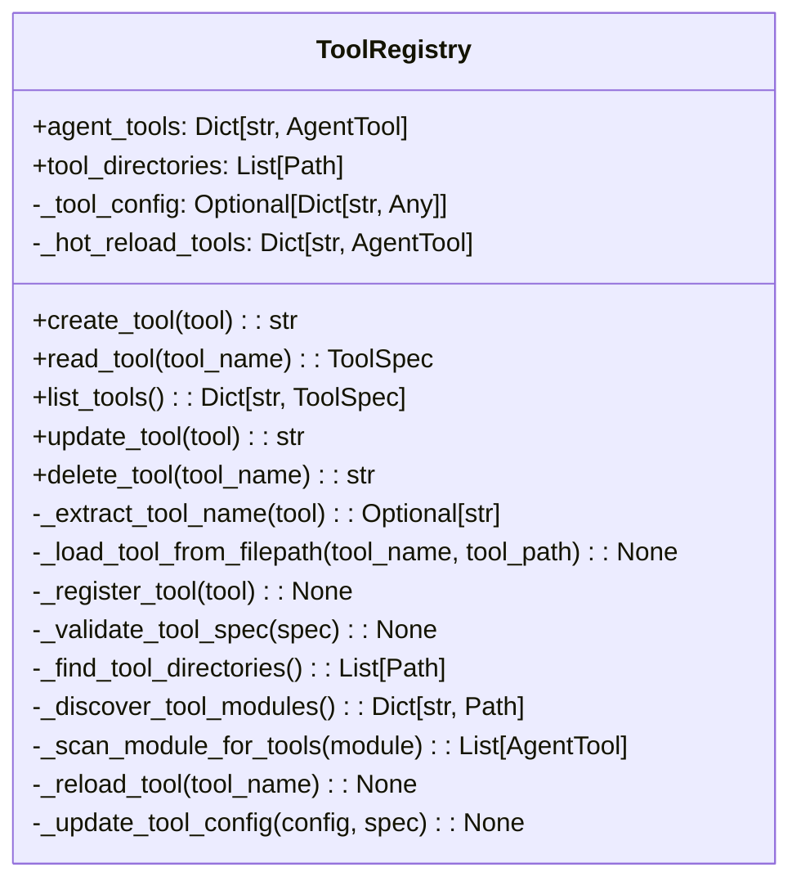
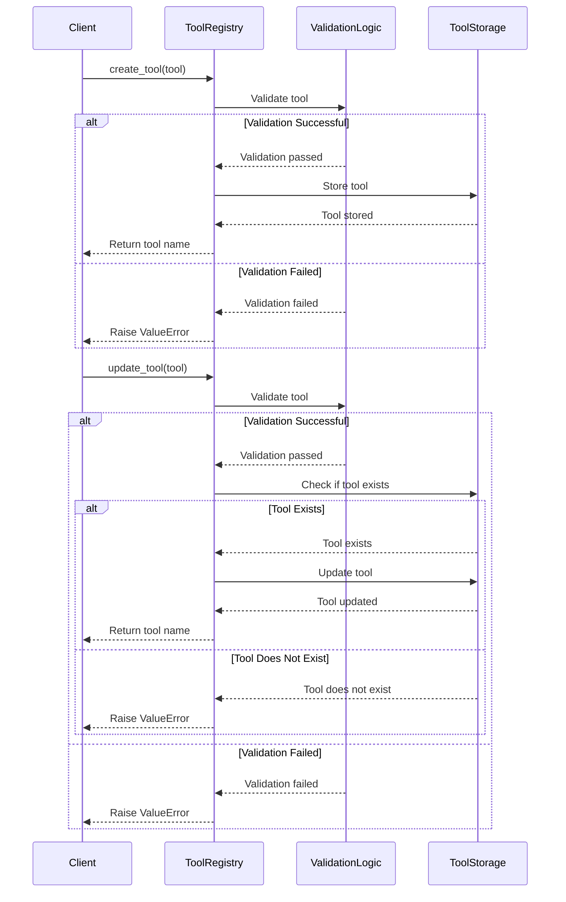

# Design Document: Tool Registry Refactoring

## Overview

This design document outlines the approach for refactoring the Tool Registry component in the Strands framework. The refactoring aims to provide a consistent CRUD interface and ensure atomic operations while maintaining the exact same functionality as the current implementation. The Tool Registry is responsible for managing tools that can be used by agents, including their discovery, validation, and invocation.

## Architecture

The refactored Tool Registry will maintain the same overall architecture but with a more consistent public API. The key components include:

1. **git Class**: The main class that provides the CRUD interface for managing tools.
2. **Internal Helper Methods**: Private methods that handle the implementation details of tool management.
3. **Tool Loading and Validation**: Functionality for loading tools from various sources and validating their specifications.

The refactoring will focus on reorganizing the existing functionality into a more consistent interface without changing the underlying behavior.

## Components and Interfaces

### Public CRUD Interface

The refactored Tool Registry will expose the following public methods, replacing the existing batch methods:

1. **create_tool(tool)**: Creates a single new tool in the registry.
   - Parameters: `tool` - A tool specification in any supported format
   - Returns: The name of the created tool
   - Raises: `ValueError` if the tool already exists or validation fails

2. **read_tool(tool_name)**: Retrieves the specification for a single tool.
   - Parameters: `tool_name` - The name of the tool to retrieve
   - Returns: The tool specification as a `ToolSpec` object
   - Raises: `ValueError` if the tool doesn't exist

3. **list_tools()**: Lists all tools in the registry.
   - Returns: A dictionary mapping tool names to their specifications

4. **update_tool(tool)**: Updates a single existing tool in the registry.
   - Parameters: `tool` - A tool specification in any supported format
   - Returns: The name of the updated tool
   - Raises: `ValueError` if the tool doesn't exist or validation fails

5. **delete_tool(tool_name)**: Deletes a single tool from the registry.
   - Parameters: `tool_name` - The name of the tool to delete
   - Returns: The name of the deleted tool
   - Raises: `ValueError` if the tool doesn't exist

### Internal Methods

The following internal methods will be used to implement the public interface:

1. **_extract_tool_name(tool)**: Extracts the name from a tool specification.
2. **_load_tool_from_filepath(tool_name, tool_path)**: Loads a tool from a file path.
3. **_register_tool(tool)**: Registers a tool in the registry.
4. **_validate_tool_spec(spec)**: Validates a tool specification.
5. **_find_tool_directories()**: Finds all tool directory paths.
6. **_discover_tool_modules()**: Discovers available tool modules in all tools directories.
7. **_scan_module_for_tools(module)**: Scans a module for decorated function tools.
8. **_reload_tool(tool_name)**: Reloads a specific tool module.
9. **_update_tool_config(config, spec)**: Updates the tool configuration.

## Data Models

The Tool Registry will continue to use the existing data models:

1. **AgentTool**: Represents a tool that can be used by an agent.
2. **ToolSpec**: Represents the specification for a tool, including its name, description, parameters, etc.

No changes to these data models are required for the refactoring.

## Error Handling

The refactored Tool Registry will maintain the same error handling approach as the current implementation:

1. **Validation Errors**: Raised when a tool specification is invalid.
2. **Existence Errors**: Raised when a tool doesn't exist or already exists.
3. **File Errors**: Raised when a tool file can't be found or loaded.

To ensure atomic operations, the refactored implementation will:

1. Validate all inputs before making any changes to the registry.
2. Use a transactional approach for batch operations, where all operations succeed or none do.
3. Restore the original state if an error occurs during an operation.

## Testing Strategy

The testing strategy for the refactored Tool Registry will focus on ensuring that the behavior remains unchanged:

1. **Unit Tests**: Test each public method of the refactored Tool Registry to ensure it behaves as expected.
2. **Integration Tests**: Test the interaction between the Tool Registry and other components, such as the Agent.
3. **Backward Compatibility Tests**: Test that existing code that uses the Tool Registry continues to work without modification.
4. **Error Handling Tests**: Test that errors are handled correctly and operations are atomic.

## Implementation Approach

The implementation will follow these steps:

1. Create the new single-tool CRUD methods to replace the existing batch methods.
2. Keep the private helper methods almost exactly the same to maintain the internal functionality.
3. Ensure that all operations are fully atomic.
4. Update any code that uses the Tool Registry to work with the new API.

### Atomicity Implementation

To ensure atomicity, the implementation will:

1. For all operations:
   - Validate the input before making any changes to the registry.
   - Use a try-except block to catch any errors and restore the original state if needed.
   - Make a copy of the relevant state before modification to enable rollback if needed.

## Diagrams

### Class Diagram

### Sequence Diagram for Atomic Operations

