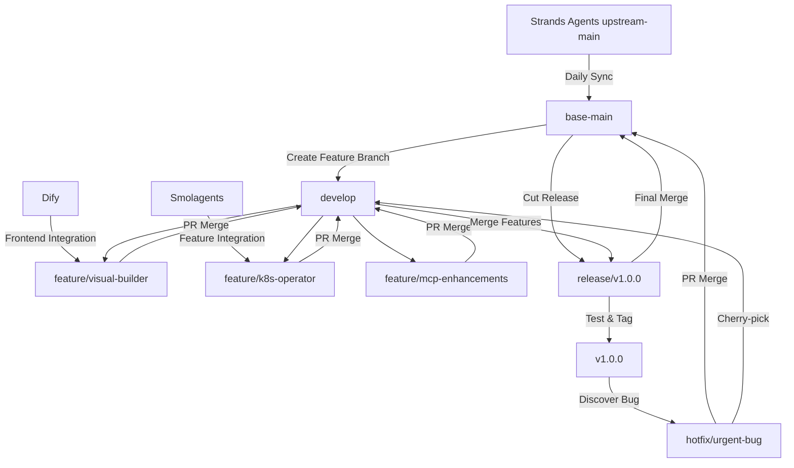

```mermaid
graph TD
    %% External Repositories
    upstream_main[Strands Agents upstream-main]
    dify[Dify]
    smolagents[Smolagents]

    %% StrandForge Branches
    base_main[base-main]
    develop[develop]
    feature_visual_builder[feature/visual-builder]
    feature_k8s_operator[feature/k8s-operator]
    feature_mcp_enhancements[feature/mcp-enhancements]
    release_v1[release/v1.0.0]
    hotfix_urgent_bug[hotfix/urgent-bug]

    %% Upstream sync and feature integration
    upstream_main -->|Daily Sync| base_main
    base_main -->|Create Feature Branch| develop
    dify -->|Frontend Integration| feature_visual_builder
    smolagents -->|Feature Integration| feature_k8s_operator

    %% Feature branches from develop
    develop --> feature_visual_builder
    develop --> feature_k8s_operator
    develop --> feature_mcp_enhancements

    %% Merge features to develop
    feature_visual_builder -->|PR Merge| develop
    feature_k8s_operator -->|PR Merge| develop
    feature_mcp_enhancements -->|PR Merge| develop

    %% Release flow
    base_main -->|Cut Release| release_v1
    develop -->|Merge Features| release_v1
    release_v1 -->|Test & Tag| v1.0.0
    release_v1 -->|Final Merge| base_main

    %% Hotfix flow
    v1.0.0 -->|Discover Bug| hotfix_urgent_bug
    hotfix_urgent_bug -->|PR Merge| base_main
    hotfix_urgent_bug -->|Cherry-pick| develop
```