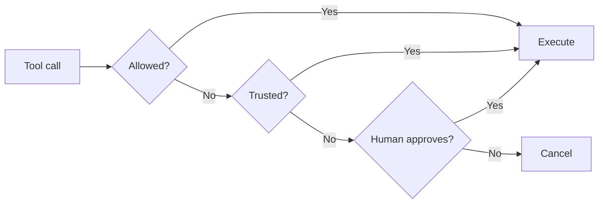

The `HumanInTheLoop` intervention handler pauses agent execution before tool calls to request human approval. It provides a configurable, drop-in way to add human oversight without writing custom interrupt logic. Pass it to `interventions` and choose how you want to collect the human’s response.

## How It Works

The handler uses the [`confirm` action](/docs/user-guide/concepts/agents/interventions/index.md) to pause for human input. Under the hood it builds on the SDK’s [interrupt mechanism](/docs/user-guide/concepts/interrupts/index.md), but abstracts away the manual interrupt/resume loop when you provide an `ask` option.



## Usage

### Interrupt/Resume Mode (Default)

Without an `ask` option, the handler raises an interrupt and the agent pauses. The caller presents the interrupt to the user, collects their response, and resumes the agent. This is the same [interrupt/resume pattern](/docs/user-guide/concepts/interrupts/index.md#hooks) used throughout the SDK. For stateless deployments, combine with a [session manager](/docs/user-guide/concepts/agents/session-management/index.md) to persist state between requests.

(( tab "Python" ))
```python
agent = Agent(
    tools=[delete_files],
    interventions=[HumanInTheLoop()],
)

# Agent pauses with stop_reason 'interrupt' when a tool needs approval
result = agent("Delete the temp files")

if result.stop_reason == "interrupt":
    # Present the interrupt to the user (web UI, Slack, etc.)
    print(result.interrupts[0].reason)

    # Resume with the human's response
    result = agent(
        [
            {
                "interruptResponse": {
                    "interruptId": result.interrupts[0].id,
                    "response": "yes",  # 'y', 'yes', or True -> approved
                }
            }
        ]
    )
```
(( /tab "Python" ))

(( tab "TypeScript" ))
```typescript
import { Agent, tool, InterruptResponseContent } from '@strands-agents/sdk'
import { HumanInTheLoop } from '@strands-agents/sdk/vended-interventions/hitl'
import { z } from 'zod'

const deleteFiles = tool({
  name: 'delete_files',
  description: 'Delete files at the given paths',
  inputSchema: z.object({ paths: z.array(z.string()) }),
  callback: (input) => `Deleted ${input.paths.length} files`,
})

const agent = new Agent({
  tools: [deleteFiles],
  interventions: [new HumanInTheLoop()],
})

// Agent pauses with stopReason 'interrupt' when a tool needs approval
let result = await agent.invoke('Delete the temp files')

if (result.stopReason === 'interrupt') {
  // Present the interrupt to the user (web UI, Slack, etc.)
  console.log(result.interrupts![0].reason)

  // Resume with the human's response
  result = await agent.invoke([
    new InterruptResponseContent({
      interruptId: result.interrupts![0].id,
      response: 'yes', // 'y', 'yes', or true → approved
    }),
  ])
}
```
(( /tab "TypeScript" ))

### Stdio Mode

For CLI applications, pass `ask="stdio"``ask: 'stdio'` to prompt the user inline via stdin. The agent blocks until the user responds, so no interrupt handling is needed on the caller side.

(( tab "Python" ))
```python
agent = Agent(
    tools=[delete_files],
    interventions=[HumanInTheLoop(ask="stdio")],
)

agent("Delete the temp files")
# Terminal prompt:
# Tool "delete_files" requires human approval. Input: {...} (y/n):
```
(( /tab "Python" ))

(( tab "TypeScript" ))
```typescript
import { Agent, tool } from '@strands-agents/sdk'
import { HumanInTheLoop } from '@strands-agents/sdk/vended-interventions/hitl'
import { z } from 'zod'

// const deleteFiles = tool({ ... }) — same as above

const agent = new Agent({
  tools: [deleteFiles],
  interventions: [new HumanInTheLoop({ ask: 'stdio' })],
})

await agent.invoke('Delete the temp files')
// Terminal prompt:
// Tool "delete_files" requires human approval. Input: {...} (y/n):
```
(( /tab "TypeScript" ))

### Custom UI Callback

For web UIs, Slack bots, or other custom interfaces, pass a function to `ask`. The function receives a prompt string describing the tool call and must return the user’s response.

(( tab "Python" ))
```python
async def ask(prompt: str) -> str:
    # Your UI: Slack DM, web modal, push notification, etc.
    return await ask_user_via_slack(prompt)

agent = Agent(
    tools=[delete_files],
    interventions=[HumanInTheLoop(ask=ask)],
)

agent("Delete the temp files")
```
(( /tab "Python" ))

(( tab "TypeScript" ))
```typescript
import { Agent, tool } from '@strands-agents/sdk'
import { HumanInTheLoop } from '@strands-agents/sdk/vended-interventions/hitl'
import { z } from 'zod'

// const deleteFiles = tool({ ... }) — same as above

const agent = new Agent({
  tools: [deleteFiles],
  interventions: [
    new HumanInTheLoop({
      ask: async (prompt) => {
        // Your UI: Slack DM, web modal, push notification, etc.
        return await askUserViaSlack(prompt)
      },
    }),
  ],
})

await agent.invoke('Delete the temp files')
```
(( /tab "TypeScript" ))

## Configuration

| Parameter | Type | Default | Description |
| --- | --- | --- | --- |
| `allowed_tools``allowedTools` | `list[str]``string[]` | `None``undefined` | Tools that bypass approval. Supports `"*"` (all) and `"!tool_name"` (negation). |
| `enable_trust``enableTrust` | `bool``boolean` | `False``false` | When enabled, trust responses are remembered for the session. |
| `evaluate_trust``evaluateTrust` | Function | Accepts `"t"` or `"trust"` | Custom validator for trust responses. Only evaluated when trust is enabled. |
| `evaluate` | Function | Accepts `True, "y", or "yes"``true, 'y', or 'yes'` | Custom validator for approval responses. |
| `ask` | `Function or "stdio"``Function or 'stdio'` | `None``undefined` | Pass a function for custom UIs, `"stdio"` for CLI prompting, or omit for interrupt/resume. |

### Allowed Tools

Use the allowed tools list to skip approval for safe, read-only tools:

(( tab "Python" ))
```python
agent = Agent(
    tools=[read_file, delete_files],
    interventions=[
        HumanInTheLoop(
            ask="stdio",
            # Pattern syntax:
            #   "read_file"             -> runs without approval
            #   "*"                     -> all tools run freely (disables handler)
            #   ["*", "!delete_files"]  -> all except delete_files
            allowed_tools=["read_file"],
        ),
    ],
)

agent("Read config.json then delete /tmp/old-logs")
# Only delete_files prompts; read_file executes immediately
```
(( /tab "Python" ))

(( tab "TypeScript" ))
```typescript
import { Agent, tool } from '@strands-agents/sdk'
import { HumanInTheLoop } from '@strands-agents/sdk/vended-interventions/hitl'
import { z } from 'zod'

// const deleteFiles = tool({ ... }) — same as above
// const readFile = tool({ ... })

const agent = new Agent({
  tools: [readFile, deleteFiles],
  interventions: [
    new HumanInTheLoop({
      ask: 'stdio',
      // Pattern syntax:
      //   'read_file'             → runs without approval
      //   '*'                     → all tools run freely (disables handler)
      //   ['*', '!delete_files']  → all except delete_files
      allowedTools: ['read_file'],
    }),
  ],
})

await agent.invoke('Read config.json then delete /tmp/old-logs')
// Only delete_files prompts; read_file executes immediately
```
(( /tab "TypeScript" ))

### Trust Mode

When trust is enabled, a human can respond with `'t'` or `'trust'` to approve the current tool call AND remember that decision for the rest of the session. Subsequent calls to the same tool skip the prompt entirely. Trust works in all modes: interrupt/resume, stdio, and custom callbacks.

Trust state is stored in `agent.state``agent.appState` and persists across turns within a session but resets when the agent is re-created. Negated tools (`"!tool_name"`) cannot be trusted and always prompt.

(( tab "Python" ))
```python
agent = Agent(
    tools=[delete_files],
    interventions=[
        HumanInTheLoop(
            ask="stdio",
            enable_trust=True,
        ),
    ],
)

agent("Delete all log files in /tmp")
# First call: user responds 't' -> approved AND remembered
# Subsequent calls: no prompt needed for the session
```
(( /tab "Python" ))

(( tab "TypeScript" ))
```typescript
import { Agent, tool } from '@strands-agents/sdk'
import { HumanInTheLoop } from '@strands-agents/sdk/vended-interventions/hitl'
import { z } from 'zod'

// const deleteFiles = tool({ ... }) — same as above

const agent = new Agent({
  tools: [deleteFiles],
  interventions: [
    new HumanInTheLoop({
      ask: 'stdio',
      enableTrust: true,
    }),
  ],
})

await agent.invoke('Delete all log files in /tmp')
// First call: user responds 't' → approved AND remembered
// Subsequent calls: no prompt needed for the session
```
(( /tab "TypeScript" ))

### Custom Evaluate

By default, the handler accepts `True, "y", or "yes"``true, 'y', or 'yes'` as approval. Use `evaluate` to define your own approval logic, for example requiring the user to type “confirm”:

(( tab "Python" ))
```python
agent = Agent(
    tools=[delete_files],
    interventions=[
        HumanInTheLoop(
            ask="stdio",
            # Only approve if the user types "confirm"
            evaluate=lambda response: isinstance(response, str) and response.lower() == "confirm",
        ),
    ],
)

agent("Delete the temp files")
# Prompt: Tool "delete_files" requires human approval. Input: {...}
# User must type "confirm" to approve (not just "y" or "yes")
```
(( /tab "Python" ))

(( tab "TypeScript" ))
```typescript
import { Agent, tool } from '@strands-agents/sdk'
import { HumanInTheLoop } from '@strands-agents/sdk/vended-interventions/hitl'
import { z } from 'zod'

// const deleteFiles = tool({ ... }) — same as above

const agent = new Agent({
  tools: [deleteFiles],
  interventions: [
    new HumanInTheLoop({
      ask: 'stdio',
      // Only approve if the user types "confirm"
      evaluate: (response) =>
        typeof response === 'string' && response.toLowerCase() === 'confirm',
    }),
  ],
})

await agent.invoke('Delete the temp files')
// Prompt: Tool "delete_files" requires human approval. Input: {...}
// User must type "confirm" to approve (not just "y" or "yes")
```
(( /tab "TypeScript" ))

## When to Use

Use `HumanInTheLoop` when you want tool-level approval gating with minimal code: it handles allow-lists, trust, and collection mode out of the box. Use [raw interrupts](/docs/user-guide/concepts/interrupts/index.md) when you need full control: custom interrupt shapes, multi-step interactions, or workflows beyond simple approve/deny.

## Related Topics

-   [Interventions](/docs/user-guide/concepts/agents/interventions/index.md): The intervention handler framework that HITL is built on
-   [Interrupts](/docs/user-guide/concepts/interrupts/index.md): Low-level interrupt/resume mechanism
-   [Agent State](/docs/user-guide/concepts/agents/state/index.md): How trust decisions persist via `agent.state``agent.appState`
-   [Session Management](/docs/user-guide/concepts/agents/session-management/index.md): Persisting interrupt state across sessions

## Related pages

- [Cedar Authorization](/docs/user-guide/concepts/agents/interventions/cedar-authorization/index.md) (2 shared tags)
- [Interventions](/docs/user-guide/concepts/agents/interventions/index.md) (2 shared tags)
- [Creating a Custom Model Provider](/docs/user-guide/concepts/model-providers/custom_model_provider/index.md) (1 shared tag)
- [Tool Executors](/docs/user-guide/concepts/tools/executors/index.md) (1 shared tag)
- [Available Sandboxes](/docs/user-guide/concepts/sandbox/available-sandboxes/index.md) (1 shared tag)
- [Building a Custom Sandbox](/docs/user-guide/concepts/sandbox/custom-sandbox/index.md) (1 shared tag)
- [Sandbox](/docs/user-guide/concepts/sandbox/index.md) (1 shared tag)
- [Hooks](/docs/user-guide/concepts/agents/hooks/index.md) (1 shared tag)
- [Steering](/docs/user-guide/concepts/agents/interventions/steering/index.md) (1 shared tag)
- [Agent Loop](/docs/user-guide/concepts/agents/agent-loop/index.md) (1 shared tag)


## Implementation

### Python

- [harness-sdk/strands-py/src/strands/vended_interventions/hitl/hitl.py](https://github.com/strands-agents/harness-sdk/blob/main/strands-py/src/strands/vended_interventions/hitl/hitl.py)

### TypeScript

- [harness-sdk/strands-ts/src/vended-interventions/hitl/hitl.ts](https://github.com/strands-agents/harness-sdk/blob/main/strands-ts/src/vended-interventions/hitl/hitl.ts)
