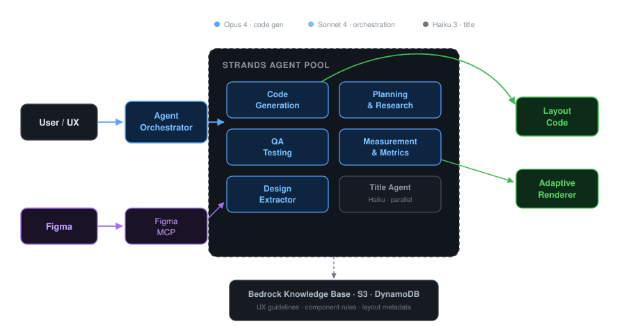

The CreativeX Novum team at Amazon Ads builds a multi agent platform to generate advertising layouts at scale. These layouts reach billions of monthly ad impressions across 20+ marketplaces. Their system, Novum Layout Studio, takes a Figma design and turns it into production React code that renders across Amazon's advertising surfaces: on-site and off-site with locale-specific requirements.

About a year ago, the team decided to rebuild their pipeline using AI agents. They evaluated LangGraph, Amazon Bedrock Agents, and Strands Agents SDK. They shipped on Strands.

## The problem

Creating advertising layouts at Amazon involves translating a design into code that handles far more than what appears in the mockup. A single layout might need to:

- Render different metadata elements depending on context (price, deal badge, energy efficiency labels for Global marketplaces)
- Integrate with Amazon's internal layout registry and infrastructure systems
- Adapt the same design to multiple ad surfaces and formats

Previously, this translation required engineers manually coding each layout. The team wanted agents to handle the heavy lifting: read the Figma file, understand the design intent, write the React code, and handle the infrastructure boilerplate.

## Why Strands over LangGraph

The team had a few hard requirements:

1. **MCP support** for integrating with Figma's MCP server and building custom MCPs
2. **Tool call orchestration** handled by the framework (the tool event loop)
3. **Low learning curve** for a team ramping up on AI engineering who needed to move fast

They seriously considered LangGraph but found the concepts of nodes, edges, and explicit graph relationships added complexity they didn't need. Their requirements boiled down to: agents that run tools, interact with MCP servers, and integrate with Amazon Bedrock knowledge bases. Strands checked those boxes with less overhead.

The team found Strands simpler and faster to ship with, especially for engineers onboarding to AI engineering for the first time. Strands now supports multiple orchestration patterns out of the box (agent-as-tool, graph, and swarm), though at the time the team started, agent-as-tool was their primary approach. The fact that Strands was already powering production services like Amazon Q Developer and VPC Reachability Analyzer gave the team confidence that the SDK could handle real traffic at scale without surprises in reliability or performance.

## Architecture: six specialized agents, one orchestrator



The system uses an orchestrator that delegates to a pool of six specialized agents:

1. **Agent Orchestrator** routes incoming requests to the right specialist based on the task
2. **Code Generation** reads Figma designs via MCP and writes production React layout code
3. **Design Extractor** pulls design tokens, styles, and component structure from Figma files
4. **QA Testing** runs automated checks against generated layouts (overlap, overflow, dimension validation)
5. **Planning & Research** handles research tasks including web scraping for world knowledge and marketplace-specific requirements
6. **Measurement** tracks layout quality metrics and benchmarks across iterations

A lightweight **Title Agent** also runs in parallel on the cheapest model, purely for generating conversation titles without blocking the main pipeline.

The system connects to external services through MCPs: a Figma MCP for design data and a Responsive eCommerce Creative (REC) MCP for the ad layout system. The team uses the REC MCP to understand ad layout systems and write code directly to the production REC code base. All agents share access to a data store layer (Amazon Bedrock Knowledge Base for UX guidelines and component rules, S3 for generated variations, and DynamoDB for layout metadata).

Each agent is defined with a system prompt, instruction files, available tools, and MCP servers. The actual workflow logic lives in the system prompt and instructions, not in code-level orchestration. The LLM decides how to sequence its tool calls based on the task, rather than following a hardcoded graph. This gives the agent flexibility to adapt its approach based on what it finds during execution, without requiring the team to anticipate every possible path in advance.

The team also tiers their model selection by task importance. Code generation gets the most capable model because quality matters there. The title agent runs the cheapest, fastest model available since conversation title quality is non-critical. This keeps costs down and avoids blocking the main pipeline with unnecessary heavyweight calls.

```python
from strands import Agent, tool

# Code generation: most capable model
code_writer = Agent(
    model="us.anthropic.claude-opus-4-20250618-v1:0",
    system_prompt=open("prompts/code_writer.md").read(),
    tools=[read_file, write_file, search_codebase],
)

# Orchestrator: delegates via agent-as-tool pattern
@tool
def write_layout_code(request: str) -> str:
    """Delegate layout code generation to the code writer agent."""
    return str(code_writer(request))

orchestrator = Agent(
    model="us.anthropic.claude-sonnet-4-20250514-v1:0",
    system_prompt="Route the user's request to the appropriate specialist agent.",
    tools=[write_layout_code],
)
```

This pattern keeps each agent focused on its specialty while the orchestrator handles routing. The diagram above shows the full system with all six agents and their MCP connections.

Notably, the team experimented with splitting the Code Generation agent into even finer sub-agents (one for Figma reading, one for code writing) but found it hurt more than it helped. The handoff overhead, where one agent has to explain its full context to the next, outweighed any benefit from further specialization. Their takeaway: split by distinct context (design extraction vs. code generation vs. QA), not by sequential steps within the same context.

## The real context problem isn't size, it's quality

The team's single biggest learning was about context management, but not in the way you might expect. With modern models supporting massive context windows, the bottleneck wasn't context size. It was context quality.

Figma's MCP server returns enormous JSON payloads for complex designs. A single node might produce 100k+ tokens, 80% of which is irrelevant metadata: layer IDs, internal Figma properties, positioning data the model doesn't need for code generation.

Their solution: build a custom MCP wrapper on top of the Figma MCP that intelligently filters the response down to only design-relevant properties. This single change had more impact than any serialization format optimization. They tested JSON vs TOON and found the difference negligible compared to simply removing junk. As the team put it, that 1% reduction from switching formats is peanuts compared to cleaning up the 80% of garbage in a raw Figma output.

The same principle applied to file operations. Their initial setup used a "write entire file" tool, meaning the model had to regenerate an entire file to change one line. Moving to diff-based file editing dramatically reduced token usage and improved accuracy.

## Figma-to-CSS: the mapping problem

Getting pixel-perfect styling right was their hardest technical challenge. Figma's design properties don't map 1:1 to CSS properties. A Figma "auto-layout" with specific padding and gap values might look correct in the editor but translate to subtly wrong CSS.

Their fix was building custom property mappings, maintained through many rounds of iteration, that their MCP server returns alongside the design data. The model uses these mappings as a reference instead of guessing the CSS equivalent of each Figma property.

They also use Figma's screenshot API as a visual verification step. The model can compare what it sees in the screenshot against the code it generated, catching cases where the serialized properties looked correct but the visual output didn't match.

## Early adopters: shaping the SDK from the inside

The CreativeX Novum team was one of the earliest internal adopters of Strands. They started building on the SDK before many of the multi-agent primitives existed, and worked closely with the Strands team throughout, opening PRs and filing feature requests that shaped how the framework evolved.

Two issues they ran into early on:

**1. Tool calls didn't know which agent invoked them.** A tool defined as a Python function had no way to identify the calling agent. The team needed tools to behave differently depending on which agent was using them, and had to hack around it with manual context-passing.

This is now a first-class feature. `ToolContext` gives every tool access to its calling agent and shared invocation state:

```python
from strands import tool, ToolContext

@tool(context=True)
def my_tool(query: str, tool_context: ToolContext) -> str:
    """A tool that knows which agent called it."""
    agent_name = tool_context.agent.name
    state = tool_context.invocation_state  # shared across all agents
    return f"Handling request from {agent_name}"
```

**2. No way to talk to a sub-agent mid-execution.** Their orchestrator delegates to sub-agents using the agent-as-tool pattern. When a user wanted to give feedback to a sub-agent while it was running, there was no clean way to inject messages into the event loop.

Strands has since shipped multiple multi-agent patterns that address broader collaboration needs: Swarms with autonomous handoffs and shared working memory, Graphs with conditional routing, and a built-in `handoff_to_user` tool for explicit human-in-the-loop transfers. For the specific hierarchical agent-as-tool pattern, mid-execution human interaction still takes some custom wiring, but the team's feedback directly influenced the Swarm and Handoff designs that now cover the most common use cases.

The tool orchestration loop, parallel tool call support, and config-based agent definition all aligned well with how they'd structured their application from day one. And the features that weren't there when they started? They helped build them.

## Benchmarking visual output

Testing a system that generates visual layouts is hard. The team went through several iterations:

**Phase 1: Human eye test.** Run 20+ Figma layouts through the system, visually inspect results. In the early days, failures were obvious (entire components in the wrong place, not off-by-a-pixel issues).

**Phase 2: Hard-coded checks.** Automated tests for component overlap, content overflow outside layout boundaries, correct layout dimensions matching the Figma spec, and duplicate components.

**Phase 3: LLM-as-judge (abandoned).** They tried asking an LLM to compare the generated layout against the original design. Results were unreliable. The model would miss obvious issues while fixating on invisible nitpicks. When primed to find problems, it hallucinated issues that didn't exist. They dropped this approach.

The team currently relies on the Phase 2 automated checks combined with Figma's screenshot API for visual verification. The model itself compares its output against the screenshot during generation, catching obvious rendering errors before the code is committed.

## What made Strands worth it

Looking back, the team highlighted three things:

1. **The tool orchestration loop.** Not having to build and maintain the tool-calling cycle saved significant development time and reduced bugs.

2. **Parallel tool calls.** This was added to Strands during their development cycle and produced an immediate speed improvement without any code changes on their end. "Things just sped up and we were like, oh wow, it supports parallel tool calls now."

3. **Config-driven architecture alignment.** Strands' model of "define an agent with a prompt, tools, and MCP servers" mapped directly to how they'd organized their application.

4. **The agent gets smarter without code changes.** Because the workflow logic lives in the system prompt rather than hardcoded orchestration, every model upgrade improves the agent's output automatically. The team just swaps the `model` parameter, runs their benchmark suite, and ships. When they upgraded from Sonnet 3.7 to Opus 4, code generation quality jumped noticeably with zero code changes on their end. This is the core bet of the model-driven approach: as foundation models improve, so does your agent.

## What we'd recommend to teams adopting Strands

Based on the CreativeX Novum team's experience:

- **Start with one agent per well-defined task.** Don't over-split into sub-agents. The context handoff overhead between agents is real. Only split when the tasks genuinely have different contexts (like front-end code vs. infrastructure code).

- **Invest in your tool outputs, not your serialization format.** Cleaning up what your tools return to the model matters far more than optimizing JSON vs. alternative formats.

- **Pick the orchestration pattern that fits your use case.** The team started with agent-as-tool for hierarchical delegation and it handled their core workflow well. Strands also offers Swarm and Graph patterns for more collaborative or structured scenarios.

- **Build deterministic tests first, then layer in LLM evaluation.** Hard-coded correctness checks (overlap detection, boundary checks, duplicate components) gave the team reliable baselines. LLM-as-judge was unreliable when they tried it in early 2025, though newer models and eval frameworks like Strands Evals may change that calculus.

- **Keep upgrading models.** The team runs their benchmark suite on each new model release. Since their logic lives in prompts rather than code-level orchestration, upgrading is just changing the `model` parameter and running evals.

*The CreativeX Novum team is part of Amazon Ads. They build a multi agent platform that generates advertising creative at scale using Strands Agents SDK, Amazon Bedrock, and MCP. Strands Agents SDK is open source at [github.com/strands-agents/harness-sdk](https://github.com/strands-agents/harness-sdk). Get started with the [documentation](https://strandsagents.com) or join the community on [Discord](https://discord.gg/strands). See also: [What We Learned from One Year of Building Production Agents](/blog/what-we-learned-from-one-year-of-building-production-agents/).*
