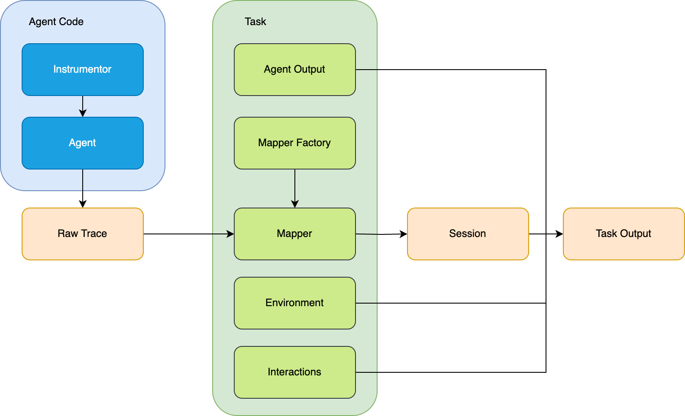

When I was comparing Strands to OpenAI Agents a few months ago, I looked primarily at their feature sets: multi-agent
primitives, context management, developer experience, and other obvious qualities. But all of these
characteristics dance around what truly matters: how well the agent answers prompts, a job often reserved for
evaluation frameworks. The caveat: running Strands through Strands Evals and OpenAI Agents through OpenAI Evals
does not yield an exact comparison. Without a shared evaluation setup, performance differences could be attributed to
the agents themselves or to evaluation discrepancies.

Today, [Strands Evals](https://github.com/strands-agents/evals) is simplifying cross-framework comparison for scenarios
like the above. It now supports traces emitted from several new agent frameworks, including those following GenAI
semantic conventions. This is part of a larger initiative to make Strands Evals framework-agnostic. The table below
shows the updated agent framework and tracing combinations Strands Evals supports. Built-in refers to the
framework's native OTel tracing. OpenInference and Traceloop are third-party instrumentor libraries that hook
into agent frameworks to produce OTel spans.

| Agent Framework | Built-in | OpenInference | Traceloop |
| --- | --- | --- | --- |
| Strands | ✓ | — | — |
| Claude Agents SDK | — | ✓ | — |
| Google ADK | ✓ | — | — |
| OpenAI Agents SDK | — | ✓ | ✓ |
| LangChain | — | ✓ | ✓ |
| Smolagents | — | ✓ | — |
| Pydantic AI | ✓ | — | — |
| AutoGen | ✓ | — | — |

In this post, I will discuss why framework-agnostic evaluation matters and how to start using Strands Evals to
evaluate agents from a variety of frameworks, including Claude Agents, OpenAI Agents, and Google ADK.

## Where framework-specific evaluation falls short

Many agent frameworks ship with native evaluation tools.

- LangChain and LangSmith
- Google ADK and Gen AI Evaluation Service
- Microsoft AutoGen and Azure AI Evaluation SDK
- Pydantic AI and Logfire

They offer feature-rich evaluation tailored to their native framework. While framework-specific
tools handle their own frameworks well, they face challenges when evaluating agents from other frameworks.
Agent frameworks often differ in instrumentation (the hooks emitting information about what the agent did)
and in the subsequent span format. Evaluating an agent from one framework in another vendor's tool requires
span format compatibility, or manual conversion.

An alternative is to use a different evaluation tool for each agent framework, sidestepping the
compatibility issues. But this approach does not scale. When you switch frameworks, you must
also learn how to use a new evaluation tool.

## What framework-agnostic evaluation provides

A framework-agnostic evaluation solves the issues above through greater interoperability:
- You define your cases and evaluators once. When you try a new agent framework, you swap the agent code and
  keep everything else the same.
- Comparisons become apples-to-apples: same cases, same evaluators, same scoring. This ensures differences in
  results come from the agents, not the evaluation setup.
- Switching costs drop because you learn one evaluation tool and bring it with you as you change frameworks.

## How Strands Evals bridges frameworks



_Figure 1: The user-defined task converts raw traces into sessions using mappers and assembles the task output_

Strands Evals handles other agent frameworks using session mappers: adapters that convert raw
spans into unified session objects. Sessions represent the agent's trajectory (a record of what
the agent did) in a standardized format and comprise a major part of the `TaskOutput`. From here,
Strands Evals works the same as with a native Strands agent. The remaining TaskOutput fields,
output, interactions, and environment, are user-defined and vary by experiment.

In practice, session mappers are called inside user-defined task functions. These tasks run the
agent, collect the emitted trace spans, and assemble the `TaskOutput`. Strands Evals provides a
factory function that facilitates this: it inspects span scopes and selects the appropriate
mapper automatically, making the same mapping logic reusable across multiple agent frameworks.

## Walkthrough: evaluating a commit message agent

The following sections walk through how to evaluate an agent built with Claude Agents SDK using Strands Evals,
demonstrating cross-framework support. The example agent writes commit messages, a repetitive task fit for
an agent. You can find the full example
[here](https://github.com/strands-agents/harness-sdk/blob/main/site/docs/examples/evals-sdk/claude-agents-evaluator.py).

This walkthrough assumes familiarity with Strands Evals. If you are new, see the
[Strands Evals quickstart](/docs/user-guide/evals-sdk/quickstart/) for a quick tour.

### Prerequisites

- Python 3.10 or later.
- An AWS account with access to Amazon Bedrock.
- AWS credentials configured locally (for example, via `aws configure` or an IAM role) with
  Amazon Bedrock `InvokeModel` permission for the judge model.

Install the dependencies:

```bash
pip install strands-agents-evals claude-agent-sdk openinference-instrumentation-claude-agent-sdk
```

### Step 1: Set up instrumentation

The first step is instrumentation. We use OpenInference, which hooks into the Claude Agents SDK
and produces OTel spans collected in-process with `InMemorySpanExporter`.

```python
from openinference.instrumentation.claude_agent_sdk import ClaudeAgentSDKInstrumentor
from strands_evals.telemetry import StrandsEvalsTelemetry

telemetry = StrandsEvalsTelemetry().setup_in_memory_exporter()
ClaudeAgentSDKInstrumentor().instrument()
```

### Step 2: Define the agent

Define a commit message agent using the Claude Agents SDK.

```python
from claude_agent_sdk import ClaudeAgentOptions, ResultMessage, query


async def run_commit_agent(diff: str) -> str:
    options = ClaudeAgentOptions(
        allowed_tools=["Bash"],
        max_turns=3,
        system_prompt=(
            "Write a conventional commit message for the given diff. "
            "Format: <type>(<scope>): <subject>. "
            "Types: feat, fix, docs, style, refactor, perf, test, chore. "
            "Imperative mood, lowercase, no period. Output only the commit message."
        ),
        env={
            "CLAUDE_CODE_USE_BEDROCK": "1",
            "ANTHROPIC_MODEL": "us.anthropic.claude-sonnet-4-6",
            "AWS_REGION": "us-east-1",
        },
    )
    result = ""
    async for msg in query(
        prompt=f"Generate a commit message for this diff:\n\n{diff}",
        options=options,
    ):
        if isinstance(msg, ResultMessage) and msg.subtype == "success":
            result = msg.result

    return result.strip()
```

### Step 3: Wire up the experiment

The task function runs the agent, converts the collected spans into a session object, and builds
the `TaskOutput` for evaluation. The critical line is `detect_otel_mapper(spans)`. It inspects
the span scopes, recognizes Claude Agents traces, and returns the appropriate mapper. You never
have to specify the framework mapper manually.

```python
import asyncio
from typing import Any

from strands_evals import Case, Experiment
from strands_evals.evaluators import HelpfulnessEvaluator, GoalSuccessRateEvaluator
from strands_evals.mappers import detect_otel_mapper, readable_spans_to_dicts


def task(case: Case) -> dict[str, Any]:
    telemetry.in_memory_exporter.clear()

    loop = asyncio.new_event_loop()
    try:
        response = loop.run_until_complete(run_commit_agent(case.input))
    finally:
        loop.close()
    telemetry.tracer_provider.force_flush()

    spans = readable_spans_to_dicts(telemetry.in_memory_exporter.get_finished_spans())
    session = detect_otel_mapper(spans).map_to_session(spans, session_id=case.session_id)
    return {"output": response, "trajectory": session}
```

With the task function in place, wire up the rest of the experiment. One case carries an
expected output for comparison. `HelpfulnessEvaluator` scores whether the response addressed
the user's need, while `GoalSuccessRateEvaluator` scores whether the user's overall goal was
achieved.

```python
experiment = Experiment(
    cases=[
        Case(
            name="fix-null-check",
            input=(
                "# src/user.py\n"
                "-    return user['name'].upper()\n"
                "+    if not user or 'name' not in user:\n"
                "+        return 'Anonymous'\n"
                "+    return user['name'].upper()\n"
            ),
            expected_output="fix(user): handle missing user or name field in get_display_name",
        ),
    ],
    evaluators=[HelpfulnessEvaluator(), GoalSuccessRateEvaluator()],
)

report = experiment.run_evaluations(task)
```

### Step 4: Inspect the results

```python
for case, score, passed, reason in zip(
    report.cases, report.scores, report.test_passes, report.reasons
):
    status = "PASS" if passed else "FAIL"
    print(f"[{status}] {case['name']} ({case['evaluator']}): {score:.2f}")
    print(f"  Reason: {reason}\n")
```

Running this produces:

```
[PASS] fix-null-check (HelpfulnessEvaluator): 0.83
  Reason: The assistant provided a concise, well-formatted commit message that correctly
  identifies the change as a "fix", scopes it to "user", and accurately describes what
  the change does. The commit message is accurate, appropriately formatted, and directly
  addresses what the user asked for.

[PASS] fix-null-check (GoalSuccessRateEvaluator): 1.00
  Reason: A commit message was provided and confirmed to follow Conventional Commits format.
  The user's goal of getting a commit message for the diff has been satisfied.
```

The output format is identical to what you would see when evaluating a native Strands agent.
Swap in a different framework and compare results directly, knowing the scoring methodology
stayed constant.

## Variation: OpenAI Agents

The following example swaps Claude Agents for OpenAI Agents to evaluate the same commit message task,
illustrating what changes and what remains the same. Once again, you can find the full example
[here](https://github.com/strands-agents/harness-sdk/blob/main/site/docs/examples/evals-sdk/openai-agents-evaluator.py).

[Obtain an OpenAI API key](https://platform.openai.com/api-keys) and set it in your environment
variables. You also need the following dependencies:

```bash
pip install openai-agents openinference-instrumentation-openai-agents
```

Set up the OpenInference instrumentor and in-memory exporter as before:

```python
from strands_evals.telemetry import StrandsEvalsTelemetry
from openinference.instrumentation.openai_agents import OpenAIAgentsInstrumentor

telemetry = StrandsEvalsTelemetry().setup_in_memory_exporter()
OpenAIAgentsInstrumentor().instrument()
```

Define an agent with OpenAI Agents SDK's `Agent` class and its executor with `Runner`.

```python
from agents import Agent, Runner


commit_agent = Agent(
    name="commit_agent",
    model="gpt-4o-mini",
    instructions=(
        "Write a conventional commit message for the given diff. "
        "Format: <type>(<scope>): <subject>. "
        "Types: feat, fix, docs, style, refactor, perf, test, chore. "
        "Imperative mood, lowercase, no period. Output only the commit message."
    ),
)


async def run_commit_agent(diff: str) -> str:
    result = await Runner.run(
        commit_agent, f"Generate a commit message for this diff:\n\n{diff}"
    )
    return result.final_output.strip()
```

No additional changes are needed. The task function, cases, evaluators, and reporting code
remain the same as the Claude Agents example. `detect_otel_mapper` recognizes OpenAI Agents SDK
spans by their scope and selects the correct mapper automatically.

Strands Evals also supports OpenAI Agents instrumented with Traceloop. Swap the instrumentor
in the first step and the rest of the setup stays the same.

```bash
pip install opentelemetry-instrumentation-openai-agents
```

```python
from opentelemetry.instrumentation.openai_agents import OpenAIAgentsInstrumentor

OpenAIAgentsInstrumentor().instrument()
```

## Evaluating production traces from AgentCore

The previous examples collected traces in-process using an `InMemorySpanExporter`. In
production, your agents may run on managed infrastructure, where traces flow through
observability pipelines. One such example is Amazon Bedrock AgentCore, which supports various agent frameworks
and exports OTel traces to Amazon CloudWatch via an ADOT (AWS Distro for OpenTelemetry) collector.
Despite these differences, Strands Evals evaluates CloudWatch spans in the same way as in-process ones.

To demonstrate that Strands Evals can evaluate non-AWS agent frameworks deployed on AWS infrastructure,
this section deploys a Google ADK commit message agent to AgentCore, retrieves its production traces from CloudWatch,
and runs them through the same Strands Evals experiment used in the earlier examples.

In addition to the prerequisites from earlier, you need:

- Node.js 20+ installed.
- AWS CDK installed.
- A [Google API key](https://aistudio.google.com/apikey).
- AWS credentials with permissions to deploy to AgentCore Runtime and query CloudWatch Logs
  (`logs:StartQuery`, `logs:GetQueryResults`). For the full list, see
  [AgentCore CLI permissions](https://docs.aws.amazon.com/bedrock/latest/userguide/agentcore-cli-permissions.html).
- [Amazon CloudWatch Transaction Search](https://docs.aws.amazon.com/bedrock/latest/userguide/agentcore-observability-enable.html)
  enabled in your account.

Install the AgentCore CLI:

```bash
npm install -g @aws/agentcore
```

### Step 1: Set up the AgentCore project

Use the AgentCore CLI to scaffold a Google ADK project. The CLI generates the project
structure, agent code, and deployment configuration.

```bash
agentcore create \
  --name CommitAgent \
  --framework GoogleADK \
  --model-provider Gemini \
  --memory none \
  --api-key <YOUR_GEMINI_API_KEY>

cd commit-agent
```

The scaffolded project includes a starter agent in `app/CommitAgent/main.py`. Update the tools
and system prompt to match the commit message task from the previous examples.

```python
tools = []

AGENT_INSTRUCTION = (
    "Write a conventional commit message for the given diff. "
    "Format: <type>(<scope>): <subject>. "
    "Types: feat, fix, docs, style, refactor, perf, test, chore. "
    "Imperative mood, lowercase, no period. Output only the commit message."
)
```

### Step 2: Deploy and invoke the agent

Deploy the agent to AgentCore Runtime:

```bash
agentcore deploy
```

With the agent deployed, invoke it to generate production traces. AgentCore exports the
resulting OTel spans to CloudWatch automatically.

```bash
agentcore invoke "Generate a commit message for this diff:
# src/user.py
 -    return user['name'].upper()
 +    if not user or 'name' not in user:
 +        return 'Anonymous'
 +    return user['name'].upper()
"
```

Take note of the session ID in the output:

```
Session: 5f630229-bb19-4fae-bcdd-ec335218f531
```

### Step 3: Evaluate the agent

To pull traces from CloudWatch into Strands Evals, create a `CloudWatchProvider` pointing at
the deployed agent. The provider handles querying CloudWatch, retrieving spans, and mapping them
from ADOT format into session objects. No manual trace conversion is needed.

```python
from strands_evals.providers import CloudWatchProvider

provider = CloudWatchProvider(agent_name="CommitAgent_CommitAgent")
```

The experiment setup is the same as the in-process examples. Define cases, attach evaluators,
and call `run_evaluations`. Instead of passing a custom task function, pass
`provider.as_task()`, which retrieves production traces by session ID and returns the
`TaskOutput` for evaluation.

```python
from strands_evals import Case, Experiment
from strands_evals.evaluators import GoalSuccessRateEvaluator, HelpfulnessEvaluator

SESSION_ID = "<your-session-id>"

cases = [
    Case(
        name="cloudwatch-session",
        input=(
            "Generate a commit message for this diff:"
            "# src/user.py\n"
            "-    return user['name'].upper()\n"
            "+    if not user or 'name' not in user:\n"
            "+        return 'Anonymous'\n"
            "+    return user['name'].upper()\n"
        ),
        session_id=SESSION_ID,
    ),
]

experiment = Experiment(
    cases=cases,
    evaluators=[HelpfulnessEvaluator(), GoalSuccessRateEvaluator()],
)

report = experiment.run_evaluations(provider.as_task())

for case, score, passed, reason in zip(
    report.cases, report.scores, report.test_passes, report.reasons
):
    status = "PASS" if passed else "FAIL"
    print(f"[{status}] {case['name']} ({case['evaluator']}): {score:.2f}")
    print(f"  Reason: {reason}\n")
```

The evaluators score the production traces the same way they scored the in-process traces from
the earlier examples. `CloudWatchProvider` handles trace retrieval and mapping internally,
using the same `detect_otel_mapper` mechanism under the hood.

## Supported observability backends

Strands Evals supports several observability backends through trace providers. A provider
connects to a backend, retrieves spans by session ID, and maps them into a `TaskOutput` using
the same session mappers described earlier.

**Amazon CloudWatch** is for agents deployed on Amazon Bedrock AgentCore or any environment
that exports OTel spans to CloudWatch Logs. It runs a CloudWatch Logs Insights query filtering
by session ID, parses the raw log records into normalized span dictionaries, and selects the
correct mapper based on span scope names.

```python
from strands_evals.providers import CloudWatchProvider

provider = CloudWatchProvider(agent_name="my-agent")

# Or point directly to a log group
provider = CloudWatchProvider(
    log_group="/aws/bedrock-agentcore/runtimes/MyAgent-abc123-DEFAULT",
    lookback_days=7,
)
```

**Langfuse** is for agents instrumented with any OTel-compatible framework and exporting to
Langfuse. It fetches traces by session ID via the Langfuse API and converts Langfuse's native
observation spans into evaluation sessions.

```python
from strands_evals.providers import LangfuseProvider

# Credentials from env: LANGFUSE_PUBLIC_KEY, LANGFUSE_SECRET_KEY
provider = LangfuseProvider()

# Or explicit
provider = LangfuseProvider(
    public_key="pk-...",
    secret_key="sk-...",
    host="https://us.cloud.langfuse.com",
)
```

## Conclusion

With framework-agnostic evaluation, you define your cases and evaluators once, swap in a
different agent, and compare results directly. The scoring methodology stays constant, so
differences in results reflect differences in the agents, not the evaluation tooling. Whether you
are choosing your first agent framework or comparing several in production, framework-agnostic
evaluation gives you one tool that follows you.

While Strands Evals strives to be framework-agnostic and supports a healthy range of frameworks,
note that it is still in active development. If you find traces that are converted incorrectly or contain
scopes unrecognized by the mapper factory, cut us an issue in the
[evals](https://github.com/strands-agents/evals/issues) repository.

Start evaluating your agents today:

```bash
pip install strands-agents-evals
```

Then explore the resources below:

- Read the [Strands Evals documentation](/docs/user-guide/evals-sdk/quickstart/) for a deeper
  look at evaluation features.
- Try the [cross-framework examples](https://github.com/strands-agents/harness-sdk/blob/main/site/docs/examples/evals-sdk).
- See [Remote Trace Providers](/docs/user-guide/evals-sdk/how-to/trace_providers/) for full
  configuration options for providers.
