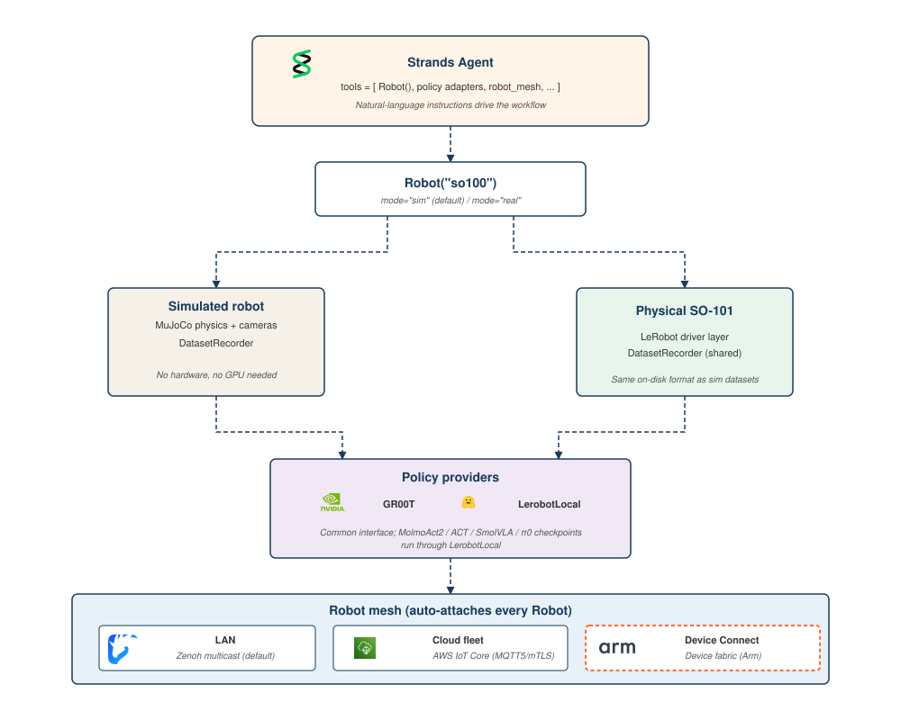
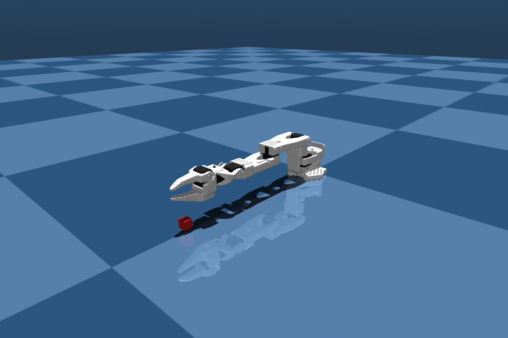
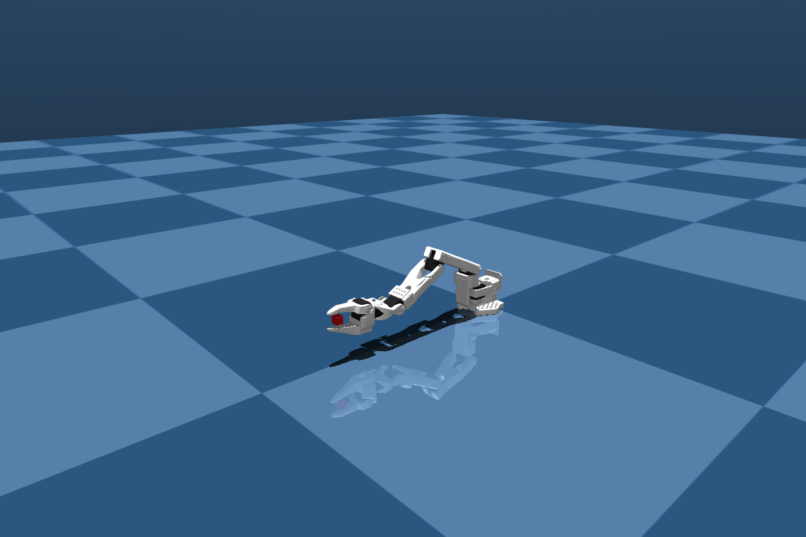
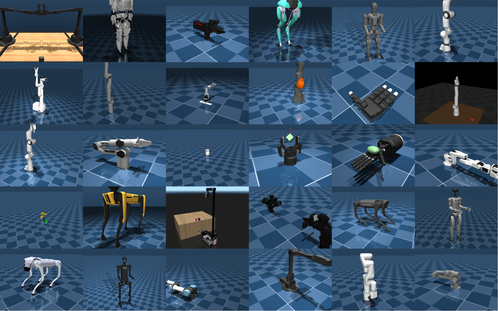

You have a robot, a folder of demonstration data on the Hugging Face Hub, and a new task you want it to learn. Today that takes five separate tools: one to record new demonstrations, another to train, a third to test in simulation, custom code to deploy on hardware, and yet another to coordinate when you have more than one robot. The pieces work on their own. They don't talk to each other.

Strands Robots is an open source SDK from AWS (Apache 2.0) that exposes robot abstractions, simulation, and the LeRobot stack as AgentTools that you compose into a single Strands agent. The integration is deliberately thin: LeRobot's own scripts handle hardware recording and calibration, and the Strands AgentTools come in for the parts an agent actually orchestrates. The simulation tool records LeRobotDatasets in the same format LeRobot writes on hardware. GR00T and LerobotLocal serve policy inference behind a common interface, and MolmoAct2 checkpoints run through the LerobotLocal path. A peer mesh fans the agent out to remote robots. The dataset format stays exactly as LeRobot wrote it; the agent loop is the glue.

This post walks you through five steps inside a single agent: build the agent over the LeRobot AgentTools, record a demonstration as a LeRobotDataset in simulation, run a policy on the same robot, deploy the same agent code to a physical SO-101 with one keyword argument change, and broadcast commands across a fleet over the Zenoh mesh. At the end, you can clone the working sample application from GitHub and run it on your laptop in simulation. No hardware, no GPU, no Hugging Face credentials needed for the default path. The runnable companion to this post lives at `examples/lerobot/hub_to_hardware.py` and `hub_to_hardware.ipynb`. The notebook is sim-only and Mock-policy by default.

## What you'll build

The Strands Robots SDK exposes the LeRobot stack as AgentTools that you compose into one Strands agent. The example agent in this post does four things: record new demonstrations in simulation, push the result to the Hub as a LeRobotDataset, run a policy in simulation against that same format, and deploy the same agent code to a physical robot with one keyword argument change. When you have more than one robot, the agent can coordinate the whole fleet through a built-in peer mesh. For hardware recording and calibration, LeRobot's own CLIs (`lerobot-record`, `lerobot-calibrate`) handle the bring-up; the agent picks up from there.



*Figure 1. `Robot("so100")` defaults to a MuJoCo-backed simulation; `mode="real"` returns a hardware robot driven by LeRobot. Both modes share the same DatasetRecorder and the same policy providers, so a dataset captured in sim and a dataset captured on hardware use the same on-disk LeRobotDataset format.*

Two design choices make this work. First, `Robot("so100")` returns a simulation by default (no hardware, no risk), and `mode="real"` returns a hardware-backed robot driven by LeRobot. The agent code is identical across both modes. Second, the DatasetRecorder that writes a LeRobotDataset is shared between the simulation path and LeRobot's own hardware recording, so a dataset captured in MuJoCo and one captured from a physical SO-101 are in the same format.

The whole workflow in five lines of Python:

```python
from strands_robots import Robot
from strands import Agent

arm = Robot("so100")  # mode="sim" (default - safe, no hardware)
agent = Agent(tools=[arm])
agent("Pick up the red cube")
```

What follows is what's actually happening inside that call, step by step.

## Prerequisites

### Minimal (default simulation path)

- Python 3.12+, on Linux or macOS (Apple Silicon supported for the MuJoCo backend).
- A Strands-compatible model provider for the agent's reasoning. Amazon Bedrock with AWS credentials, the Anthropic API, OpenAI, or Ollama running locally.
- Strands Robots installed with the install extras: `uv pip install "strands-robots[sim-mujoco,lerobot,mesh]"`

That's it. The example in this post runs end-to-end on a laptop with these three.

### Advanced (hardware deployment, real policies, Hub push)

- A Hugging Face account and token with write permission, for pushing datasets and pulling policy checkpoints from the Hub.
- For the hardware path: an SO-101 follower and leader pair, or any other LeRobot-supported robot. Both devices need calibration files under `~/.cache/huggingface/lerobot/calibration/`.
- For local GR00T inference: an NVIDIA GPU with at least 16 GB of video memory and Docker installed. The post uses the `gr00t_inference` tool's `lifecycle="full"` action, which pulls the image, downloads a checkpoint, and starts the container in one call.

## Step 1 - Set up the example

Install Strands Robots and get the example files:

```bash
uv pip install "strands-robots[sim-mujoco,lerobot,mesh]"
git clone https://github.com/strands-labs/robots.git
cd robots
```

Export your Hugging Face token if you want the agent to push datasets or pull policies from the Hub. This is optional for the default simulation path in this post; the example runs end-to-end with the Mock policy and writes the dataset to your local cache without needing Hub access.

```bash
export HF_TOKEN=hf_...
```

The runnable example lives at `examples/lerobot/hub_to_hardware.py` (Python script) and `hub_to_hardware.ipynb` (notebook), in the `strands-labs/robots` repository alongside the MuJoCo and LIBERO examples. The notebook is the recommended starting point: open it in JupyterLab and run cells top-to-bottom in simulation mode without any hardware connected.

## Step 2 - Record demonstrations and push to the Hub

The simulation tool records LeRobotDatasets in the same format LeRobot writes on hardware. No hardware required. The Simulation tool's `start_recording` action writes through the same DatasetRecorder class: same parquet schema for joint states and actions, same per-camera MP4 layout. The agent prompt is almost identical:

```python
from strands import Agent
from strands_robots import Robot

robot = Robot("so100")  # mode="sim" by default
agent = Agent(tools=[robot])

agent(
    "Record a demonstration of 'pick the red cube and place it in the box' "
    "using the Mock policy provider at FPS 30. Write the dataset to "
    "my_user/cube_picking_sim and push to the Hub when done."
)
```



*Figure 2. The recording scene in MuJoCo simulation: the SO-100 arm reaching toward a red cube on the ground plane, captured to a LeRobotDataset. No hardware, no GPU, no Hugging Face credentials needed for this default path.*

The Mock policy is intentional: it generates placeholder joint actions so the workflow runs end-to-end without a trained checkpoint. The robot moves through random motions rather than completing the grasp, and the recording is structurally complete (valid joint states, valid camera frames, a well-formed LeRobotDataset episode), but the demonstration itself isn't useful as training data. Step 3 below swaps in GR00T or LerobotLocal for real grasping behavior. To see actual cube-picking in this step, run `--policy lerobot_local --checkpoint allenai/MolmoAct2-SO100_101` (a MolmoAct2 checkpoint, auto-detected from its `config.json` and routed through the LerobotLocal path); the prompt, dataset format, and agent code stay the same.

The proof is what happens next. LeRobot's own dataset loader reads the sim-recorded data with no Strands-specific code path:

```python
from lerobot.datasets.lerobot_dataset import LeRobotDataset

dataset = LeRobotDataset("my_user/cube_picking_sim")
print(dataset.features)
# {'observation.state': Sequence(...),
#  'observation.images.front': VideoFrame(...),
#  'action': Sequence(...),
#  'episode_index': Value(...), 'frame_index': Value(...), ...}
```

This features dict is identical in shape to any LeRobot dataset on the Hub: same column names, same parquet+MP4 layout, same loader path. Training scripts that consume hardware-recorded data consume the sim-recorded data without modification. Datasets pushed from sim sit alongside hardware recordings in the same Hub repository if you want them to.

### Recording on hardware

To record demonstrations on a physical SO-101 instead of simulation, use LeRobot's record CLI directly. The Strands integration doesn't wrap that command as an AgentTool because LeRobot already does the job cleanly:

```bash
lerobot-calibrate --robot.type=so101_follower --robot.id=my_follower
lerobot-calibrate --robot.type=so101_leader   --robot.id=my_leader

lerobot-record \
  --robot.type=so101_follower --robot.id=my_follower \
  --teleop.type=so101_leader  --teleop.id=my_leader \
  --dataset.repo_id=my_user/cube_picking \
  --dataset.single_task='Pick up the red cube and place it in the box' \
  --dataset.num_episodes=25 \
  --dataset.push_to_hub=true
```

The dataset that lands on the Hub from this command is in the same format as the simulation recording. To fine-tune a policy on it, run LeRobot's training CLI (`lerobot-train`); training itself is out of scope for this post and follows the standard LeRobot workflow. From Step 3 onward, the agent picks up either the original or a fine-tuned checkpoint interchangeably. For full SO-101 hardware setup, calibration walkthroughs, and troubleshooting, see the README in the example folder.

## Step 3 - Run a policy in simulation

With the dataset on the Hub, the next step is to run a policy. The example uses the `Robot()` factory in its default sim mode, then attaches `gr00t_inference` so the agent can manage the inference container:

```python
from strands import Agent
from strands_robots import Robot, gr00t_inference

robot = Robot("so100")  # mode="sim" by default
agent = Agent(tools=[robot, gr00t_inference])

agent(
    "Start GR00T inference on port 5555 with the cube-picking checkpoint "
    "from my_user/cube-picker. Then ask the robot to pick up the red cube."
)
```

Under the hood, the agent runs `gr00t_inference(action="lifecycle", lifecycle="full", ...)` to pull the GR00T container image, download the checkpoint from the Hub, and start the inference service. It then runs a `run_policy` action on the simulated robot with `policy_provider="groot"`, passing the GR00T service's host and port in the `policy_config` dict (the container is reachable on port 5555). The simulation steps with the policy's action chunks, and a render of the result is available via `Simulation.render`.



*Figure 3. With a trained policy (a GR00T or MolmoAct2 checkpoint), the agent drives the SO-100 to grasp the red cube in simulation, the behavior the Mock policy stands in for.*

For developers who prefer in-process inference (no container, no ZeroMQ (ZMQ)), swap `gr00t_inference` for a LerobotLocalPolicy instance loaded from a Hub repository. The provider routes any model ID under the `lerobot/` organization to the in-process path:

```python
from strands_robots.policies import create_policy
policy = create_policy("lerobot/act_aloha_sim_transfer_cube_human")
```

LerobotLocalPolicy supports ACT, Diffusion Policy, SmolVLA, π0, and π0.5, anything LeRobot's own policy registry can resolve from a `config.json`. Real-Time Chunking turns on automatically for flow-matching policies that ship an `rtc_config` (π0, SmolVLA).

NVIDIA's recently released Cosmos 3 is also available as a policy provider behind the same interface, so the agent code stays the same whichever provider you point it at.

> Note: LerobotLocalPolicy loads Hugging Face models with `trust_remote_code=True`. Set `STRANDS_TRUST_REMOTE_CODE=1` to opt in, and only load checkpoints from organizations you trust.

## Step 4 - Deploy the policy to physical hardware

This is the same code as Step 3, with one keyword argument changed. The Robot factory returns a hardware-backed robot driven by LeRobot's `make_robot_from_config`:

```python
robot = Robot(
    "so100",
    mode="real",
    port="/dev/ttyACM0",
    data_config="so100_dualcam",
    cameras={
        "front": {"type": "opencv", "index_or_path": "/dev/video0", "fps": 30},
        "wrist": {"type": "opencv", "index_or_path": "/dev/video2", "fps": 30},
    },
)
agent = Agent(tools=[robot, gr00t_inference])

agent(
    "Start GR00T inference on port 5555 with the cube-picking checkpoint "
    "from my_user/cube-picker. Then ask the robot to pick up the red cube."
)
```

The same agent prompt now runs against a physical arm. The hardware path uses LeRobot's robot abstraction for joint commands and camera reads, and the GR00T container reachable on port 5555 generates the action chunks.

Before this runs against your SO-101, calibration for both follower and leader has to be in place. Run LeRobot's calibration command (`lerobot-calibrate`) once per device; the files land under `~/.cache/huggingface/lerobot/calibration/` and any Strands code path that touches the hardware reads them from there. If a calibration is missing, the agent surfaces the error from the LeRobot driver layer.

## Step 5 - Coordinate multiple robots with the mesh

Up to now we've driven one robot at a time. The mesh is how Strands Robots handles more than one. Picture a leader arm on your desk teleoperating a follower arm in another room, or five SO-101s running the same warehouse task in parallel, or a humanoid coordinating with a mobile base. All of those are mesh patterns. The mesh is built on Zenoh, an open source peer-to-peer protocol, and you don't manage IP addresses, write discovery code, or pick a broker; new robots show up on the mesh the moment they come up, and the agent can talk to all of them at once.

Every `Robot()` and every `Simulation()` joins a Zenoh peer mesh automatically. The `robot_mesh` tool gives the agent a vocabulary for fleet operations such as discovery, structured commands, broadcasts, and emergency stop:

```python
agent = Agent(tools=[robot_mesh])

agent(
    "List every robot and simulation on the mesh. "
    "Then send 'go to home pose' to each one in parallel."
)
```

The agent calls `robot_mesh(action="peers")` to enumerate locals and discovered peers, then `robot_mesh(action="broadcast", ...)` to send the structured command to every peer with a timeout. Add the `[mesh-iot]` extra to route this traffic over AWS IoT Core for cross-network fleets. The `robot_mesh` tool's action reference in the project documentation covers the full vocabulary: subscribe, watch, inbox, and structured peer-to-peer commands.

By default, every physically-actuating mesh action pauses for a human approval interrupt before it runs: the fleet-wide broadcast and emergency_stop, plus the single-peer tell, send, and stop. You can tune this set with the `STRANDS_MESH_HITL_ACTIONS` environment variable (set it to `all`, `none`, or a comma-separated subset). The first time you run this example, you'll see a `robot_mesh-broadcast-approval` prompt in your terminal; type `y` (or `yes` / `approve`) to authorize the broadcast. The approval is delivered out-of-band of the LLM's tool arguments, so a prompt-injection attempt that tries to slip an approval flag into the command body cannot bypass the gate.

The transport scales without touching agent code. The built-in Zenoh mesh is the automatic fallback: on the LAN, Zenoh multicast handles peer discovery with no broker, and adding the `[mesh-iot]` extra routes traffic through AWS IoT Core (MQTT5 with mTLS) for cloud fleets, with a BridgeTransport that fans LAN and cloud behind one API (select it with `STRANDS_MESH_BACKEND=bridge`).

For production fleets, Device Connect, a device-aware networking layer developed in collaboration with Arm, handles discovery, presence, structured RPC, event routing, and safety. The same `robot_mesh` tool dispatches through Device Connect when it is available and falls back to the built-in Zenoh mesh otherwise, so the agent code in this post is unchanged either way. See the Device Connect documentation for setup and current availability.

## Try it using the sample application

The full sample is on GitHub at `strands-labs/robots` in the `examples/lerobot/` folder. It packages all five steps into a single CLI script (`hub_to_hardware.py`) and a notebook (`hub_to_hardware.ipynb`). The CLI defaults run end-to-end in simulation with the Mock policy. No GPU, no Docker, no Hugging Face credentials needed.

```bash
uv pip install "strands-robots[sim-mujoco,lerobot,mesh]"
git clone https://github.com/strands-labs/robots.git
cd robots

export STRANDS_MESH_LOCAL_DEV=1

python examples/lerobot/hub_to_hardware.py
```

The recorded dataset lands at `~/.cache/huggingface/lerobot/local/strands-cube-pick/`. To push to the Hugging Face Hub instead of keeping it local, pass `--hf-user <your-user>` after exporting `HF_TOKEN` with write scope. For real grasping behavior in Step 3, pass `--policy groot --checkpoint <hf_repo>` (requires Docker + NVIDIA GPU) or `--policy lerobot_local --checkpoint <hf_repo>` (requires a GPU and `STRANDS_TRUST_REMOTE_CODE=1`).

The notebook (`examples/lerobot/hub_to_hardware.ipynb`) walks through the same workflow cell by cell, with narration between each step. Open it in JupyterLab and run top-to-bottom in simulation mode.

## Security considerations

The code snippets shown in this setup represent a "hello world" example of setting up Strands Robots with Hugging Face. For more serious, production-ready use cases there are some important considerations users should be aware of.

### Prompt injection

Supplying untrusted data into agents can lead to prompt injection, where untrustworthy context is treated as LLM instructions. Given the actuation of these robots in physical space, this is an important risk to track. To mitigate this behavior, developers should be careful to feed the robots only data that comes from a trusted source. If not all input data can be trusted, developers should restrict the tools available to the agent to prevent the robots from making safety-critical actions.

### Robot mesh auth behavior

The `STRANDS_MESH_LOCAL_DEV=1` setting shared in the code snippets in this blog initializes the robot mesh without authentication or access controls. This means that any device on the same network can provide commands to the robot fleet. This is acceptable for trusted development environments, but is not suitable for untrusted networks or production environments. For these use cases, `STRANDS_MESH_AUTH_MODE=mtls` is required.

### Operator approval for fleet-wide actions

The `robot_mesh` tool's physically-actuating actions affect peers on the network: broadcast and emergency_stop reach every peer, while tell, send, and stop reach a single targeted peer. To prevent an agent from issuing these commands autonomously (or under prompt injection), all five are gated behind a human-in-the-loop interrupt by default. When the agent invokes a gated action, the Strands runtime pauses the agent loop and asks the operator to approve out-of-band of the LLM's tool arguments. You can adjust the gated set with the `STRANDS_MESH_HITL_ACTIONS` environment variable (`all`, `none`, or a comma-separated subset). Per-action rate limits, command validation, and an audit trail run alongside the interrupt. Outside an agent loop (a bare script or unit test), the gated actions fail closed.

## Clean up

The preceding workflow starts a GR00T container, opens serial ports on hardware, and writes a local dataset cache. To return your environment to a clean state:

- Stop the GR00T inference container: `agent.tool.gr00t_inference(action="stop", port=5555)`, or use `lifecycle="teardown"` to remove the container as well.
- Release the serial ports: if you ran the hardware path, disconnect the SO-101 follower and leader.
- Optionally remove the local dataset cache: the recorded dataset lives under `~/.cache/huggingface/lerobot/<repo_id>`. Datasets you pushed to the Hub are unaffected.

## How this fits together

The integration's central design choice is that Strands Robots doesn't reimplement what LeRobot already provides. Hardware abstraction, calibration, and the dataset format stay upstream. Strands adds the AgentTool surface that makes them composable from natural language.

Two consequences follow. For users, every dataset on the Hub is an asset an agent can extend, fine-tune from, and deploy against with no conversion step. For developers, simulation data and hardware data share a single file format, so training scripts written for one consume the other unchanged. The line between sim and real becomes a deployment detail, not an architectural divide.

## Where to go from here



*Figure 4. The Strands Robots catalog spans arms, humanoids, quadrupeds, and hands, all in the same MuJoCo simulation and behind the same `Robot()` factory. The SO-100 in this post is one of many supported embodiments.*

The full Strands Robots documentation covers the robot catalog, simulation, policy providers, the mesh, and Device Connect in depth. For larger workloads, the `strands-labs/robots-sim` repository hosts heavier simulation backends including Isaac Sim and Newton, plus a LIBERO benchmark example. Both backends plug into the same Robot abstraction shown in this post, so the agent code stays the same as you scale up.

Contributions are welcome under Apache 2.0. If you build something with this workflow, open an issue with what worked and what didn't. The SDK improves fastest when developer feedback lands directly on the surface that needs it.

## Resources

- Strands Robots (SDK, AgentTools, Robot factory): [github.com/strands-labs/robots](https://github.com/strands-labs/robots), Apache 2.0
- Strands Robots docs (full documentation): [strands-labs.github.io/robots](https://strands-labs.github.io/robots)
- Strands Robots Sim (examples, simulation backends): [github.com/strands-labs/robots-sim](https://github.com/strands-labs/robots-sim)
- The example: `examples/lerobot/hub_to_hardware.py` and `hub_to_hardware.ipynb`
- [LeRobot](https://github.com/huggingface/lerobot): datasets, policies, hardware drivers
- [Strands Agents SDK](https://github.com/strands-agents/harness-sdk)
- [NVIDIA Isaac-GR00T N1.7](https://github.com/NVIDIA/Isaac-GR00T)
