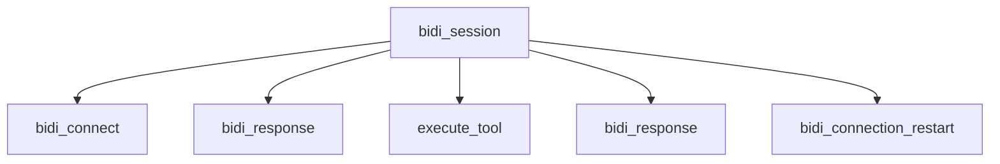

`BidiAgent` sessions differ from request/response agents in structure: a single
connection spans multiple model responses, tool calls, and possibly reconnects, and a
response can end because the user interrupted it rather than because the model
finished. This page covers the traces, metrics, and logs specific to bidirectional
streaming. For general tracing, metrics, and logging concepts shared by every Strands
agent, see [Traces](../../observability-evaluation/traces.md),
[Metrics](../../observability-evaluation/metrics.md), and
[Logs](../../observability-evaluation/logs.md).

## Enabling Tracing

:::note[Install OpenTelemetry Dependencies]
To run the Nova Sonic example below and export OTEL data, install both optional dependencies:

```shell
pip install 'strands-agents[bidi,otel]'
```
:::

Tracing configuration is identical to the non-streaming agent. Configure OpenTelemetry
as described in [Traces](../../observability-evaluation/traces.md) and session spans
are produced automatically:

```python
import asyncio

from strands.experimental.bidi import BidiAgent, BidiConnectionStartEvent
from strands.experimental.bidi.models import BidiNovaSonicModel
from strands.telemetry import StrandsTelemetry

strands_telemetry = StrandsTelemetry()
strands_telemetry.setup_otlp_exporter()     # Send spans to an OTLP endpoint
strands_telemetry.setup_console_exporter()  # Print spans to stdout


async def main():
    agent = BidiAgent(
        model=BidiNovaSonicModel(),
        system_prompt="You are a helpful voice assistant.",
        name="Voice Assistant",
    )

    # The session span opens on entry and closes on exit. Receiving the connection
    # event confirms that the provider connection is established and traced.
    async with agent:
        async for event in agent.receive():
            if isinstance(event, BidiConnectionStartEvent):
                break


asyncio.run(main())
```

Endpoints and headers come from the standard OpenTelemetry environment variables:

```bash
# Specify custom OTLP endpoint
export OTEL_EXPORTER_OTLP_ENDPOINT="http://collector.example.com:4318"

# Set default OTLP headers
export OTEL_EXPORTER_OTLP_HEADERS="key1=value1,key2=value2"
```

## Trace Structure

The session span is the parent of bidi response, connection, restart, and tool spans. It
starts a new trace when no recording span is active; when `BidiAgent` runs inside an
instrumented request or custom span, the session span joins that existing trace:



| Span | Covers |
|------|--------|
| `bidi_session` | The whole session, from agent start to agent stop |
| `bidi_connect` | Establishing the model connection |
| `bidi_response` | One response from the model |
| `execute_tool` | One tool call |
| `bidi_connection_restart` | A reconnect after a provider timeout |

Two span names carry a suffix identifying what they cover: `bidi_session <agent name>`
and `execute_tool <tool name>`. The response ID is an attribute rather than part of the
span name to avoid a distinct span name per turn, which fragments aggregation in most
tracing backends.

Response spans and tool spans can overlap in wall-clock time, since the model may keep
streaming audio while a tool call is in progress. Tool spans are children of the
session rather than of the response that requested the tool.

## Captured Attributes

Every span carries `gen_ai.event.start_time`, `gen_ai.event.end_time`, and
`gen_ai.system` set to `strands-agents`, matching the non-streaming agent. Under the
latest semantic conventions, `gen_ai.provider.name` replaces `gen_ai.system`.

| Span | Attribute | Description |
|------|-----------|-------------|
| Session | `gen_ai.operation.name` | `bidi_session` |
| Session | `gen_ai.agent.name` | Name of the agent, defaulting to `Strands Agents` |
| Session | `gen_ai.request.model` | Model ID, when the provider exposes one |
| Session | `gen_ai.agent.tools` | JSON array of tool names registered on the agent |
| Session | `gen_ai.system_instructions` | System prompt, subject to the redaction policy |
| Session | `gen_ai.usage.input_tokens` | Input tokens accumulated across the session |
| Session | `gen_ai.usage.output_tokens` | Output tokens accumulated across the session |
| Session | `gen_ai.usage.total_tokens` | Total tokens accumulated across the session |
| Session | `gen_ai.usage.cache_read_input_tokens` | Cached input tokens read across the session |
| Connection | `gen_ai.operation.name` | `bidi_connect` |
| Connection | `gen_ai.request.model` | Model ID, when the provider exposes one |
| Response | `gen_ai.operation.name` | `bidi_response` |
| Response | `gen_ai.response.id` | Provider-assigned response identifier |
| Response | `gen_ai.response.finish_reason` | Why the response ended |
| Response | `gen_ai.server.time_to_first_audio` | Milliseconds from response start to first audio chunk |
| Restart | `gen_ai.operation.name` | `bidi_connection_restart` |
| Restart | `gen_ai.error.message` | Timeout error that triggered the restart |

Session token counts are written when the session span closes. A session that is still
open has no usage attributes. Zero-valued usage attributes are omitted, so an absent
cache-read attribute means no positive cache-read count was observed; it does not
distinguish "not reported" from "reported as zero."

Use `bidi_connect` to diagnose slow provider setup. If setup fails, both the connection
and session spans close with error status and the exception surfaces to the caller.

`gen_ai.server.time_to_first_audio` is recorded once, on the first audio chunk. A
text-only response has no such attribute. Response finish reasons are:

| Value | Meaning |
|-------|---------|
| `complete` | The model finished the response on its own |
| `interrupted` | The user cut in, or a new response began before this one ended |
| `error` | The model stream raised while the response was open |
| `incomplete` | The session stopped while the response was still open |

`incomplete` is expected when a session ends mid-turn and is not itself an error. A
custom provider may also report `tool_use`; none of the bundled providers do.

A restart span covers the reconnect operation. During this interval, sends wait for
the connection gate to reopen. Check span status, rather than the presence of
`gen_ai.error.message`, to determine whether the restart succeeded. Status `OK` means
the agent reconnected and the session continued.

Tool calls use the same `execute_tool <tool name>` span and attributes as non-streaming
agents. See [Tool-Level Attributes](../../observability-evaluation/traces.md#tool-level-attributes).

### Interruption Events

An interruption is recorded as a `bidi_interruption` event on the session span with an
`interruption.reason` attribute. The interrupted response separately closes with
`gen_ai.response.finish_reason` set to `interrupted`.

To count interruptions, query the session span's `bidi_interruption` events. To find
which response ended, query response spans with an `interrupted` finish reason. Keeping
the event on the session also captures barge-ins between response spans. For detection
and playback behavior, see [Interruptions](interruption.md).

## Inspecting Spans Locally

The console exporter is the fastest way to confirm spans are being produced. A session
that registers two tools and is interrupted mid-response produces the following session
span, with the resource block omitted:

<details>
<summary>Example session span</summary>

```json
{
    "name": "bidi_session Voice Assistant",
    "context": {
        "trace_id": "0xef368de68111d713160d6d38e7a305ff",
        "span_id": "0xa11b2c3d4e5f6789",
        "trace_state": "[]"
    },
    "kind": "SpanKind.INTERNAL",
    "parent_id": null,
    "start_time": "2026-08-10T13:27:25.500000Z",
    "end_time": "2026-08-10T13:27:30.900000Z",
    "status": {
        "status_code": "OK"
    },
    "attributes": {
        "gen_ai.event.start_time": "2026-08-10T13:27:25.500001+00:00",
        "gen_ai.operation.name": "bidi_session",
        "gen_ai.system": "strands-agents",
        "gen_ai.agent.name": "Voice Assistant",
        "gen_ai.request.model": "amazon.nova-2-sonic-v1:0",
        "gen_ai.agent.tools": "[\"get_weather\", \"calculator\"]",
        "gen_ai.system_instructions": "You are a helpful voice assistant.",
        "gen_ai.event.end_time": "2026-08-10T13:27:30.900000+00:00",
        "gen_ai.usage.input_tokens": 120,
        "gen_ai.usage.output_tokens": 64,
        "gen_ai.usage.total_tokens": 184
    },
    "events": [
        {
            "name": "bidi_interruption",
            "timestamp": "2026-08-10T13:27:28.100000Z",
            "attributes": {
                "interruption.reason": "user_speech"
            }
        }
    ],
    "links": []
}
```

</details>

`gen_ai.usage.cache_read_input_tokens` is omitted here because no positive cache-read
count was observed. Zero-valued usage attributes are not exported, so absence does not
distinguish "not reported" from "reported as zero." A single spoken turn within the
same session produces the following child response span:

<details>
<summary>Example response span</summary>

```json
{
    "name": "bidi_response",
    "context": {
        "trace_id": "0xef368de68111d713160d6d38e7a305ff",
        "span_id": "0xce2958bc052dcc39",
        "trace_state": "[]"
    },
    "kind": "SpanKind.INTERNAL",
    "parent_id": "0xa11b2c3d4e5f6789",
    "start_time": "2026-08-10T13:27:26.709677Z",
    "end_time": "2026-08-10T13:27:26.830163Z",
    "status": {
        "status_code": "OK"
    },
    "attributes": {
        "gen_ai.event.start_time": "2026-08-10T13:27:26.709679+00:00",
        "gen_ai.operation.name": "bidi_response",
        "gen_ai.system": "strands-agents",
        "gen_ai.response.id": "resp_01",
        "gen_ai.event.end_time": "2026-08-10T13:27:26.830133+00:00",
        "gen_ai.response.finish_reason": "complete",
        "gen_ai.server.time_to_first_audio": 120
    },
    "events": [],
    "links": []
}
```

</details>

For local trace visualization, follow the shared [Local Development Setup](../../observability-evaluation/traces.md#local-development-setup).
It covers Jaeger and console-exporter setup. See
[Visualization and Analysis](../../observability-evaluation/traces.md#visualization-and-analysis)
for other OpenTelemetry-compatible backends.

## Session Metrics

`BidiAgent` does not produce a metrics summary object. Interruption and reconnect
counts are available through hooks, token usage is available through the event stream,
and response latency is recorded on trace spans.

### Counting Interruptions and Reconnects

Register a hook provider to accumulate session health counters:

```python
import logging

from strands.experimental.hooks.events import (
    BidiAfterConnectionRestartEvent,
    BidiInterruptionEvent,
)
from strands.hooks import HookProvider, HookRegistry

logger = logging.getLogger(__name__)


class SessionStats(HookProvider):
    """Counts barge-ins and reconnects over the life of a session."""

    def __init__(self) -> None:
        self.interruptions = 0
        self.restarts = 0

    def register_hooks(self, registry: HookRegistry) -> None:
        registry.add_callback(BidiInterruptionEvent, self.on_interruption)
        registry.add_callback(BidiAfterConnectionRestartEvent, self.on_restart)

    def on_interruption(self, event: BidiInterruptionEvent) -> None:
        self.interruptions += 1
        logger.info("reason=<%s> | user interrupted the model", event.reason)

    def on_restart(self, event: BidiAfterConnectionRestartEvent) -> None:
        if event.exception is None:
            self.restarts += 1
```

Pass it in with `hooks=[SessionStats()]` when constructing the agent.
`BidiAfterConnectionRestartEvent.exception` is `None` when the reconnect succeeded, so
the check above counts successful recoveries. A rising interruption count typically
indicates responses that run long for a voice interface; a rising reconnect count
indicates sessions frequently reaching provider timeout conditions. The full list of
lifecycle events is in [Hooks](hooks.md).

### Tracking Token Usage per Modality

Traces record aggregate session tokens. The per-modality breakdown is only available on
the event stream:

```python
from strands.experimental.bidi import (
    BidiAgent,
    BidiResponseCompleteEvent,
    BidiUsageEvent,
)


async def track_session(agent: BidiAgent) -> None:
    async for event in agent.receive():
        if isinstance(event, BidiUsageEvent):
            print(
                f"input={event.input_tokens} output={event.output_tokens} "
                f"total={event.total_tokens}"
            )
            for modality in event.modality_details:
                print(
                    f"  {modality['modality']}: "
                    f"in={modality['input_tokens']} out={modality['output_tokens']}"
                )
        elif isinstance(event, BidiResponseCompleteEvent):
            print(f"response {event.response_id} ended: {event.stop_reason}")
            break
```

Typical output for one turn:

```
input=120 output=64 total=184
  text: in=20 out=0
  audio: in=100 out=64
response resp_01 ended: complete
```

`modality_details` is an empty list when the provider does not report a breakdown, so
the loop above is safe on every provider. See [Events](events.md) for the full event
reference.

## Logging

The agent loop logs its own state transitions at `DEBUG`. Enable them to diagnose
behavior the trace does not explain, such as a tool call that never appears to execute:

```python
import logging

logging.getLogger("strands.experimental.bidi").setLevel(logging.DEBUG)
logging.basicConfig(
    format="%(levelname)s | %(name)s | %(message)s",
    handlers=[logging.StreamHandler()],
)
```

A session that starts, calls a tool, and stops logs this:

```
DEBUG | strands.experimental.bidi.agent.agent | context_manager=<enter> | starting agent
DEBUG | strands.experimental.bidi.agent.agent | agent starting
DEBUG | strands.experimental.bidi.agent.loop | agent loop starting
DEBUG | strands.experimental.bidi.agent.loop | model task starting
DEBUG | strands.experimental.bidi.agent.loop | tool_name=<get_weather> | tool execution starting
DEBUG | strands.experimental.bidi.agent.agent | context_manager=<exit> | stopping agent
DEBUG | strands.experimental.bidi.agent.loop | agent loop stopping
```

Audio and transcript chunks are not logged, since a minute of conversation produces
thousands of chunks. For log levels, formatters, and handler configuration, see
[Logs](../../observability-evaluation/logs.md).

## Advanced Configuration

### Redacting the System Prompt

`gen_ai.system_instructions` holds the system prompt verbatim by default. Redaction is
opt-in through the same allowlist that governs the non-streaming agent, configured with
the same `OTEL_SEMCONV_STABILITY_OPT_IN` variable used to enable the latest semantic
conventions (see [Session-Level Attributes](#session-level-attributes)):

```bash
# Redact all sensitive attributes, including the system prompt
export OTEL_SEMCONV_STABILITY_OPT_IN="gen_ai_unredacted_attributes="

# Redact everything sensitive except the system prompt
export OTEL_SEMCONV_STABILITY_OPT_IN="gen_ai_unredacted_attributes=gen_ai.system_instructions"
```

Once the `gen_ai_unredacted_attributes` token is present, any sensitive attribute not
named in the list is exported as `[REDACTED]`. Omitting the token leaves everything
unredacted, which is the default. `gen_ai.system_instructions` is the only bidi-specific
attribute subject to this policy; list multiple attribute names by separating them with
`;` (for example `gen_ai_unredacted_attributes=gen_ai.system_instructions;gen_ai.input.messages`) —
a comma separates opt-in tokens within `OTEL_SEMCONV_STABILITY_OPT_IN` itself and does not
separate entries inside the allowlist.

### Sampling Control

A voice session produces far fewer traces than a chat agent handling the same number of
user turns, since the whole session is one trace. Sample at the trace level with the
standard OpenTelemetry variables:

```bash
# Example: Sample 50% of traces
export OTEL_TRACES_SAMPLER="traceidratio"
export OTEL_TRACES_SAMPLER_ARG="0.5"
```

Because all bidi spans belong to one trace, the trace-level sampling decision keeps or
drops the session and its child spans together. When the session runs inside an existing
trace, it inherits that trace's sampling decision.

## Provider Differences

Providers report streaming lifecycle events differently, which is reflected directly
in the trace:

| Provider | Response spans | Notes |
|----------|-----------------|-------|
| Nova Sonic | One per content block | A single spoken turn can produce several `bidi_response` spans. All but the last close as `interrupted`, and time to first audio re-baselines on each. Count spoken turns from interruption events and finish reasons rather than by counting response spans. No cache tokens or modality breakdown reported. |
| OpenAI Realtime | One per turn | Reports cache read tokens and a modality breakdown when available. |
| Gemini Live | None | Emits no response lifecycle events, so a session produces no `bidi_response` spans. Interruptions, token usage including cache reads, and the modality breakdown are still reported. |

## Best Practices

1. **Monitor time to first audio over session duration**: a long session can be
   healthy; a slow first audio chunk is user-facing latency.
2. **Separate connect latency from response latency**: use `bidi_connect` to isolate
   handshake cost from model response time.
3. **Track reconnects with hooks**: during a reconnect, sends wait for the connection
   gate to reopen. Monitor reconnect frequency to identify sessions that regularly reach
   provider timeout conditions.
4. **Watch the interruption rate**: a rising rate of barge-ins often indicates
   responses that are too long for a voice interface.
5. **Redact the system prompt in production**: session spans carry it verbatim unless
   the unredacted allowlist is configured otherwise.
6. **Correlate the modality breakdown with cost**: audio tokens typically dominate
   voice session cost, and only the event stream reports them separately from text.

## Common Issues and Solutions

| Issue | Solution |
|-------|----------|
| No spans at all | Install the `otel` extra and configure an exporter before agent start |
| No `bidi_response` spans | Expected on Gemini Live, which emits no response lifecycle |
| Session span has no token attributes | The session is still open, or usage was never reported |
| More response spans than spoken turns | Expected on Nova Sonic, one response per content block |
| `gen_ai.system_instructions` reads `[REDACTED]` | Add it to the unredacted allowlist |
| Restart span has an error message but status `OK` | The reconnect succeeded; the message is the timeout that triggered it |

## Next Steps

- [Traces](../../observability-evaluation/traces.md) - Exporters and visualization
- [Logs](../../observability-evaluation/logs.md) - Log levels and handler configuration
- [Events](events.md) - Complete guide to bidirectional streaming events
- [Hooks](hooks.md) - Extend agent functionality with hooks
- [Interruptions](interruption.md) - How barge-in detection works
- [Python API Reference](@api/python/strands.experimental.bidi.agent.agent) - Complete API documentation
