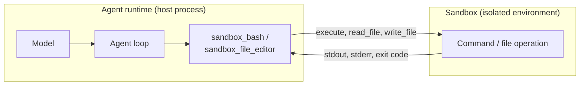

A sandbox is the execution environment where your agent runs commands, executes code, and reads or writes files. When you give an agent a sandbox, the tools that do this work stop touching the host process and route everything through the sandbox instead: a Docker container, a remote host over SSH, or your own backend.

Without a sandbox, an agent that runs shell commands runs them directly on the machine hosting the agent, with that process's full permissions. That is fine for a trusted script on your own laptop. It is a liability the moment the agent acts on untrusted input or runs unattended in production. A sandbox draws the boundary: the agent decides *what* to run, the sandbox decides *where* it runs and what it can reach.

The same sandbox also vends the tools the agent uses to act on it. Attach a Docker sandbox and the agent gains a `sandbox_bash` tool and a `sandbox_file_editor` tool already pointed at that container. You do not wire them up yourself.

## Configuring a Sandbox

You attach a sandbox when you create the agent. The agent registers the sandbox's tools during initialization, so the model can use them on the first turn:

<Tabs>
<Tab label="Python">

```python
from strands import Agent
from strands.sandbox.docker import DockerSandbox

# Point at a running container; the agent's shell and file tools run inside it
sandbox = DockerSandbox(container="agent-workspace", working_dir="/workspace")
agent = Agent(sandbox=sandbox)

agent("Clone the repo at /workspace and run the test suite")
```
</Tab>
<Tab label="TypeScript">

```typescript
--8<-- "user-guide/concepts/sandbox/index_imports.ts:configuring_imports"

--8<-- "user-guide/concepts/sandbox/index.ts:configuring"
```
</Tab>
</Tabs>

When you omit the sandbox, the agent falls back to a host execution environment with no isolation. The fallback exists so sandbox-aware tools work out of the box during development, not as a security boundary. Its deliberately blunt name says so:

<Tabs>
<Tab label="Python">

`NotASandboxLocalEnvironment` runs commands and file operations directly on the host. Reach for an explicit sandbox whenever isolation matters.

```python
from strands import Agent

# No sandbox: command and file tools run on the host with no isolation
agent = Agent()
print(type(agent.sandbox).__name__)

# Typical output:
# NotASandboxLocalEnvironment
```
</Tab>
<Tab label="TypeScript">

In Node.js, omitting the sandbox uses a host execution environment (`NotASandboxLocalEnvironment`). In the browser there is no host default, so reading <Syntax ts="agent.sandbox" plain /> throws until you configure one. Pass `false` to opt out explicitly and keep that intent stable even if the default changes later.

```typescript
--8<-- "user-guide/concepts/sandbox/index_imports.ts:host_default_imports"

--8<-- "user-guide/concepts/sandbox/index.ts:host_default"
```
</Tab>
</Tabs>

## Tools a Sandbox Vends

Every built-in sandbox provides two tools, already bound to that sandbox instance:

| Tool | What the agent does with it |
|------|------------------------------|
| `sandbox_bash` | Runs a shell command inside the sandbox and reads the output |
| `sandbox_file_editor` | Views, creates, and edits files in the sandbox filesystem |

These are the same building blocks as the standalone bash and file editor tools, with one difference: their operations execute inside the sandbox, and their descriptions name the target so the model knows where it is working ("Runs in Docker container ...").

Registration follows one rule worth knowing. If you have already registered a tool with the same name, the sandbox's version is skipped and yours wins. That lets you override `sandbox_bash` with a stricter variant without fighting the sandbox:

<Tabs>
<Tab label="Python">

```python
from strands import Agent
from strands.sandbox.docker import DockerSandbox
from strands.vended_tools import make_bash

sandbox = DockerSandbox(container="agent-workspace")

# A read-only bash under the same name the sandbox uses
locked_bash = make_bash(
    sandbox=sandbox,
    name="sandbox_bash",
    description="Run read-only shell commands. Do not modify files.",
)

# The agent keeps locked_bash; the sandbox's own sandbox_bash is skipped
agent = Agent(sandbox=sandbox, tools=[locked_bash])
```
</Tab>
<Tab label="TypeScript">

```typescript
--8<-- "user-guide/concepts/sandbox/index_imports.ts:override_tool_imports"

--8<-- "user-guide/concepts/sandbox/index.ts:override_tool"
```
</Tab>
</Tabs>

## Available Sandboxes

The SDK ships two concrete sandboxes. Both run commands by spawning a process on the host that targets the isolated environment, so neither needs an in-process runtime for the container or remote machine.

| Sandbox | Runs commands in | Import from |
|---------|------------------|-------------|
| Docker | A running Docker container, via `docker exec` | <Syntax py="strands.sandbox.docker" ts="@strands-agents/sdk/sandbox/docker" plain /> |
| SSH | A remote host, via OpenSSH | <Syntax py="strands.sandbox.ssh" ts="@strands-agents/sdk/sandbox/ssh" plain /> |

### Docker

Use the Docker sandbox when you want the agent's work confined to a container you control. You start and manage the container; the sandbox runs commands in it with `docker exec`.

<Tabs>
<Tab label="Python">

```python
from strands import Agent
from strands.sandbox.docker import DockerSandbox

# working_dir and user are optional; omit them to use the container's defaults
sandbox = DockerSandbox(
    container="agent-workspace",
    working_dir="/workspace",
    user="1000:1000",
)
agent = Agent(sandbox=sandbox)
```
</Tab>
<Tab label="TypeScript">

```typescript
--8<-- "user-guide/concepts/sandbox/index_imports.ts:docker_imports"

--8<-- "user-guide/concepts/sandbox/index.ts:docker"
```
</Tab>
</Tabs>

### SSH

Use the SSH sandbox to run the agent's work on a remote host. Each command spawns a fresh `ssh` process in batch mode, so authentication must be key-based: interactive password prompts are disabled.

<Tabs>
<Tab label="Python">

```python
from strands import Agent
from strands.sandbox.ssh import SshSandbox

sandbox = SshSandbox(
    host="ubuntu@10.0.1.5",
    working_dir="/home/ubuntu/workspace",
    identity_file="~/.ssh/agent_key",
)
agent = Agent(sandbox=sandbox)
```

By default the SSH sandbox trusts a host key on first connect and rejects it if it later changes. It also rejects SSH options outside a vetted allowlist. Both guards can be loosened (`allow_unknown_hosts`, `allow_unsafe_ssh_options`) when you understand the tradeoff.
</Tab>
<Tab label="TypeScript">

```typescript
--8<-- "user-guide/concepts/sandbox/index_imports.ts:ssh_imports"

--8<-- "user-guide/concepts/sandbox/index.ts:ssh"
```

By default the SSH sandbox trusts a host key on first connect and rejects it if it later changes. It also rejects SSH options outside a vetted allowlist. Both guards can be loosened (<Syntax ts="allowUnknownHosts" plain />, <Syntax ts="allowUnsafeSshOptions" plain />) when you understand the tradeoff.
</Tab>
</Tabs>

## Working With a Sandbox Directly

The sandbox is not only for the model. You can drive it from your own code through <Syntax py="agent.sandbox" ts="agent.sandbox" />, which is useful for setup, verification, and teardown around an agent run.

<Tabs>
<Tab label="Python">

```python
import asyncio

from strands import Agent
from strands.sandbox.docker import DockerSandbox

agent = Agent(sandbox=DockerSandbox(container="agent-workspace", working_dir="/workspace"))

async def main():
    # Seed an input file, let the agent work, then read the result back
    await agent.sandbox.write_text("/workspace/input.csv", "id,value\n1,42\n")

    agent("Summarize /workspace/input.csv and write the summary to /workspace/out.txt")

    result = await agent.sandbox.execute("cat /workspace/out.txt")
    print(result.exit_code, result.stdout)

asyncio.run(main())
```

The file helpers come in two forms. `read_file` and `write_file` move raw `bytes` for binary content; `read_text` and `write_text` wrap them with UTF-8 encoding for the common case. `list_files` returns `FileInfo` entries, and `remove_file` deletes one.
</Tab>
<Tab label="TypeScript">

```typescript
--8<-- "user-guide/concepts/sandbox/index_imports.ts:direct_use_imports"

--8<-- "user-guide/concepts/sandbox/index.ts:direct_use"
```

The file helpers come in two forms. <Syntax ts="readFile" plain /> and <Syntax ts="writeFile" plain /> move raw bytes for binary content; <Syntax ts="readText" plain /> and <Syntax ts="writeText" plain /> wrap them with UTF-8 encoding for the common case. <Syntax ts="listFiles" plain /> returns `FileInfo` entries, and <Syntax ts="removeFile" plain /> deletes one.
</Tab>
</Tabs>

### Streaming Output

`execute` waits for the command to finish and returns the full result. When you want output as it arrives, for a long-running build or a live log, use the streaming form. It yields stdout and stderr chunks as they are produced, then a final result with the exit code:

<Tabs>
<Tab label="Python">

```python
import asyncio

from strands.sandbox import ExecutionResult, StreamChunk

async def main():
    async for chunk in agent.sandbox.execute_streaming("npm run build"):
        if isinstance(chunk, StreamChunk):
            print(chunk.data, end="")
        elif isinstance(chunk, ExecutionResult):
            print(f"\nexit code: {chunk.exit_code}")

asyncio.run(main())
```
</Tab>
<Tab label="TypeScript">

```typescript
--8<-- "user-guide/concepts/sandbox/index_imports.ts:streaming_imports"

--8<-- "user-guide/concepts/sandbox/index.ts:streaming"
```
</Tab>
</Tabs>

## How It Works

The agent process and the sandbox are separate. The agent runs the model, holds conversation state, and decides which tools to call. The sandbox is the environment those tool calls reach into. A sandbox-aware tool does not run the command itself: it hands the command to the sandbox and waits for the result.



This separation is why a custom sandbox is small to write. The tools, the agent loop, and the model do not change when you swap environments. Only the transport between the tool and the execution environment changes, and that lives behind a handful of methods on the `Sandbox` interface.

## Building a Custom Sandbox

Write a custom sandbox when your execution environment is not a local Docker container or an SSH host: a remote code-execution API, a microVM, or a managed runtime. You have two starting points.

Most backends run a POSIX shell, so start from `PosixShellSandbox`. It implements code execution and every file operation in terms of shell commands, which means you implement exactly one method: <Syntax py="execute_streaming" ts="executeStreaming" />. Build the command line for your backend, run it, and yield the output.

<Tabs>
<Tab label="Python">

```python
import asyncio
from collections.abc import AsyncGenerator
from typing import Any

from strands.sandbox import ExecutionResult, PosixShellSandbox, StreamChunk

class FirecrackerSandbox(PosixShellSandbox):
    """Run commands in a Firecracker microVM addressed by id."""

    def __init__(self, vm_id: str) -> None:
        self.vm_id = vm_id

    async def execute_streaming(
        self,
        command: str,
        *,
        timeout: float | None = None,
        cwd: str | None = None,
        env: dict[str, str] | None = None,
        **kwargs: Any,
    ) -> AsyncGenerator[StreamChunk | ExecutionResult, None]:
        proc = await asyncio.create_subprocess_exec(
            "fc-exec", self.vm_id, "sh", "-c", command,
            stdout=asyncio.subprocess.PIPE,
            stderr=asyncio.subprocess.PIPE,
        )
        stdout, stderr = await proc.communicate()
        if stdout:
            yield StreamChunk(data=stdout.decode(), stream_type="stdout")
        if stderr:
            yield StreamChunk(data=stderr.decode(), stream_type="stderr")
        yield ExecutionResult(
            exit_code=proc.returncode or 0,
            stdout=stdout.decode(),
            stderr=stderr.decode(),
        )
```

The inherited methods now route through your `execute_streaming`: `execute_code` base64-encodes the source and pipes it to an interpreter, and the file operations run `cat`, `mkdir`, `ls`, and `rm` for you.
</Tab>
<Tab label="TypeScript">

```typescript
--8<-- "user-guide/concepts/sandbox/index_imports.ts:custom_posix_imports"

--8<-- "user-guide/concepts/sandbox/index.ts:custom_posix"
```

The inherited methods now route through your <Syntax ts="executeStreaming" plain />: <Syntax ts="executeCode" plain /> base64-encodes the source and pipes it to an interpreter, and the file operations run `cat`, `mkdir`, `ls`, and `rm` for you.
</Tab>
</Tabs>

Extend the `Sandbox` base directly only when your backend is not shell-based, for example an HTTP code-execution API that returns structured results and generated files. Then you implement all six operations yourself: the two streaming methods plus <Syntax py="read_file" ts="readFile" />, <Syntax py="write_file" ts="writeFile" />, <Syntax py="remove_file" ts="removeFile" />, and <Syntax py="list_files" ts="listFiles" />.

### Vending Tools From a Custom Sandbox

To give your sandbox the same `sandbox_bash` and `sandbox_file_editor` tools the built-in sandboxes provide, override <Syntax py="get_tools" ts="getTools" /> and return tools bound to it. The factories take the sandbox instance, so the tools route through it:

<Tabs>
<Tab label="Python">

```python
from strands.types.tools import AgentTool
from strands.vended_tools import make_bash, make_file_editor

class FirecrackerSandbox(PosixShellSandbox):
    # ... execute_streaming as above ...

    def get_tools(self) -> list[AgentTool]:
        return [
            make_file_editor(sandbox=self, name="sandbox_file_editor"),
            make_bash(sandbox=self, name="sandbox_bash"),
        ]
```
</Tab>
<Tab label="TypeScript">

```typescript
--8<-- "user-guide/concepts/sandbox/index_imports.ts:custom_tools_imports"

--8<-- "user-guide/concepts/sandbox/index.ts:custom_tools"
```
</Tab>
</Tabs>

## Security

A sandbox is a boundary only when the environment behind it is isolated. The built-in Docker and SSH sandboxes confine the agent to a container or a remote host you control. The host fallback (`NotASandboxLocalEnvironment`) does not isolate anything: commands run with the full permissions of the agent process.

:::caution[The default is not a sandbox]
Omitting a sandbox runs the agent's command and file tools directly on the host. Treat this as convenience for trusted, local development only. For untrusted input or unattended production runs, pass an explicit Docker or SSH sandbox and scope the container or remote account to the least privilege the task needs.
:::

The shell-based sandboxes validate inputs that would otherwise let a command break out of its intended context: interpreter names and environment variable names are checked against strict patterns, and source code is transported base64-encoded rather than interpolated into a shell string. The SSH sandbox additionally pins host keys on first use and gates SSH options behind an allowlist. These are defense in depth, not a license to feed the sandbox untrusted commands without thought. See [Responsible AI](../../safety-security/responsible-ai.md) for the broader shared-responsibility model.

## See also

- [Vended Tools](../tools/vended-tools.mdx): the standalone bash and file editor tools the sandboxes bind
- [Tools Overview](../tools/index.mdx): how tools extend agent capabilities
- [Interrupts](../interrupts.mdx): require human approval before sensitive sandbox operations
- [Responsible AI](../../safety-security/responsible-ai.md): the shared-responsibility model for tool execution
