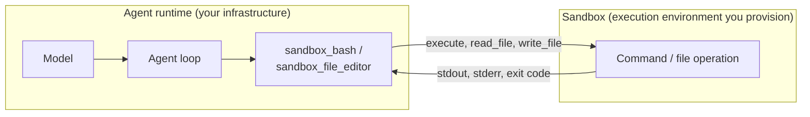

A sandbox is the interface an agent uses to reach an execution environment you provision. When you attach one, the tools that run commands, execute code, and read or write files stop touching the host process and route every operation through the sandbox instead: a Docker container, a remote host over SSH, or a backend you write.

The name invites a misread worth clearing up first. A sandbox does not sandbox the agent. The agent process, the model calls, and the agent loop keep running wherever you started them, with whatever permissions that process already has. What the sandbox changes is the destination of tool operations: the agent decides *what* to run, the sandbox decides *where* it runs. The isolation you get is the isolation of the environment you point it at, no more and no less. A `DockerSandbox` aimed at a privileged container with the host filesystem mounted is not a boundary. The same interface aimed at a locked-down container is.

The same sandbox also vends the tools the agent uses to act on it. Attach a Docker sandbox and the agent gains a `sandbox_bash` tool and a `sandbox_file_editor` tool already pointed at that container. You do not wire them up yourself.

## Two Ways to Run an Agent With a Sandbox

There are two distinct patterns for combining an agent with a sandbox, and they answer different questions. OpenAI's [sandbox agents guide](https://developers.openai.com/api/docs/guides/agents/sandboxes) frames the same split as the boundary between the *harness* (the control plane that owns the agent loop, model calls, and tool routing) and *compute* (the execution plane where model-directed work runs).

The first pattern is **the agent in a sandbox**. The runtime itself is the isolated environment: a container, a GitHub Action, a microVM with scoped credentials. The agent makes changes locally, and the worst it can do is bounded by that environment. This needs no SDK feature. Your deployment definition is the sandbox.

The second pattern is **a sandbox for the agent**, and it is what this feature provides. The agent runtime stays where it is, in your trusted infrastructure, while command and file operations are routed into a separate execution environment. The control plane (model calls, conversation state, tool routing, approvals) stays put; only the execution plane moves. That separation lets you keep credentials, audit logs, and human review outside the environment where model-directed commands actually run.

Reach for a Strands sandbox when you want that second pattern: the agent's reasoning runs in one place, and its commands and file edits run somewhere you have deliberately confined.

## Configuring a Sandbox

You attach a sandbox when you create the agent. The agent registers the sandbox's tools during initialization, so the model can use them on the first turn:

<Tabs>
<Tab label="Python">

```python
from strands import Agent
from strands.sandbox.docker import DockerSandbox

# Point at a running container; the agent's shell and file tools run inside it
sandbox = DockerSandbox(container="agent-workspace", working_dir="/workspace")
agent = Agent(sandbox=sandbox)

agent("Clone the repo at /workspace and run the test suite")
```
</Tab>
<Tab label="TypeScript">

```typescript
--8<-- "user-guide/concepts/sandbox/index_imports.ts:configuring_imports"

--8<-- "user-guide/concepts/sandbox/index.ts:configuring"
```
</Tab>
</Tabs>

When you omit the sandbox, the agent falls back to a host execution environment with no isolation. The fallback exists so sandbox-aware tools work out of the box during development, not as a security boundary. Its deliberately blunt name says so:

<Tabs>
<Tab label="Python">

`NotASandboxLocalEnvironment` runs commands and file operations directly on the host. Reach for an explicit sandbox whenever isolation matters.

```python
from strands import Agent

# No sandbox: command and file tools run on the host with no isolation
agent = Agent()
print(type(agent.sandbox).__name__)

# Typical output:
# NotASandboxLocalEnvironment
```
</Tab>
<Tab label="TypeScript">

In Node.js, omitting the sandbox uses a host execution environment (`NotASandboxLocalEnvironment`). In the browser there is no host default, so reading <Syntax ts="agent.sandbox" plain /> throws until you configure one. Pass `false` to opt out explicitly and keep that intent stable even if the default changes later.

```typescript
--8<-- "user-guide/concepts/sandbox/index_imports.ts:host_default_imports"

--8<-- "user-guide/concepts/sandbox/index.ts:host_default"
```
</Tab>
</Tabs>

## Tools a Sandbox Vends

Every built-in sandbox provides two tools, already bound to that sandbox instance:

| Tool | What the agent does with it |
|------|------------------------------|
| `sandbox_bash` | Runs a shell command inside the sandbox and reads the output |
| `sandbox_file_editor` | Views, creates, and edits files in the sandbox filesystem |

These are the same building blocks as the standalone bash and file editor tools, with one difference: their operations execute inside the sandbox, and their descriptions name the target so the model knows where it is working ("Runs in Docker container ...").

Registration follows one rule worth knowing. If you have already registered a tool with the same name, the sandbox's version is skipped and yours wins. That lets you override `sandbox_bash` with a stricter variant without fighting the sandbox:

<Tabs>
<Tab label="Python">

```python
from strands import Agent
from strands.sandbox.docker import DockerSandbox
from strands.vended_tools import make_bash

sandbox = DockerSandbox(container="agent-workspace")

# A read-only bash under the same name the sandbox uses
locked_bash = make_bash(
    sandbox=sandbox,
    name="sandbox_bash",
    description="Run read-only shell commands. Do not modify files.",
)

# The agent keeps locked_bash; the sandbox's own sandbox_bash is skipped
agent = Agent(sandbox=sandbox, tools=[locked_bash])
```
</Tab>
<Tab label="TypeScript">

```typescript
--8<-- "user-guide/concepts/sandbox/index_imports.ts:override_tool_imports"

--8<-- "user-guide/concepts/sandbox/index.ts:override_tool"
```
</Tab>
</Tabs>

## How It Works

The agent process and the sandbox are separate. The agent runs the model, holds conversation state, and decides which tools to call. The sandbox is the environment those tool calls reach into. A sandbox-aware tool does not run the command itself: it hands the command to the sandbox and waits for the result.



This is the harness-and-compute split made concrete. The model, the agent loop, and conversation state are the control plane and stay in your runtime. The command and file operations are the execution plane and run in the sandbox. Only the transport between a tool and the environment changes when you swap sandboxes, which is why a custom sandbox is small to write: it lives behind a handful of methods on the `Sandbox` interface.

## Security

A sandbox is a boundary only when the environment behind it is isolated. This is the part the name obscures, so it is worth stating plainly: the sandbox interface routes the agent's command and file operations into an environment, but it does not create the isolation. The guarantees you get are entirely the guarantees of the environment you provisioned and pointed it at.

A Docker sandbox aimed at a container running as root, with the host Docker socket mounted, gives the agent a path to the host. The same interface aimed at a rootless container with dropped capabilities and no network is a real boundary. The interface is identical; the security is not. Scope the container or the remote account to the least privilege the task needs, and treat that configuration as the actual control.

:::caution[The default is not a sandbox]
Omitting a sandbox runs the agent's command and file tools directly on the host with the full permissions of the agent process. Treat this as convenience for trusted, local development only. For untrusted input or unattended production runs, pass an explicit Docker or SSH sandbox and confine the environment behind it.
:::

The built-in sandboxes add defense in depth on top of whatever you configure, not in place of it. They validate inputs that would otherwise let a command break out of its intended context, and the SSH sandbox pins host keys and gates SSH options behind an allowlist. Those guards are detailed alongside each sandbox in [Available Sandboxes](./available-sandboxes.mdx). They reduce the blast radius of a mistake; they do not make an unconfined environment safe. See [Responsible AI](../../safety-security/responsible-ai.md) for the broader shared-responsibility model.

## Next Steps

- [Available Sandboxes](./available-sandboxes.mdx): the built-in Docker and SSH sandboxes, and driving a sandbox from your own code
- [Building a Custom Sandbox](./custom-sandbox.mdx): target a backend the built-ins do not cover, and vend its tools
- [Vended Tools](../tools/vended-tools.mdx): the standalone bash and file editor tools the sandboxes bind
- [Responsible AI](../../safety-security/responsible-ai.md): the shared-responsibility model for tool execution
