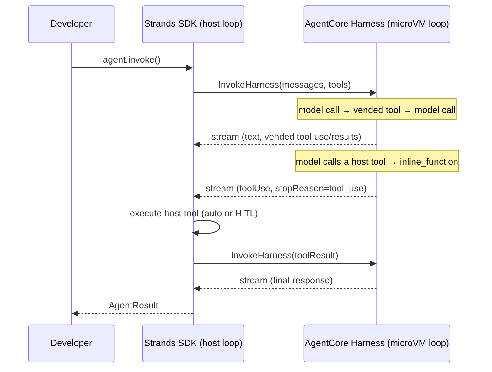

# AgentCore Harness as a Strands Model Provider

**Status**: Proposed

**Date**: 2026-06-29

**Issue**: [Prototype PR #2632](https://github.com/strands-agents/harness-sdk/pull/2632)

**Scope**: Both Python and TypeScript SDKs

## Table of Contents

- [Context](#context)
- [Proposal](#proposal)
  - [How it Works](#how-it-works)
  - [Translating the Call](#translating-the-call)
  - [Tools](#tools)
  - [Context and Memory](#context-and-memory)
  - [Hooks](#hooks)
- [Developer Experience](#developer-experience)
- [Proposed AgentCore Changes](#proposed-agentcore-changes)
- [Alternative Implementations](#alternative-implementations)
- [Consequences](#consequences)
- [Open Questions](#open-questions)
- [Willingness to Implement](#willingness-to-implement)
- [Appendix](#appendix)

## Context

Taking agents from prototype to production is a major focus across the industry, and this is exactly where teams are getting stuck today. "Managed agent" platforms have emerged as an answer: you hand the provider your agent's definition and it runs the loop for you, on production infrastructure you don't operate. 

But when it comes to developers, these managed platforms all come with a tradeoff: the rich, extensible SDK must be left behind for raw API calls and low-level plumbing. An intuitive toolkit for building agents, OR the infrastructure that makes production possible... why should you have to choose?

[AgentCore Harness](https://docs.aws.amazon.com/bedrock-agentcore/latest/devguide/harness.html) has solved the hard infrastructure problem through microVM isolation, persistent memory, identity, observability and more for agents running in production. Developer experience is [Strands](https://strandsagents.com/)' calling card: typed streaming, hooks, multi-agent orchestration, and overall an intuitive framework that developers already know well.

In short: developers already build with the Strands SDK, and the same framework is already running their agent in production (Harness). It's time to put the two pieces together.

## Proposal

We introduce a new `Model` provider: `AgentCoreHarness`. Developers shift an agent from local execution to managed infrastructure by changing one parameter.

### How it Works

The core of the agent loop runs inside the microVM, not on the host. On each turn, the host issues a single `InvokeHarness` request, and the Harness runs the real loop (calling the model, executing tools) while streaming the result back.



The host loop is a thin shell around this: it forwards the turn, relays the streamed events, and steps in only when a tool must run on the host. How tools are split between the microVM and the host is covered in [Tools](#tools) below.

### Translating the Call

The provider turns each turn of the Strands agent loop into one `InvokeHarness` request and maps the response stream back to standard model events.

Almost everything in the request comes from the `AgentConfig` the developer already writes: the messages, system prompt, tools, and the model with its inference parameters. The provider itself adds only what identifies the managed agent to run, a `harnessArn` and a `sessionId`.

| `InvokeHarness` field | From `AgentConfig` (unchanged) | New on `AgentCoreHarness` config |
|---|---|---|
| `messages` | ✓ conversation messages | — |
| `systemPrompt` | ✓ `systemPrompt` | — |
| `tools` | ✓ `tools` (classified, see [Tools](#tools)) | — |
| `model`, `maxTokens`, `temperature`, `topP` | ✓ model config (Bedrock / OpenAI / Gemini / LiteLLM), carrying its own inference parameters | — |
| `runtimeSessionId` | — | ✓ |
| `harnessArn` | — | ✓ |

The streamed response (message starts, content block deltas, tool-use and tool-result blocks, stop reasons, and usage) maps one-to-one onto the Strands model event types the agent loop already consumes. The full field-level mapping can be found in the [Appendix](#appendix).

The Harness exposes further optional overrides which can be set via the provider config as well: per-user memory scoping (`actorId`), a named endpoint/version (`qualifier`), microVM-loaded skills, and the loop's safety limits (`allowedTools`, `maxIterations`, `timeoutSeconds`). These default sensibly and most developers never set them; the full set can also be found in the [Appendix](#appendix).

### Tools

Both custom and vended tools are passed to the Harness through the same `tools` array, but they run in two different places.

**Custom tools** are the developer's own `tool()` functions, defined exactly as always: a schema and a callback that runs on the host.

```typescript
const getWeather = tool({
  name: 'get_weather',
  inputSchema: z.object({ city: z.string() }),
  callback: async ({ city }) => fetchWeather(city),   // runs on the host
})
```

The provider implementation translates these to `inline_function` definitions (name, description, schema, but no implementation). When the model calls one, the Harness pauses and hands the call back to the host; the host runs the callback (automatically or with a human in the loop), and a follow-up request resumes the loop with the result automatically.

**Vended tools** carry no callback. They are references to capabilities the Harness runs itself in the microVM (code interpreter, browser, gateway, remote MCP), added with helpers like `codeInterpreter()` and `browser()` (see [Appendix](#appendix)).

Each helper returns nothing more than a configuration object naming the capability, which the provider passes straight through into the `InvokeHarness` request; the Harness runs it in the sandbox and streams the call and result back.

```typescript
const agent = new Agent({
  model: new AgentCoreHarness({ harnessArn, sessionId }),
  tools: [
    getWeather,          // custom → inline_function, runs on the host
    codeInterpreter(),   // vended → runs in the microVM
    browser(),           // vended → runs in the microVM
  ],
})
```

### Context and Memory

The developer can choose how conversation context and memory are managed: let the Harness handle it, or bring their own. The `stateful` flag on the provider selects between the two. 

`stateful` is an existing Strands flag (server-stateful providers like the Responses API already use it) and is purely an SDK-side switch. It controls whether the SDK keeps the conversation history and sends it each turn, or clears it and lets the Harness rebuild context server-side. 

**Let the Harness manage it (`stateful: true`, the default)**

Use this when the harness is deployed with memory enabled. 

The Harness owns conversation state. It persists each turn server-side by `sessionId`, reloads history on the next invocation, and manages context and long-term memory itself, scoped per user with `actorId`. The provider sends only the new message each turn and clears local history; the developer configures nothing.

**Bring your own (`stateful: false`)**

Use this when the harness is deployed with memory disabled, so context is managed only on the host.

The host owns conversation state, exactly as it does for a local agent. The agent's Strands conversation manager, context offloader, and compression tools run on the host and decide what the model sees each turn (trimming, summarizing, or offloading history), and the provider sends that host-managed context to the Harness. This is the path for developers who want Strands' context primitives instead of the Harness's built-in management.

### Hooks

All the same hook events still fire and stream to the host, whether the work ran on the host or inside the microVM. A hook can fully intervene in work run on the host, but can only observe work the microVM has already done (and "react" to it on the host side).

**Actionable (host work):**
- Tool-call hooks on custom tools: approve, cancel, rewrite input, swap the tool, or pause for human-in-the-loop
- `BeforeModelCallEvent` / `AfterModelCallEvent`, bracketing each `InvokeHarness` request

**Observe-only (microVM work):**
- The model's streamed output, content blocks, and messages
- Vended tool calls and their results (browser, code interpreter, gateway, remote MCP)

Logging, tracing, and metrics therefore cover the whole agent, while interception applies only to the custom tools the host runs. We also propose `Before/AfterHarnessInvokeEvent` to bracket each `InvokeHarness` request explicitly, rather than overloading the model-call hooks.

---

## Developer Experience

A local agent runs the loop on the host:

```typescript
import { Agent, BedrockModel } from '@strands-agents/sdk'

const agent = new Agent({
  model: new BedrockModel(),
  systemPrompt,
})
```

Swapping the model to `AgentCoreHarness` moves the same agent into a managed microVM. Nothing else changes:

```typescript
import { Agent } from '@strands-agents/sdk'
import { AgentCoreHarness } from '@bedrock-agentcore/sdk'

const agent = new Agent({
  model: new AgentCoreHarness({ harnessArn, sessionId }),
  systemPrompt,
})
```

The full agent is defined through the Strands interface developers already use, including a mix of vended tools and custom tools that run on the host:

```typescript
import { Agent, tool } from '@strands-agents/sdk'
import { AgentCoreHarness, codeInterpreter, browser, remoteMcp } from '@bedrock-agentcore/sdk'

const getWeather = tool({ /* ... */ })

const agent = new Agent({
  model: new AgentCoreHarness({ harnessArn, sessionId }),
  systemPrompt,
  tools: [
    getWeather,                        // custom tool, runs on the host (automated or HITL)
    codeInterpreter(),                 // sandboxed code execution in the microVM
    browser(),                         // cloud browser in the microVM
    remoteMcp({ url: 'https://...' }), // remote MCP server, connected from the microVM
  ],
})
```

And it doesn't need to stop there. Developers can continue building up the harness around their agent, taking advantage of Strands' hooks, plugins and other mechanisms with the assurance that their agent loop and execution lives in a secure sandboxed environment.


## Proposed AgentCore Changes

The provider works against `InvokeHarness` as it exists today. The item below is about smoothing the iterate-from-the-SDK experience, not enabling the integration.

### Provision the execution role for the full tool surface up front.** 

The default harness execution role already covers Bedrock model invocation and the built-in browser and code interpreter, so those vended tools work immediately. Other capabilities each require an additional statement on the execution role: AgentCore Gateway, custom browser or code-interpreter resources, non-Bedrock model providers (which need API-key credential access), and skills fetched from S3 or Git. Adding one today means editing the role and re-running `agentcore deploy`. 

If the role were provisioned with the broader permission set at creation, a developer could add or swap any of these purely through the Strands `AgentConfig`, passing them on each `InvokeHarness` call, without redeploying. This is what makes the "change the agent in code, not in config" experience hold for the full tool surface: deploy once, then iterate entirely from the SDK.


## Alternative Implementations

### 1. A dedicated `HarnessAgent` class

A purpose-built `Agent` subclass could expose harness parameters as first-class arguments and handle context and memory coordination across the host/microVM directly (rather than leveraging the stateful flag).

```typescript
const agent = new HarnessAgent({
  harnessArn,
  sessionId,
  model: { provider: 'bedrock', modelId: '...' },
  tools: [getWeather, codeInterpreter()],
})
```

- **Pro:** not bound by the `Model` interface's `stream()` contract, so it could expose harness-native capabilities a model provider cannot: dedicated methods for session control, filesystem and command access, or live browser interaction, plus per-invocation harness arguments as first-class parameters.
- **Pro:** ability to evolve class separately from model providers
- **Con:** more surface to build and own than a thin provider, and it gives up the one-parameter swap, since adopting it means switching to a new agent type rather than changing the model.

This is a natural evolution if richer harness-native control is needed. The provider is the right first step: it delivers the core managed experience immediately and with the smallest change to existing code.

### 2. A `ManagedHarness` plugin instead of a model provider

The Harness integration could be a `Plugin` that intercepts the model call and routes it to `InvokeHarness`, leaving the agent with no model of its own.

```typescript
new Agent({
  plugins: [new ManagedHarness({ harnessArn, sessionId })],
  tools: [getWeather, codeInterpreter()],
})
```

- **Pro:** harness parameters can be set per invocation through `invocationState`, not just statically on a constructor.
- **Con:** the `Agent` must support construction with no `model`, a structural change to a core contract, since the plugin hijacks inference.
- **Con:** configuration splits across the plugin and the agent, and a plugin that silently replaces the model is a surprising mental model for something that is, conceptually, just where inference happens.

### 3. Reuse the existing OpenAI Responses provider

Strands already has an `OpenAIModel` in Responses mode that can target the Bedrock Mantle endpoint, which supports stateful conversations and server-side tools through Lambda or AgentCore Gateway.

```typescript
new Agent({
  model: new OpenAIModel({
    api: 'responses',
    stateful: true,
    baseURL: 'https://bedrock-mantle.us-west-2.api.aws/v1',
    modelId: 'openai.gpt-oss-120b',
  }),
})
```

- **Pro:** no new code; an existing provider already speaks a stateful, server-side-tool API.
- **Con:** it is a different system. Mantle Responses offers stateful inference and server-side tools, but not the Harness agent loop: no vended browser or code interpreter, no skills, no managed or bring-your-own memory, no microVM filesystem, no inline-function human-in-the-loop, no mid-session model switching.
- **Con:** it cannot emit `InvokeHarness`, so it delivers a thin slice of the value and none of what makes the Harness a managed agent.

## Consequences

### What becomes easier

- Moving an agent from local execution to managed microVM infrastructure becomes a one-parameter change, with the rest of the `AgentConfig` (tools, system prompt, hooks, multi-agent setup) unchanged.
- Developers reach the full Harness surface (vended browser, code interpreter, gateway, remote MCP, skills, managed memory) through the Strands interface they already know, instead of hand-writing `InvokeHarness` calls and parsing the event stream.
- AgentCore gains an SDK entry point: a developer already in Strands can adopt managed infrastructure without leaving the framework.

### What becomes harder or requires attention

- The `stateful` flag must match how the harness was deployed (memory enabled vs. disabled). The SDK cannot verify this, so a mismatch silently manages context twice or loses it.
- Per-invocation control of harness parameters is not available until `invocationState` is plumbed into the provider (see [Open Questions](#open-questions)).
- The provider's behavior depends on harness-side details the SDK cannot see (the deployed memory configuration, the internal loop's streaming granularity), which need validation against a live harness.

### Migration

No migration is required. The provider is additive: existing agents and the other model providers are unaffected.

## Open Questions

- **Provider location and ownership**: Should `AgentCoreHarness` live in the Strands SDK alongside the other providers, or in the AgentCore SDK? As a thin `Model` provider it could be owned and maintained by the AgentCore team in their own SDK, matching how the integration is positioned. Living in Strands gives a single import and keeps it beside the other providers. (A `HarnessAgent` or plugin, by contrast, would more naturally live in Strands core.)

- **Stateless invocation with memory disabled**: When a harness is deployed with memory disabled, does `InvokeHarness` reason purely over the messages the client sends each turn, with no server-side history reload? The host-owns-context mode (`stateful: false`) depends on this being true. This is the key behavior for AgentCore to confirm.

- **Exposing the microVM as a Strands `Sandbox`**: Strands tools like `AgentSkills` read from a pluggable `Sandbox` rather than the local filesystem. A `Sandbox` backed by the harness microVM would let those tools operate directly on the microVM's filesystem, unifying host-side and microVM-side skills (and filesystem and command access) under one interface. This would be distinct from the in-progress `AgentCoreSandbox`, which wraps the standalone AgentCore Code Interpreter; a harness `Sandbox` would instead wrap the running harness session. Worth exploring as a follow-on.

- **Per-invocation harness overrides**: The `Model` `stream()` contract does not receive `invocationState`, so harness parameters are static per agent today. Plumbing `invocationState` into the provider (or the proposed harness-invoke hooks) would allow per-call overrides such as `actorId` or `qualifier`.

## Willingness to Implement

Yes!

---
## Appendix

<details>
<summary><code>AgentCoreHarnessConfig</code></summary>

```typescript
interface AgentCoreHarnessConfig {
  // Required: identifies the managed agent and conversation
  harnessArn: string
  sessionId: string

  // Model and inference parameters (discriminated by provider)
  model?:
    | { provider: 'bedrock'; modelId: string }
    | { provider: 'openai'; modelId: string; apiKeyArn: string }
    | { provider: 'gemini'; modelId: string; apiKeyArn: string }
    | { provider: 'litellm'; modelId: string; apiBase?: string; apiKeyArn?: string }
  maxTokens?: number
  temperature?: number
  topP?: number

  // Context ownership: true (Harness manages) or false (host manages). Default true.
  stateful?: boolean

  // Optional overrides (default sensibly; most agents omit these)
  actorId?: string         // per-user memory scoping
  runtimeUserId?: string
  qualifier?: string       // named harness endpoint / version
  skills?: HarnessSkill[]   // microVM-loaded skills (Git / S3 / catalog)
  allowedTools?: string[]
  maxIterations?: number
  timeoutSeconds?: number
}
```

</details>

<details>
<summary>Stop reason mapping</summary>

The harness `stopReason` is mapped to the Strands `StopReason` union.

| Harness `stopReason` | Strands `StopReason` |
|---|---|
| `end_turn` | `endTurn` |
| `tool_use` | `toolUse` |
| `max_tokens` | `maxTokens` |
| `stop_sequence` | `stopSequence` |
| `content_filtered` | `contentFiltered` |
| `model_context_window_exceeded` | `modelContextWindowExceeded` |
| `max_iterations_exceeded` | `limitTurns` |
| `max_output_tokens_exceeded` | `limitOutputTokens` |

</details>

<details>
<summary>Stream event mapping</summary>

`InvokeHarness` streams the same event shapes the SDK already consumes, so mapping is one-to-one:

| Harness stream event | Strands model event |
|---|---|
| `messageStart` | `modelMessageStartEvent` |
| `contentBlockStart` (toolUse) | `modelContentBlockStartEvent` (toolUseStart) |
| `contentBlockStart` (toolResult) | `modelContentBlockStartEvent` (toolResultStart) |
| `contentBlockDelta` (text / toolUse / reasoning / toolResult) | `modelContentBlockDeltaEvent` |
| `contentBlockStop` | `modelContentBlockStopEvent` |
| `messageStop` | `modelMessageStopEvent` |
| `metadata` (usage, metrics) | `modelMetadataEvent` |

Vended tools the Harness runs in the microVM stream back as `toolResult` content blocks, which the SDK surfaces through the `toolResultStart` / `toolResultDelta` events added for this provider.

</details>

<details>
<summary>Vended tool helpers</summary>

A vended tool is a `serverTool` carrying a provider-namespaced configuration object rather than a host callback. The provider reads that configuration and passes it straight through as the `InvokeHarness` tool definition.

```typescript
function browser(opts?: { name?: string; browserArn?: string }): Tool {
  return serverTool({
    name: opts?.name ?? 'browser',
    description: 'Browse and interact with web pages in a cloud browser.',
    providerConfig: {
      'agentcore-harness': {
        type: 'agentcore_browser',
        name: opts?.name ?? 'browser',
        config: { agentCoreBrowser: { browserArn: opts?.browserArn } },
      },
    },
  })
}
```

</details>

<details>
<summary>Baseline: driving the Harness directly</summary>

For comparison, the same single-turn-with-a-tool interaction written against `InvokeHarness` directly requires manually parsing the stream, executing the tool, and issuing a second call to return the result.

```python
import boto3, json

client = boto3.client("bedrock-agentcore", region_name="us-west-2")

response = client.invoke_harness(
    harnessArn=HARNESS_ARN,
    runtimeSessionId=SESSION_ID,
    tools=[{"type": "inline_function", "name": "get_weather", "config": {
        "inlineFunction": {
            "description": "Get the current weather for a city.",
            "inputSchema": {"type": "object", "properties": {"city": {"type": "string"}}},
        }
    }}],
    messages=[{"role": "user", "content": [{"text": "What's the weather in Seattle?"}]}],
)

# Walk the stream to reconstruct the tool call
tool_use_id, tool_input = None, ""
for event in response["stream"]:
    if "contentBlockStart" in event:
        start = event["contentBlockStart"].get("start", {})
        if "toolUse" in start:
            tool_use_id = start["toolUse"]["toolUseId"]
    elif "contentBlockDelta" in event:
        delta = event["contentBlockDelta"].get("delta", {})
        if "toolUse" in delta:
            tool_input += delta["toolUse"].get("input", "")

# Execute the tool, then make a second call to return the result and resume
client.invoke_harness(
    harnessArn=HARNESS_ARN,
    runtimeSessionId=SESSION_ID,
    messages=[
        {"role": "assistant", "content": [{"toolUse": {"toolUseId": tool_use_id, "name": "get_weather", "input": json.loads(tool_input)}}]},
        {"role": "user", "content": [{"toolResult": {"toolUseId": tool_use_id, "content": [{"text": "72F, partly cloudy"}], "status": "success"}}]},
    ],
)
# ... then parse this stream for the final response
```

</details>
