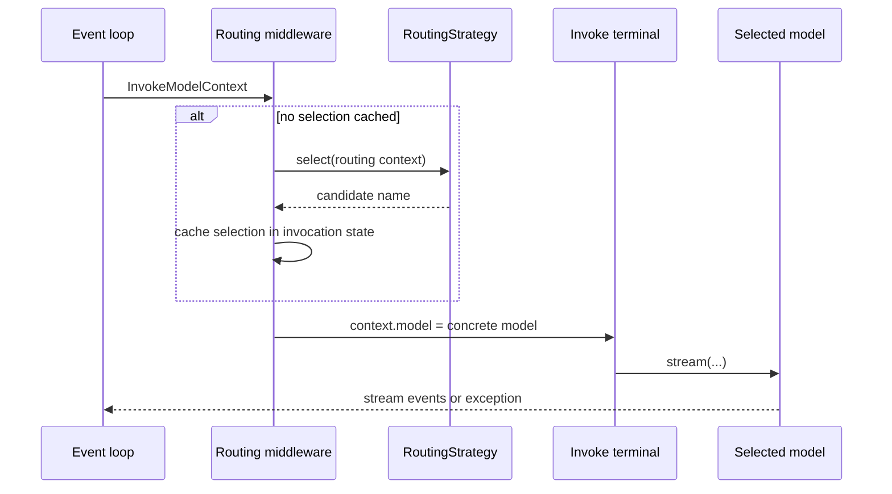

# Model Routing

**Status**: Proposed

**Date**: 2026-07-10

**Issue**: [#364](https://github.com/strands-agents/harness-sdk/issues/364)

**Scope**: Python SDK (the same shape ports to the TypeScript SDK later)

## Overview

Today a Strands `Agent` holds exactly one `Model`. It is resolved once in the constructor, and every inference call goes through that one `agent.model`. The model is fixed at build time.

Model routing lets an agent choose *which model handles a call* at runtime, based on the request, the conversation, cost, availability, or the phase of work. This matters more now that frontier models cost roughly 5x to 10x what smaller ones do, so sending easy turns to a small model is a real saving. Customers have asked for it directly ([#364](https://github.com/strands-agents/harness-sdk/issues/364)).

## Goals and Non-Goals

Goals:
- Make model choice a runtime decision, opt-in, with single-model usage unchanged.
- Provide a small strategy interface for proactive selection and reactive fallback.
- Route among `Model` instances, including models backed by different providers.
- Ship failure-driven fallback, a local heuristic, and one model-driven strategy in v1, so the feature is useful on its own.

Non-Goals (v1):
- Load balancing across deployments of the same model. This needs a global view of traffic and belongs in a gateway.
- Classifier or semantic routing, quality cascades, and cost-aware routing. These are fast-follow; cost is blocked on per-model pricing the SDK does not carry yet.
- Response caching. A cache hit skips the model call entirely, so it sits in front of routing, not inside it.

## Prior Art

| Framework | Where it runs | Decision signal | Idea to adapt |
|---|---|---|---|
| [LiteLLM Router](https://docs.litellm.ai/docs/routing) | Client / proxy across deployments | Load, cooldowns, cost/latency weights, ordered fallbacks | Ordered fallback as a baseline |
| [LangChain](https://python.langchain.com/docs/how_to/routing) | Composable wrappers | Conditional branch; ordered fallbacks | Fallback as a composable wrapper |
| [Portkey](https://portkey.ai/docs/product/ai-gateway-streamline-llm-integrations/fallbacks) | Gateway | Nestable conditional / load-balance / fallback | Strategies should nest |
| [RouteLLM](https://arxiv.org/html/2406.18665v2) | Client (research) | Learned classifier on query complexity | Reference for classifier routing |
| [Pydantic-AI `FallbackModel`](https://ai.pydantic.dev/api/models/fallback/) | Model wrapper | Ordered model list, falls through on failure | Fallback fits a typed SDK cleanly |
| [Bedrock Intelligent Prompt Routing](https://docs.aws.amazon.com/bedrock/latest/userguide/prompt-routing.html) | Server-side endpoint | Predicted per-request quality in a family | Server-routed endpoints are just candidates |

The intersection worth taking is small: client-side model selection with fallback and proactive strategies. Fallback is the one mechanism every framework ships, which makes it the safe first build.

## Scope

Routing decides among concrete **`Model` instances** in the SDK. Selection defaults to once per agent invocation: the first model call stores the chosen candidate in invocation-scoped state, and later model calls reuse it unless fallback advances the route. V1 rejects routers containing stateful models because switching would break provider-managed conversation state.

**The unit of routing is a `Model`.** Concrete model implementations encapsulate their provider-specific model id, region, and configuration. Candidates can therefore represent models on one provider (`BedrockModel("haiku")`, `BedrockModel("sonnet")`), the same model through different providers (`BedrockModel("sonnet")`, `AnthropicModel("sonnet")`), regional copies, or configuration variants. A server-routed endpoint such as Bedrock intelligent prompt routing is likewise one candidate `Model`. Traffic-aware load balancing across a deployment pool remains gateway territory because it needs a fleet-wide view.

Three strategies ship in v1:

| Strategy | Trigger | Basis |
|---|---|---|
| Fallback | reactive | ordered candidates; retry the selected model, then advance. Reuses `ModelRetryStrategy` |
| Context-fit | proactive | `count_tokens` and `context_window_limit`; local, with no extra model call |
| Model-driven | proactive | a small decision model classifies the request and names a candidate |

Proactive selection and fallback compose. A strategy chooses the first candidate, while its failure path can advance to another candidate after retries are exhausted.

## Proposal

An `Agent` receives its model through `model=`, and every inference call currently reaches that model through `InvokeModelStage`. Routing belongs in this existing stage because it prepares and owns the model invocation. A separate routing stage would split one operation across two lifecycle boundaries without adding a useful interception point.

**Recommended: widen `model=` to `Model | ModelRouter`, and select through `InvokeModelStage` middleware.** `ModelRouter` is its own type, not a `Model`, and implements `Plugin`. During initialization, `Agent` recognizes a router passed through `model=`, registers the plugin, and resolves `agent.model` to the router's concrete default candidate. Plain `Model` initialization remains unchanged.

```python
agent = Agent(model=ModelRouter(models=[...], strategy=...))
```

`InvokeModelContext` gains a `model: Model` field initialized from `agent.model`. The router's input middleware selects a candidate on the first call, stores its name in `invocation_state`, and replaces `context.model`. Later calls in the same invocation reuse that selection. If a candidate is another router, resolution continues until the context contains a concrete `Model`.

The existing invoke terminal reads `context.model` instead of `agent.model`, then performs the model call exactly as it does today. It retains ownership of streaming, model state, tracing, and errors. The selected model is therefore known before the model-invoke span starts, without creating a second call site or mutating shared agent state.



**Reactive fallback** uses the existing retry path. The router registers its fallback callback after `ModelRetryStrategy` in hook priority. While the retry strategy sets `event.retry`, the router keeps the selected candidate. Once that model's retries are exhausted, the router records the next candidate in invocation-scoped state, resets the retry budget for the new candidate, and requests another attempt. When the event loop re-enters `InvokeModelStage`, middleware resolves the updated candidate rather than running initial selection again. Per-invocation routing state keeps concurrent invocations independent.

Alternatives are in [Alternatives Considered](#alternatives-considered).

## Developer Experience

Routing is opt-in through `model=`. Pass a `Model` for today's behavior, or a `ModelRouter` to route. Candidates are primarily `Model` objects; model-id strings remain convenience shorthand. A single list may contain models backed by different providers. `strategy` is an object because strategies carry configuration and form the extension point.

```python
haiku  = BedrockModel(model_id="anthropic.claude-3-5-haiku-20241022-v1:0")
sonnet = BedrockModel(model_id="anthropic.claude-3-5-sonnet-20241022-v2:0")
opus   = AnthropicModel(model_id="claude-opus-4-1")

# Fallback: try in order, advance only after retries are exhausted.
agent = Agent(model=ModelRouter(models=[sonnet, opus], strategy=FallbackStrategy()))

# Context-fit: pick the smallest known context window that fits the request.
agent = Agent(model=ModelRouter(models=[haiku, sonnet, opus], strategy=ContextFitStrategy()))

# Model-driven: a small judge model names the candidate to use.
agent = Agent(model=ModelRouter(
    models={"cheap": haiku, "strong": opus},
    strategy=ModelDrivenStrategy(judge=haiku),
))

# Single-model usage is unchanged.
agent = Agent(model=sonnet)
```

Routers can nest when each level has a different responsibility. Resolution is recursive and always produces a concrete model before the terminal runs:

```python
adaptive = ModelRouter(models=[haiku, sonnet], strategy=ContextFitStrategy())
agent = Agent(model=ModelRouter(models=[adaptive, opus], strategy=FallbackStrategy()))
```

In v1, a strategy that depends on model metadata ranks concrete models only. An order-based parent such as `FallbackStrategy` may contain nested routers; metric-based ranking of nested groups needs aggregate metadata and is deferred.

## Interface Design

```python
class RoutingStrategy(Protocol):
    name: str

    async def select(self, context: RoutingContext) -> str: ...
    async def next_after_failure(self, context: RoutingContext) -> str | None: ...

Candidate = Union[Model, str, "ModelRouter"]

class ModelRouter(Plugin):
    def __init__(self, models: list[Candidate] | dict[str, Candidate],
                 strategy: RoutingStrategy, *, default: str | None = None): ...

Agent(model: Model | str | ModelRouter = ...)
```

- `RoutingContext` exposes existing request data and the candidate models. Context-fit can call each candidate's `count_tokens` and compare the result with that candidate's `context_window_limit`.
- Built-in proactive strategies share ordered failure behavior; `FallbackStrategy.select` simply chooses the first candidate.
- `InvokeModelContext.model` always contains a concrete `Model` when the terminal runs.
- Routing selections and fallback position live in `invocation_state`, not mutable router fields.
- A model is a candidate only when it appears in a router. `agent.model` resolves to the router's explicit default, or its first concrete candidate when no default is given.
- Routing rejects stateful candidates in v1.
- Agent invocations using `structured_output_model` pass through `InvokeModelStage` and reuse the invocation's selection. The deprecated direct `Agent.structured_output()` path bypasses this stage and uses the default candidate.

`ContextFitStrategy` uses context capacity only. It chooses the smallest known context window that fits that candidate's token count and falls back to the largest known window when none fit. It does not depend on cost metadata.

## Work Plan

- **P0, router core and fallback.** Add `ModelRouter`, widen `model=`, recognize the router as a plugin during agent initialization, add `model` to `InvokeModelContext`, cache selection in invocation state, resolve nested routers, and make the terminal call the context model. Register routing before model-dependent invoke middleware, order fallback after `ModelRetryStrategy`, reset retry state when advancing, and reject stateful candidates.
- **P0, context-fit and model-driven strategies.** Add local context-window selection and decision-model selection. Record the selected candidate on the existing model-invoke span.
- **P1, cost-aware routing.** Add a pricing source of truth, then rank context-fit survivors by price.
- **P1, classifier, semantic routing, and quality cascades.** Add learned or embedding selection without a decision-model call, and result-aware escalation once the SDK exposes a suitable quality signal.

## Alternatives Considered

- **Router is a `Model`, passed as `model=`.** A router could implement the `Model` interface and forward calls. Rejected: it would have to re-expose model capabilities that do not describe a router, and invocation middleware already provides the required call boundary.
- **A dedicated `model_router=` argument.** A separate slot beside `model=`. Rejected: two model-related arguments need precedence rules and expand the public surface. Accepting either value through `model=` is smaller.
- **A before-call hook that swaps `agent.model`.** Rejected: `agent.model` is shared, so concurrent invocations can race. A model field on the per-call context avoids shared mutation.
- **A separate model-routing stage.** Rejected: selection exists only to prepare a model invocation. `InvokeModelStage` already provides middleware phases around that operation and keeps tracing and streaming in one terminal.
- **A provider-list `Model`, `Model(provider=[...])`.** Rejected for v1: concrete model instances already express provider and deployment differences. Adding provider selection to the model layer is a larger refactor that overlaps with gateway responsibilities.

## Consequences

Easier:
- Model choice becomes a runtime decision through one opt-in value, without custom model swapping in application code.
- Fallback, context-fit, and model-driven routing reuse existing retry, token-counting, middleware, and tracing primitives.
- Nested routers compose ordered groups with proactive selection.
- Cross-provider routing uses the same candidate list as any other routing case.

Needs attention:
- Agent initialization must distinguish a router input from the concrete default exposed as `agent.model`.
- The invoke context and terminal gain a model field; plain-model calls otherwise follow the existing path.
- Routing input must run before invoke middleware that reads model capabilities; those consumers use `context.model` rather than capturing `agent.model`.
- `BeforeModelCallEvent` and its projected token estimate run before `InvokeModelStage`, so they continue to use the concrete default in v1. Strategies that need candidate-specific token counts compute them from the candidates directly.
- The router forwards canonical Strands messages without additional cross-provider normalization. Each candidate model remains responsible for validating and translating supported content.
- Routing provides no cache-affinity signal in v1. Choosing another model on a later invocation or during fallback can lose a provider prompt-cache hit.
- Cost-aware routing needs a pricing source of truth and remains a follow-up.

Migration: none. `model=` continues to accept a `Model` or model-id string, and routing is opt-in by passing a `ModelRouter`.

## Willingness to Implement

Yes.
