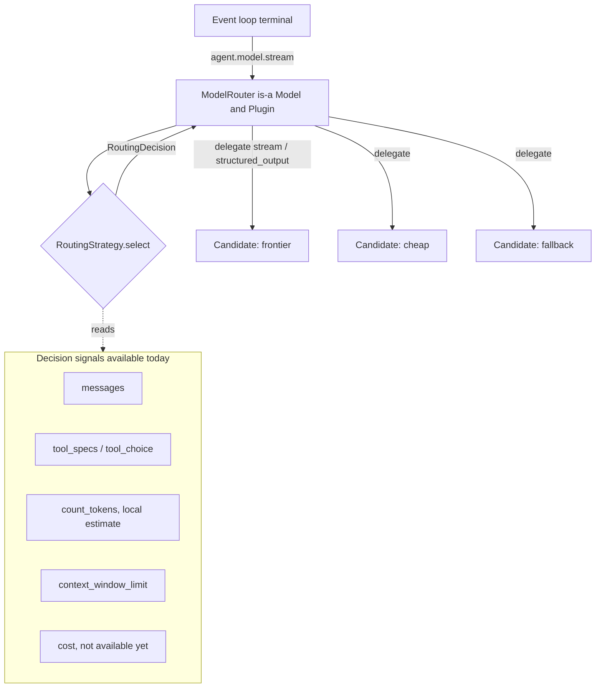
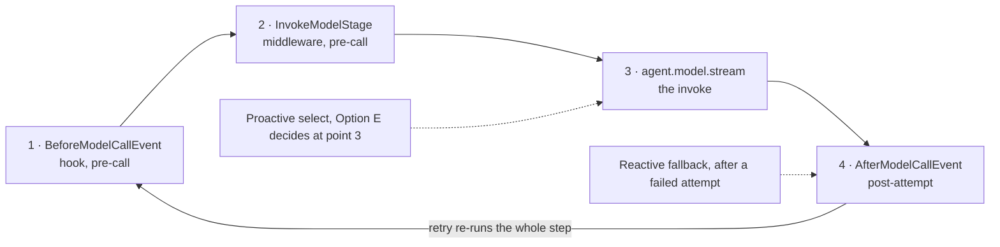
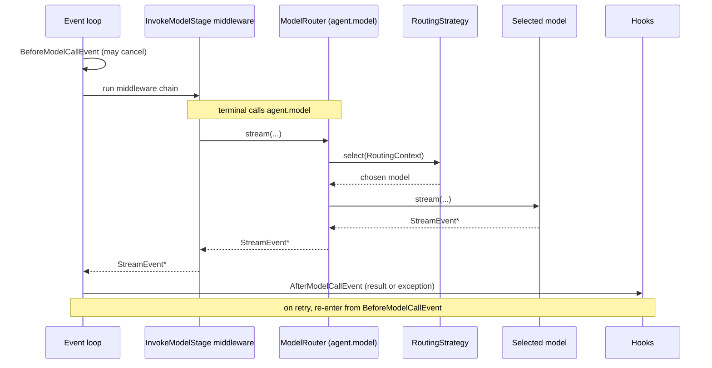
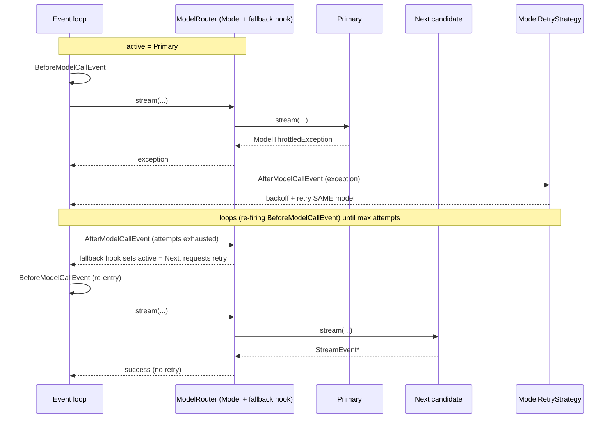

# Model Routing

**Status**: Proposed

**Date**: 2026-07-09

**Issue**: TBD

---

## Overview

Today a Strands `Agent` holds exactly one `Model`. It is resolved once in the constructor, and from then on every inference call goes through that one `agent.model`. In other words, the model is fixed at build time.

Model routing is a proposed feature that lets an agent decide *which model handles a call* at runtime instead of at construction. The model that serves a given call is chosen from the request, the conversation, cost, availability, or the phase of work, rather than binding one model for the life of the agent. The industry has been moving this way, and it matters more now that advanced models cost roughly 5x to 10x what smaller ones do, so sending cheap turns to cheap models is a real saving.

## Goals & Non-Goals

Goals:
- Make model choice a per-call runtime decision, opt-in, with single-model usage unchanged.
- A small, composable abstraction that enables routing.
- Ship the two lowest-risk strategies (fallback, intelligent) on primitives that already exist.

Non-Goals (v1):
- **Serving-endpoint / provider load balancing.** This is gateway-style routing, and we leave it to a gateway.
- **LLM / classifier / semantic / cost-aware routing and quality cascades.** These are fast-follow items.


## Research

### How other frameworks do it

The table summarizes the main routing mechanisms these frameworks use.

| Framework | Where routing runs | Decision signal | Idea for Strands to adapt |
|---|---|---|---|
| [LiteLLM Router](https://docs.litellm.ai/docs/routing) | Client/proxy across many deployments | Load, cooldowns, cost/latency/reliability weights, ordered fallbacks | Ordered fallback plus reliability-weighted selection as a baseline |
| [LangChain](https://python.langchain.com/docs/how_to/routing) | Composable wrappers at LLM or chain level | Conditional branch (`RunnableBranch`); ordered `RunnableWithFallbacks` | Fallback as a composable wrapper; different models may need different prompts |
| [OpenRouter Auto Router](https://openrouter.ai/blog/insights/model-routing/) | Hosted service | Separates *which model* from *which provider* | Keep model-choice and provider-choice as distinct concerns |
| [Portkey Gateway](https://portkey.ai/docs/product/ai-gateway-streamline-llm-integrations/fallbacks) | Gateway/proxy | Nestable strategies: conditional, load-balance, fallback; triggers on status codes | Strategies should be **composable/nestable** |
| [RouteLLM](https://arxiv.org/html/2406.18665v2) | Client (research/OSS) | Learned classifier / matrix factorization on predicted query complexity | Reference point for classifier-based cost/quality routing |
| [Aurelio semantic-router](https://github.com/aurelio-labs/semantic-router) / [vLLM semantic-router](https://github.com/vllm-project/semantic-router) | Client decision layer | Embedding/semantic vector match, no LLM call to decide | Fast classifier alternative that avoids an extra model call |
| [Pydantic-AI `FallbackModel`](https://ai.pydantic.dev/api/models/fallback/) | Model wrapper in a typed SDK | Wraps an ordered model list; falls through on failure | A router that **is-a Model** is the ergonomic fit for a typed SDK |
| [AWS Bedrock Intelligent Prompt Routing](https://docs.aws.amazon.com/bedrock/latest/userguide/prompt-routing.html) | Server-side, single serverless endpoint | Predicted per-request quality across a model family | Some routing can be **delegated server-side** rather than built client-side |


The intersection worth taking for Strands is small: client-side, model-target, fallback plus proactive selection. Two non-obvious points stand out: fallback is the one mechanism everyone ships, and a router that is-a `Model` needs no new plumbing in a typed SDK.

### Design Axes & Trade-offs

Every routing approach is a point in a small space. Making the axes explicit lets us decide, per factor, whether Strands builds it, configures it, or delegates it.

| Axis | Question | Options |
|---|---|---|
| **Target (What)** | What gets chosen? | the **model** (a different model identity) · the **serving endpoint** for a model (provider / deployment / region) |
| **Objective (Why)** | What is being optimized? | cost · quality/accuracy · latency · availability/reliability · compliance/residency |
| **Trigger (When)** | What prompts the decision? | **proactive**: before any attempt (request/context/signals) · **reactive**: after an attempt (*failure*-driven fallback, or *quality*-driven cascade) |
| **Scope** | How often / how sticky? | per-call · per-invocation · per-session (sticky) |
| **Location (Where)** | Where does the logic live? | client / in-SDK · gateway or proxy · server-side (provider, e.g. Bedrock) |
| **Composition** *(meta)* | Combined? | single · nested/composed |


There are trade-offs within each axis:

1. Target: building endpoint routing means Strands reimplements what gateways (LiteLLM, Portkey) and Bedrock already do well; skipping it means users who need pure load balancing reach for a gateway.

2. Objective: making the objective a config value keeps one strategy flexible, but it needs the input signals to exist. Cost is the problem, since `Model` exposes no cost metadata today.

3. Trigger: this is the primary architectural fork, because proactive and reactive routing need different plumbing in our SDK. A proactive decision, made before the call, needs no event-loop change. A reactive decision, made after an attempt, needs the failure or result signal that arrives on `AfterModelCallEvent`. The middleware also has a model-call stage, and we already have `ModelRetryStrategy`, which reacts to that event, retries on `ModelThrottledException`, and resets on `AfterInvocationEvent`. One interface cannot serve both cleanly.

4. Scope: per-call is the most flexible (it can escalate mid-invocation after a tool result) but the riskiest for stateful models and cache locality; per-invocation is simpler and safer but cannot adapt within a run.

5. Location: this is clearly in our SDK. The real boundary is state scope. A decision that needs only what this process can see belongs in the SDK, while anything that needs a global view of traffic belongs in a gateway.

6. Composition: we should decide this upfront, since it depends on how sophisticated we want the first release to be.


## Scope decisions

The trade-offs resolve into a single decision. The baseline routes only between models (not providers), decides in the SDK before each call, falls back after a failure, and never silently switches away from a model that holds server-side state. What to optimize for is a config option, though cost is deferred until we have per-model pricing. Strategies stay simple for now, but the interface is built so they can nest later, and provider or endpoint load balancing is left to a gateway or Bedrock.

Two strategies ship first, because both reuse machinery that already exists:

| Strategy | Reuses in Strands | Why first |
|---|---|---|
| Fallback  | `ModelRetryStrategy`, `AfterModelCallEvent`, `AfterInvocationEvent` | Lowest risk; retry the primary, then advance to the next model |
| Intelligent  | `count_tokens`, `context_window_limit` | Local, deterministic decision; no extra model round-trip |

## Integration

Primitives in our SDK that could help:
- **Hook**: a callback the agent fires at points in its lifecycle.
- **Middleware**: a step in the request pipeline that can inspect or alter a call before it runs.
- **Plugin**: an add-on you attach to an agent that wires up hooks and behavior.

### Options

What actually separates the options is three things: whether it is safe when one agent handles several calls at once, whether it can react *after* a call (which fallback needs), and whether it forces a change to the agent's core loop.

- **A. Make the router look like a model.** The router implements the `Model` interface and is passed as `model=`, exactly like a normal model. Internally it picks one of several models and forwards the call. Nothing else in the agent changes.
- **B. A hook that rewrites the agent's model before each call.** Reuses the event system, but it edits `agent.model`, a value shared across calls. If one agent runs two requests at once, they overwrite each other.
- **C. A pipeline step that names the model to use.** Conceptually clean, but the code that actually calls the model ignores what the pipeline chose and reads the agent's model directly, so it would not take effect without changing that core code.
- **D. A separate `model_router=` setting (a plugin).** Self-describing, and it keeps routing distinct from "the model," but it is a brand-new knob and it still needs one of the other mechanisms underneath to actually intercept the call.
- **E. Both A and D at once.** One object that is a model (so it can be passed as `model=` and forward calls) and a plugin (so it can also listen for the "a call just finished or failed" event that fallback relies on).


| Option | How it is enabled | Safe under concurrent calls | Can react after a call (fallback) | Changes the core loop |
|---|---|---|---|---|
| A, router is a model | pass as `model=` | Yes | Not on its own | No |
| B, before-call hook | register a hook | No, edits shared state | Yes | No |
| C, pipeline picks model | add a pipeline step | Yes | Partly | Yes, blocked today |
| D, separate `model_router=` | new argument | Yes | Yes | No (needs A underneath) |
| E, model + plugin | pass as `model=` | Yes | Yes | No |

B edits a shared value, so concurrent calls on one agent race each other.

In C, the code that currently runs the model reads the agent's model directly and ignores the pipeline's choice, so it would require a core-loop change first.

D is a plugin-style option, but it still needs something to intercept the call, and the cleanest interceptor is a model-shaped wrapper, so D collapses into E.

### Why not widen a hook or middleware to set the model?

The current contracts:
- The event-loop terminal invokes `stream_messages(agent.model, ...)`, so it reads `agent.model` directly.
- `BeforeModelCallEvent` is read-only except `cancel` (its write guard allows only `"cancel"`), and it has no `model` field.
- `InvokeModelContext` has no `model` field, and the terminal would ignore it regardless.

So there are two ways to make a hook or middleware route, each with a cost:

| Approach | What it takes to work | Cost |
|---|---|---|
| Mutate `agent.model` from a hook | nothing new, just write the attribute | `agent.model` is one shared slot: concurrent calls race, and even a single invocation (which runs many model calls across tool-use cycles) must save and restore it and reason about a moving "current model" |
| Per-call model override (option C) | add a writable `model` field to the event or context, and change the terminal to honor it | modifies the SDK's hottest, most-tested code path and introduces a new permanent public contract |
| Router is-a `Model` (option E) | nothing, the router is already the call target | the decision is a local inside `stream()`, so it is call-scoped by construction: no shared state, no restore, no core-loop change |


**Decision: Option E.** One `ModelRouter` that behaves as a model, slots into the existing `model=`, forwards each call, and can wrap other routers. It is also a plugin, so it can react to the after-a-call event that fallback needs without editing shared state. The `model=` argument itself does not change, and single-model usage is untouched. A separate `model_router=` argument (option D) is a discoverability affordance we can add later. The one downside is that `model=` now also accepts a routing policy, not just a model; if we want an explicit separation, `model_router=` can layer on top while keeping the model-shaped core.


## Proposed Architecture & Workflow

Routing inserts a decision step in front of the model call. The agent still holds a model; that model is a router that asks a strategy which candidate should serve the call and delegates to it. Everything upstream (hooks, middleware, retry) runs unchanged.



### Where a decision can attach

A single model call passes four points. A routing decision attaches at one of them, and this is what separates proactive selection from reactive fallback.



Points 1, 2 and 3 all resolve *which model* before the provider request is sent; they differ only in mechanism, and the chosen Option E decides at point 3 (the router's own `stream`). Point 4 is the only place a reactive decision can be made, because it is the only point that knows an attempt failed, which is why fallback is a `Plugin`-registered hook rather than part of `select`. A retry does not resume at the invoke; it re-runs the whole step from point 1 (`BeforeModelCallEvent` fires again), because the event loop retries by re-entering its `while` loop.

### Per-call workflow



### Fallback workflow



`ModelRetryStrategy` handles backoff and retrying the *same* model, while the router's own fallback hook advances to the *next* model. The ordering between them (retry first, then fall back) is still open.

## DevX

Routing is an optional capability passed to `Agent`, with a small config, sensible defaults, and single-model usage unchanged. A one-line fallback is trivial, and advanced strategies opt in.

Candidate models are supplied as a list, and the shape follows the strategy. Fallback takes an ordered list where order is the priority, and a selection strategy ranks over whatever candidates it is given.

```python
haiku  = BedrockModel(model_id="anthropic.claude-3-5-haiku-20241022-v1:0")
sonnet = BedrockModel(model_id="anthropic.claude-3-5-sonnet-20241022-v2:0")
opus   = AnthropicModel(model_id="claude-opus-4-1", temperature=0.2)

# An "escalating" group: try haiku, fall back to sonnet on failure.
escalating = ModelRouter(models=[haiku, sonnet], strategy=FallbackStrategy())
# Route by context between that group and a large-context model.
agent = Agent(model=ModelRouter(models=[escalating, opus], strategy=ContextCostStrategy()))


class ContextCostStrategy:
    """Pick the cheapest candidate whose context window fits the request."""

    def select(self, ctx: RoutingContext) -> str:
        need = ctx.projected_input_tokens        # from the routing context
        fits = {name: m for name, m in ctx.candidates.items()
                if m.context_window_limit is None or m.context_window_limit >= need}
        pool = fits or ctx.candidates            # nothing fits, consider all
        return min(pool, key=lambda name: pool[name].cost)
```

Single-model usage is untouched: `Agent(model=BedrockModel())` and `Agent(model="claude-...")` behave exactly as today.


## Interface Design

```python
class RoutingStrategy(Protocol):
    name: str
    async def select(self, context: RoutingContext) -> RoutingDecision: ...          # proactive
    async def on_result(self, context: RoutingResultContext) -> RoutingDecision | None: ...  # reactive (optional)


class ModelRouter(Model, Plugin):   # a Model (delegates) and a Plugin (registers the fallback hook)
    def __init__(self, models: list[Model | str] | dict[str, Model | str],
                 strategy: RoutingStrategy, *, default: str | None = None): ...
```

- `RoutingContext` carries what the SDK already exposes: `messages`, `tool_specs`, and per-candidate `count_tokens` and `context_window_limit`.
- As a `Model`, the router implements the full surface (`stream`, `structured_output`, `count_tokens`, `context_window_limit`, `stateful`) by delegating to the selected candidate.
- As a `Plugin`, `init_agent` registers the `AfterModelCallEvent` hook so fallback composes with `ModelRetryStrategy` (retry first, then advance) rather than reimplementing backoff.


## Work Plan

**P0: Router core + fallback.** `ModelRouter` (a delegating `Model` and `Plugin`), `RoutingStrategy` (`select` plus optional `on_result`), a candidate registry (ordered list and named mapping, taking a `Model` or a model-id string), `FallbackRouter` composing with `ModelRetryStrategy`, a `stateful` guard, and the default scope.

**P0: Intelligent routing.** A signals-based `select()` on `count_tokens` and `context_window_limit`, with the routing decision emitted on the model-invoke span.

**P1: Cost-aware routing (follow-up).** Add price columns to the defaults table (`_defaults.py`), then a cost/latency objective.

**P1: LLM-based routing (follow-up).** Agentic handoff, a classifier or semantic `select()`, a quality-driven cascade, and an evaluation harness. Routing with a classifier model, or letting the agent pick, is deferred rather than designed out. It adds a model call to the decision path (latency and cost on every route), and trustworthy use needs a decision model, a label or prompt scheme, and an evaluation harness. The quality-driven variant (cascade) additionally needs a verification or confidence signal the SDK does not expose yet. It fits the same abstraction, since an LLM router is just a `RoutingStrategy.select()` that calls a model internally, and it layers on top of the v1 router as its own workstream.

## Open Questions

- **Cost source of truth.** Cost-aware routing needs per-model pricing, which the SDK does not carry today. Where should it live: price columns added to the existing defaults table (`_defaults.py`), a new property on `Model`, or a separate provider registry? This gates all cost-based routing.
- **Stateful models.** A `stateful` model keeps conversation state on the server side, so switching away from it mid-conversation would lose that state. Should the router forbid routing among `stateful` candidates entirely, or allow it only at a per-invocation (not per-call) scope?
- **`structured_output` routing.** An agent calls the model two ways: `stream` (normal generation) and `structured_output` (return a typed object). Should the router run its strategy separately for a `structured_output` call, or should that call reuse whatever model the last `stream` decision picked? A task may warrant a different model for a structured result than for free-form text.
- **`model_router=` argument.** A router already works via `Agent(model=router)` since a router is a `Model`. Should we also add a dedicated `Agent(model_router=...)` argument for discoverability, or is reusing `model=` clear enough that the extra argument is not worth it?
