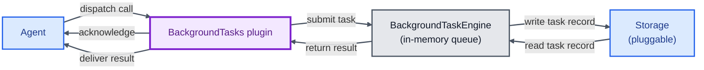
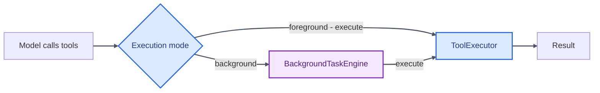
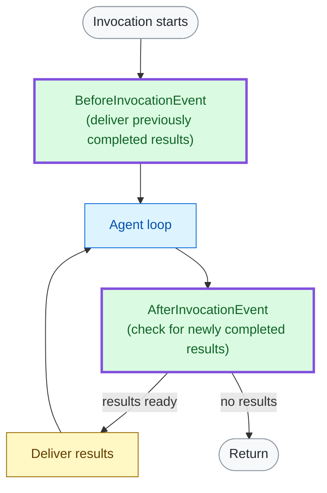

# Background Tasks Plugin

**Status**: Proposed

**Date**: 2026-07-28

**Issue**: N/A

**Scope**: TypeScript SDK, but Python to follow.

---

[Problem](#problem) · [Proposal](#proposal) · [DX](#developer-experience)

---

## Problem

When the model calls tools, the agent loop blocks until the entire batch completes. Seconds or minutes of tool latency become idle time, during which the model cannot reason, see early results, or make additional requests.

### Current State

`ConcurrentToolExecutor` lets calls within a round execute in parallel, but the batch still moves at the speed of its slowest tool. A fast lookup and a five-minute research task remain coupled – the lookup may finish immediately, but the model cannot use it until the research task completes.

```mermaid
gantt
    title Current execution waits for the slowest tool
    dateFormat HH:mm:ss
    axisFormat %M:%S

    section Model
    Reason, call tools          :model1, 00:00:00, 10s
    Blocked waiting for results :crit, wait, after model1, 5m
    Resume reasoning            :model2, after wait, 10s

    section Tools
    Long-running tool           :tool1, after model1, 5m
    Short tool                  :tool2, after model1, 30s
    Short tool                  :tool3, after model1, 15s
```



This creates three practical limitations:
1. **Adaptive concurrency is impossible** – the model cannot act on early results and launch follow-up work
2. **Long-running work cannot continue between turns** – the current invocation must remain open until every tool call in that round completes
3. **Developers must build async coordination themselves** – task tracking, recovery, concurrency limits, and asynchronous delivery all require custom infrastructure

Existing community implementations demonstrate two useful patterns for asynchronous agent work. [async-agentic-tools](https://github.com/mikegc-aws/async-agentic-tools) reinvokes the Agent when work completes, while [devduck tasks](https://github.com/cagataycali/devduck/blob/main/devduck/tools/tasks.py) lets the model start and poll background jobs. 

This proposal takes a complementary path: it introduces a flexible, storage-backed mechanism for dispatching compatible tools in the background and delivering their results to the model at safe agent-loop boundaries. **Reinvocation and richer back-and-forth subagent coordination will build on this foundation.**

## Goals and Non-Goals

**Goals:**

- Model-driven background execution for compatible tool calls
- Automatic result delivery at safe agent loop boundaries (no polling)
- Consistent behavior across local tools, MCP tools and agents-as-tools

**Non-Goals:**

- Automatically reinvoking an Agent when background work completes
- Interactive messaging with a running background task / subagent

---

## Proposal

We introduce `BackgroundTasks`, an opt-in plugin that lets the model dispatch tool calls in the background and continue reasoning while they run.

```typescript
import { Agent } from '@strands-agents/sdk'
import { BackgroundTasks } from '@strands-agents/sdk/vended-plugins'

const agent = new Agent({
  tools: [deepResearch, quickLookup],
  plugins: [new BackgroundTasks()],
})
```

With the default plugin configuration, the model gets to decide on background execution for any compatible tool call. Dispatch returns an immediate acknowledgement, and the result is delivered at the next safe agent-loop boundary.

[Developer Experience](#developer-experience) covers per-tool overrides and storage usage. Alternatives Considered ([Appendix](#appendix)) compares this approach with other API designs.

### How it Works

At a high level, the plugin connects the Agent lifecycle to a storage-backed background task engine that manages scheduling, bounded execution, cancellation, and recovery.



The engine schedules and coordinates execution background work. Storage preserves task state across agent invocations (id, input, status, timestamps) and eventually the tool result/failure itself.

Foreground and background calls both use the same `ToolExecutor` instance configured on the Agent.



### Dispatching Background Tasks

When a tool is eligible for background execution (see [Developer Experience](#developer-experience) for per-tool overrides), it receives an additional `_background: boolean` param in its input schema, with the following description:

```
"Run this tool call in the background. Acknowledgement is immediate; continue without waiting or polling. Strands will deliver the final result automatically at a later Agent boundary."
```

When the model dispatches a call with `_background: true`, it immediately receives a dispatch acknowledgement (tool result). The actual task executes concurrently while the model continues with foreground work, and its result is delivered at the next safe agent-loop boundary.

```
Background task dispatched.

Task ID: <taskId>
Tool: <toolName>
Status: queued

The task is running in the background. Continue without waiting or polling.
Strands will deliver the final result automatically when it is ready.
```

### Result Delivery

Completed background task results are delivered at one of two safe boundaries in the agent loop:



Both paths deliver the result as a synthetic assistant tool use followed by a matching user tool result. A simplified exchange begins with this assistant message:

```
{
  "name": "strands_background_task_result",
  "toolUseId": "<deliveryId>",
  "input": {
    "taskId": "<taskId>",
    "toolName": "<toolName>",
    "status": "completed"
  }
}
```

The matching user response contains the result:

```
Background task completed.

Task ID: <taskId>
Tool: <toolName>
Status: completed

The final result follows.

<the actual structured tool result>
```

Results that complete during an invocation are delivered before it returns. Later results remain ready and are delivered when the Agent is invoked again. If a result cannot fit in context, the model receives its task ID so the application can retrieve it directly.

### Storage and Recovery

`BackgroundTasks` persists the task before returning the dispatch acknowledgement. If persistence fails, the task is not accepted and the model receives an error instead of a task ID.

Task records contain enough information to reconstruct queued work and deliver its eventual result or failure, including the tool name, input, status, and output. Applications must treat durable task records as sensitive data.

The default `InMemoryStorage` retains tasks only for the lifetime of the process. Restart recovery requires a durable `Storage` implementation and recreation of the Agent with the same Agent ID, registered tools, and storage namespace.

Recovery depends on the persisted status:

| Persisted status | Recovery behavior |
| --- | --- |
| `queued` | Requeued for execution |
| `working` | Marked `failed` with `recoveryError` |
| `paused` | Remains paused until `resume()` supplies the required interrupt responses |
| `completed`, `failed`, or `cancelled` | Retained for management and result delivery |

The plugin and engine do not automatically retry tool execution. Arbitrary tools may produce external side effects, so repeating an interrupted call could duplicate those effects.

Cancellation and timeout use an `AbortSignal` and therefore require cooperative tools. A tool that ignores cancellation may continue producing external side effects, although its task result is discarded. The timeout applies only while a task is actively executing, not while it is queued or paused.

Completed results remain ready until they are successfully delivered. Durable storage preserves them across restarts.

Execution coordination is single-process. Durable storage provides recovery, not distributed locking or exactly-once external effects.

## Developer Experience

By default, the model decides whether to background any given call.

```typescript
import { Agent } from '@strands-agents/sdk'
import { BackgroundTasks } from '@strands-agents/sdk/experimental'

const agent = new Agent({
  tools: [bash, deepResearch, renderVisual],
  plugins: [new BackgroundTasks()],
})
```

Tools can be pinned to always/never run in the background. Star notation covers the blanket case.

| Policy | Who decides? | Tool schema | Behavior |
|---|---|---|---|
| `agentic` (default) | Model, per call | Adds `_background` | Backgrounds calls when selected |
| `always` | Developer | Unchanged | Backgrounds every call |
| `never` | Developer | Unchanged | Runs every call in the foreground |

```typescript
const agent = new Agent({
  tools: [bash, deepResearch, renderVisual],
  plugins: [
    new BackgroundTasks({
      policy: {
        '*': 'agentic',
        deepResearch: 'always',
        renderVisual: 'never',
      },
    }),
  ],
})
```

A `Storage` implementation can be passed to durably persist/retrieve task records in an external store.

```typescript
const agent = new Agent({
  tools: [bash, deepResearch, renderVisual],
  plugins: [
    new BackgroundTasks({
      storage: new S3Storage({
        bucket: 'agent-bucket',
        prefix: 'background-tasks/',
      }),
    }),
  ],
})
```

## Consequences

| Use background tasks when… | Do not use background tasks when… |
|---|---|
| Work is long-running or has unpredictable latency. | Work is short and scheduling overhead adds little value. |
| The model does not depend on the result immediately. | The model needs the result for its very next task. |
| Tasks are independent and completion order can vary. | Strict ordering or deterministic replay matters. |
| Work may safely outlive the current invocation. | The invocation must remain open until all work completes. |

---

## Willingness to Implement

Yes. Intended sequence:

#### P0: Model-driven background dispatch and delivery

The proposed design. Base mechanism letting the model make calls and keep reasoning without being blocked.

#### P1: Deeper subagent mechanism

This will build off of the base mechanism and involve other SDK features such as `use_agent` (dynamic dispatch) and direct agent-as-tool streaming. Goal is support persistent subagent communication, such as queueing tasks and allowing external reinvocation of the model.

## FAQ

### What tools cannot be executed in the background?

Only framework-owned control and delivery tools are categorically excluded. Model-selected (`agentic`) backgrounding also requires a direct object input schema that the plugin can extend with the reserved `_background` field. Wildcard policies leave incompatible tools unchanged, while an explicit `agentic` policy for an incompatible schema fails during initialization.

### Can background tasks dispatch background tasks?

No (at least, not as part of this initial proposal). Once a tool is already running as a background task, the plugin suppresses nested background dispatch and executes subsequent tool calls inside the existing task. This keeps one owner for cancellation, timeout, recovery, capacity, and result delivery, and prevents unbounded fan-out.

### Can an invocation wait for background tasks to complete?

By default, `agent.invoke()` returns when the model finishes, even if background tasks are still running; their results are delivered at the next invocation. P1 will add completion-triggered reinvocation for richer subagent workflows. 

As an interim option, `BackgroundTasks` could expose a bounded `waitUntilComplete` setting that keeps the invocation open until all running background tasks reach a terminal state.

---

## Appendix

<details>
<summary><strong>A: Alternatives Considered</strong></summary>

### The proposed design (recommended)

**Pros:** The model expresses the decision as a boolean on a tool call it already knows how to make – no meta-calling convention, no new tool vocabulary. Works uniformly across regular tools, agents-as-tools, and MCP tools. Results enter history as typed tool results rather than trusted user text, and delivery survives provider failures and process restarts.

**Cons:** Injecting `_background` mutates tool input schemas the SDK does not own. When the model chooses (`agentic`), decision quality is model-dependent.

### 1. A single `background()` meta-tool

Instead of a `_background` param on each eligible tool, the plugin registers one tool the model calls to dispatch any other tool:

```typescript
background({ tool: 'deepResearch', input: { query: '...' } })
```

**Pros:** No schema mutation of existing tools – MCP and vendored tool schemas pass through untouched. One place to document the contract.

**Cons:** The inner tool's arguments become an untyped payload inside another tool's input, so the provider no longer validates them against the real schema – malformed calls surface at execution instead of generation. The model must also learn a meta-calling convention rather than flipping a boolean on a call it already knows how to make, and models are measurably better at direct tool calls than at nesting one call inside another.

### 2. A `backgroundTools: [...]` first-class parameter

A list on the Agent itself; every call to a listed tool runs in the background:

```typescript
const agent = new Agent({
  tools: [quickLookup, deepResearch],
  backgroundTools: [deepResearch],
})
```

**Pros:** Simplest possible surface. Fully deterministic – no reliance on model judgment, nothing injected into schemas.

**Cons:** The developer must predict at build time which calls are slow, but latency is often input-dependent – the same `bash` call can take milliseconds or minutes. Dropping model choice drops the core unlock (model-driven concurrency), reducing the feature to the `always` policy alone. It also grows the first-class `Agent` API for an opt-in feature that plugins exist to carry.

Furthermore, setting `policy: { deepResearch: 'always' }` allows developers to execute this level of control without sacrificing the model-driven `agentic` mode.

</details>
