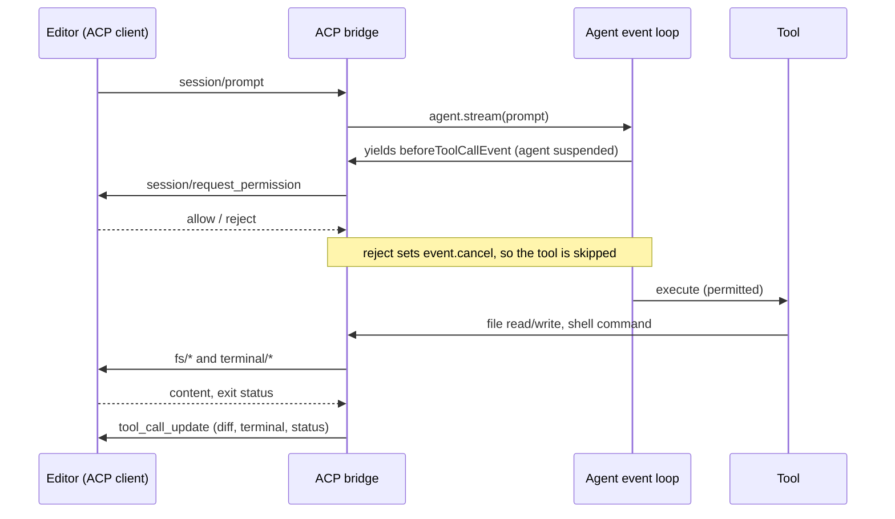

# Agent Client Protocol Support

**Status**: Proposed

**Date**: 2026-08-07

**Issue**: [strands-agents/harness-sdk#3814](https://github.com/strands-agents/harness-sdk/issues/3814)

**Scope**: TypeScript SDK first. The Python SDK follows the same shape; official ACP libraries exist for both languages.

## Overview

A Strands agent can be given tools through MCP and can talk to other agents through A2A. Both adapters ship in the SDK. There is no supported way for a developer's editor to drive a Strands agent.

The [Agent Client Protocol](https://agentclientprotocol.com) (ACP) is the standard for that link. It does for editor-to-agent what LSP did for editor-to-language-server: one JSON-RPC contract, so any conforming agent runs in any conforming editor. It is backed by Zed Industries and JetBrains, has official libraries in five languages, and is implemented by Zed, JetBrains AI Assistant, Qt Creator, Visual Studio, several VS Code extensions, four neovim plugins, Emacs, Obsidian, marimo, and Jupyter.

Strands is currently the only major agent framework with no ACP support it owns. The consequence is not a missing niche editor: a developer who builds an agent on Strands cannot put that agent in front of themselves in the tool they work in all day, while the same developer on Mastra, LangGraph, LlamaIndex, Pydantic AI, or Koog can.

## Goals and Non-Goals

Goals:
- An existing Strands agent runs in any ACP client without changes to the agent, its tools, or its model configuration.
- Map ACP's client-delegated capabilities (filesystem, terminal, permission requests) onto primitives the SDK already owns, rather than reimplementing them alongside.
- Opt-in and free when unused: no new required dependency, no cost to an agent that never speaks ACP.
- Reach Python parity on the same shape, as `a2a` did.

Non-Goals (v1):
- Remote transports. ACP's HTTP and WebSocket story is explicitly a work in progress upstream; stdio is what clients ship today.
- The client half of ACP. Driving *other* ACP agents as subagents is a tool and multi-agent concern, and `session/fork` and `session/set_model` come with it.
- Replacing A2A or AG-UI. These protocols answer different questions; see Alternatives.
- Slash commands, plan updates, and config options. Additive session updates that can land incrementally.
- Any change to the interrupt or intervention primitives. An earlier draft proposed an awaitable interrupt to serve permission requests. That turned out to be unnecessary: `BeforeToolCallEvent.cancel` already covers it (see Current State).

## Prior Art

| Framework | ACP support | Shipped by | Notes |
|---|---|---|---|
| [Mastra](https://mastra.ai/docs/agents/acp) | `@mastra/acp` | First-party | Documented alongside core agent docs |
| [Koog](https://docs.koog.ai/agent-client-protocol/) | `agents-features-acp` | First-party (JetBrains) | Same vendor co-sponsors the protocol |
| [LangChain / LangGraph](https://docs.langchain.com/oss/python/deepagents/acp) | Deep Agents ACP | First-party docs | Positioned as the way to run agents in editors |
| [Pydantic AI](https://pypi.org/project/pydantic-acp/) | `pydantic-acp` | Adapter toolkit (ACP Kit) | |
| [LlamaIndex](https://github.com/AstraBert/workflows-acp) | `workflows-acp` | Community | Agent Workflows adapter |
| [fast-agent](https://fast-agent.ai/acp/) | `fast-agent-acp` | First-party | |
| Strands | `@ryancormack/strands-acp` | Community, one contributor | Catalog entry, TypeScript only |

Inside Strands there is a closer precedent. `strands-ts/src/a2a` is 1,213 lines of protocol adapter in core, exported at the `./a2a` and `./a2a/express` subpaths, with `@a2a-js/sdk` declared as an *optional* peer dependency. `strands-py/src/strands/multiagent/a2a` is its Python counterpart, and MCP is arranged the same way. Protocol adapters already live in core, already carry their SDK as an optional peer, and already cost nothing to agents that do not use them.

## Current State

`@ryancormack/strands-acp` is a working bridge, listed as a featured integration in the Strands catalog since 2026-07-18. It establishes the shape: `AcpAgent implements acp.Agent`, one Strands `Agent` per ACP session from a factory, `agent.stream()` translated into session updates over newline-delimited JSON-RPC on stdio.

`@ryancormack/strands-acp` covered 4 of ACP's 11 `SessionUpdate` variants, called none of the 9 methods an agent can invoke on the client, hardcoded every tool's `kind` to `execute`, and emitted no `ToolCallContent`. It has since been extended to close most of that gap: inferred tool kinds, file locations, tool results and failure status, reasoning as `agent_thought_chunk`, lossless history replay, stream disposal on cancellation, and a full `session/request_permission` flow with per-tool policy and session-remembered answers.

That work is why the recommendation below is narrower than a first pass at this problem would suggest.

### What actually needs to live in core

Most of this proposal is already covered by the community package with no change to the SDK. That changes what "add ACP support" is actually asking Strands to decide.

Filesystem and terminal delegation needs nothing from core. `Sandbox` is an abstract class exported at the `./sandbox` subpath, `Agent` accepts `sandbox?: Sandbox | false`, and sandbox-aware tools resolve `context.agent.sandbox` at call time. An `AcpSandbox` routing to `fs/*` and `terminal/*` is a fifth implementation alongside the existing four.

Permission gating also needs nothing from core, and this was the surprising part. `agent.stream()` is an async generator, so the agent is suspended at each yield until the consumer pulls again. An ACP permission round-trip can take as long as the user needs, inside a single `session/prompt`, with no timeout imposed by the bridge. The agent loop yields the live `BeforeToolCallEvent` and then re-reads it:

  ```js
  const beforeToolCallEvent = new BeforeToolCallEvent({ agent: this, toolUse, tool, invocationState })
  yield beforeToolCallEvent
  // Cancel individual tool if hook requested it
  if (beforeToolCallEvent.cancel) { /* synthesizes an error tool result */ }
  ```

Setting `event.cancel` before resuming the generator is a complete veto, and the model receives an error result for the refused call rather than the turn ending. This is implemented and tested in the community package today.

So this isn't a proposal to unblock something the SDK currently prevents. It's a proposal about ownership: whether ACP should be a framework capability with Python parity and one team behind it, or stay a single contributor's TypeScript package that happens to work.

One gap did surface, and it is small. Nothing in the SDK describes what a tool *does*, so the bridge infers ACP tool kinds by pattern-matching tool names (`file_read` → `read`, `apply_patch` → `edit`). That heuristic is wrong for any tool whose name does not follow the convention, and every UI integration has to reinvent it. Tool kind is metadata the tool author knows and the SDK could carry.

## Proposal

ACP inverts ownership of three resources. Normally a Strands agent owns its filesystem access, its shell, and its approval policy. Under ACP the client owns all three and the agent asks:



**Recommended: an `acp` module in the SDK, mirroring how `a2a` ships, plus optional tool-kind metadata.** A new `strands-ts/src/acp` exported at the `./acp` subpath, with `@agentclientprotocol/sdk` as an optional peer dependency. Agents that never import it are unaffected and never install it. Three bridges, plus one small additive core field. The event and permission bridges have a working reference implementation; the resource bridge is designed but not yet built.

The event bridge maps agent stream events to session updates, covering the surface ACP actually offers: `agent_thought_chunk` for reasoning, tool kinds, `diff` content for file edits, `failed` status from `AfterToolCallEvent.error`, and `usage_update` from metrics the SDK already collects.

The permission bridge is a policy over `BeforeToolCallEvent.cancel`, asking the client via `session/request_permission` and remembering `allow_always` / `reject_always` for the session. ACP session modes become permission profiles over the same mechanism, which is what `setSessionMode` (currently a stub returning `{}`) is for. `./vended-interventions/hitl` is the existing local expression of this policy, so ACP becomes another front end to it rather than a parallel approval system.

The resource bridge is not yet implemented. It is an `AcpSandbox` extending the existing `Sandbox` abstract class. Because tools resolve `context.agent.sandbox` at call time, unmodified tools transparently read and write through the editor, respecting unsaved buffers and undo history. This is the fifth sandbox implementation after the local default, `posix-shell`, `docker`, and `ssh`.

The one core addition is optional tool-kind metadata: a field on a tool declaring what it does, drawn from ACP's vocabulary because it is the one already standardised. The `acp` module reads it and falls back to name inference when absent, so nothing breaks for existing tools. This is additive, useful to AG-UI and any other UI surface, and replaces a regex on tool names with something the tool author states directly.

**Pros:** ACP becomes a framework capability rather than one contributor's package; the three bridges reuse existing primitives instead of duplicating them; the dependency and release story is proven by `a2a`; Python parity becomes reachable; tool metadata pays off beyond ACP.

**Cons:** it adds public surface to core against a protocol still moving (ACP publishes a v2 draft alongside v1), and the SDK takes on tracking it. The permission bridge puts human latency inside the tool loop, which is new. And since an external package demonstrably can do this, the SDK is choosing to own maintenance it could decline.

### Alternative: leave it as a community extension

Keep `@ryancormack/strands-acp` external and document it.

**Pros:** zero core surface and zero new maintenance. It works today, including permission gating and client-delegated resources, because the seams it needs are already public, which is a direct vindication of the "extensible by design" tenet. It can track ACP's v2 draft without waiting on SDK semver, which matters for a protocol still changing.

**Cons:** no Python, since the package is TypeScript only, and the monorepo ships both languages for MCP and A2A. Tool-kind inference stays a name heuristic that every integration re-solves. It tracks two moving SDKs from outside and breaks on either. Practically, "Strands supports ACP" would mean one contributor's package while competitors ship it as a framework feature: a discoverability and confidence gap more than a technical one.

### Alternative: a first-party package outside the SDK

`@strands-agents/acp` in the monorepo, released separately.

**Pros:** independent cadence for a protocol at v1-with-v2-draft, keeps the core dependency graph unchanged, and answers the ownership and Python-parity objections without expanding the SDK's surface. Now that no core change is strictly required, this is the cheapest option that still fixes the credibility gap.

**Cons:** users still have to find and add a second package, so it does not fully close the discoverability gap. The `a2a` precedent answered this question the other way for a protocol with the same properties, and splitting them invites the question of why.

### Alternative: a shared client-protocol abstraction

One internal event model serving ACP, AG-UI, and future UI protocols.

**Pros:** one mapping, many surfaces; avoids a second bespoke translation layer.

**Cons:** the two protocols disagree on the thing that matters. AG-UI pushes events to a view; ACP inverts ownership of the filesystem, terminal, and approvals. An abstraction over both collapses to the AG-UI subset. Worth revisiting once a second protocol needs the same inversions.

## Developer Experience

The entry point is a function, and the agent is untouched:

```ts
import { createStdioServer } from '@strands-agents/sdk/acp'
import { Agent, BedrockModel } from '@strands-agents/sdk'

createStdioServer({
  agentFactory: () =>
    new Agent({
      model: new BedrockModel({ modelId: 'anthropic.claude-sonnet-5' }),
      tools: [fileEditor, shell],
    }),
})
```

Pointing an editor at that process is the whole integration. In Zed this is an `agent_servers` entry; other clients register an equivalent command.

Permissions are declarative. Omitting the policy gates nothing, so adopting the module changes no behaviour until asked:

```ts
createStdioServer({
  agentFactory: () => new Agent({ model, tools }),
  permissions: {
    default: 'ask',
    tools: { file_read: 'allow', delete_file: 'deny' },
  },
})
```

A gated call reaches the editor carrying the tool's kind, its parsed input, and the file locations it touches. The user's answer resumes the same turn. `allow_always` and `reject_always` are remembered for the session, so the user is asked once per tool. A rejection is not a failed turn: the tool is skipped and the model receives an error result for that call, so it can explain itself or try another approach. Session modes let the client swap the whole profile (an editor's "plan" mode denies every mutating tool) without the agent knowing.

The resource bridge is on by default when the client advertises the capability:

```ts
createStdioServer({
  agentFactory: () => new Agent({ model, tools }),
  // Route tool file and shell access through the client when it advertises
  // fs/terminal support. Set false to always use the agent's own sandbox.
  delegateResources: true,
})
```

A tool calling `context.agent.sandbox.readFile(path)` then reads the editor's in-memory buffer including unsaved edits, and a write lands as an editor edit the user can undo. Nothing in the tool changes. When the client advertises no filesystem capability the same tool falls back to the configured sandbox, so one agent works in a rich editor and in a bare terminal client.

Tools that want an exact kind declare it rather than relying on their name:

```ts
const applyPatch = tool({
  name: 'apply_patch',
  kind: 'edit', // surfaced to any UI; inferred from the name when omitted
  // ...
})
```

## Interface Design

Names are provisional and subject to API review. The boundaries are the proposal.

```ts
interface AcpServerConfig {
  agentFactory: (sessionId: string, params: NewSessionRequest) => Agent
  capabilities?: Partial<AgentCapabilities>
  toolKinds?: Record<string, ToolKind>
  permissions?: PermissionPolicy
  delegateResources?: boolean
  sessionStore?: SessionManager
}

type PermissionDecision = 'allow' | 'ask' | 'deny'

interface PermissionPolicy {
  default?: PermissionDecision
  tools?: Record<string, PermissionDecision>
  modes?: Record<string, Partial<PermissionPolicy>>
}

function createStdioServer(config: AcpServerConfig): AgentSideConnection
class AcpAgent implements acp.Agent       // for custom transports
class AcpSandbox extends Sandbox          // client-delegated fs and terminal

// Core addition, outside the acp module: an optional `kind` on a tool
// definition, defaulting to undefined and inferred when absent.
```

- `agentFactory` stays per-session. It is the seam where a caller attaches their own model, tools, and session manager.
- `permissions` defaults to gating nothing, so the module is additive for existing callers.
- `sessionStore` accepts the existing `SessionManager` so `session/load` and `session/resume` restore history through `src/session` and `src/storage` instead of each caller reinventing persistence.
- `AcpSandbox` implements the existing abstract class unchanged: `executeStreaming`, `executeCodeStreaming`, `readFile`, `writeFile`, `removeFile`, `listFiles`. `executeCodeStreaming` has no ACP equivalent and delegates to a terminal invocation or reports unsupported.
- `PermissionPolicy` is data rather than a callback, so it is inspectable and serialisable. A callback escape hatch can follow if a real case needs one.
- `toolKinds` stays on the config as an override for third-party tools whose definitions the caller does not control, even once tools can declare a kind themselves.
- `mcpServers` from the session request are honoured rather than ignored, connecting the client's configured MCP servers through the existing `src/mcp` module, so an editor's MCP configuration applies to the Strands agent it launches.

## Work Plan

- **P0, transport and event bridge.** `src/acp` module, `./acp` subpath export, optional peer dependency, stdio server. Session-update coverage: thought chunks, tool kinds, locations, tool content including diffs, `failed` status, usage. Stop-reason mapping. Cancellation that releases the agent stream.
- **P0, permission bridge.** `session/request_permission` over `BeforeToolCallEvent.cancel`, `PermissionPolicy`, session-remembered answers, session modes as profiles.
- **P0, resource bridge.** `AcpSandbox` over `fs/*` and `terminal/*`, capability-gated with fallback to the configured sandbox.
- **P1, tool-kind metadata.** Optional `kind` on tool definitions, read by the `acp` module and anything else that renders tools.
- **P1, session persistence.** `SessionManager` wiring for `session/load` and `session/resume`.
- **P1, Python parity.** The same bridges against `agent-client-protocol`, following where `a2a` sits in `strands-py`.
- **P2, client side and remaining surface.** Consuming external ACP agents as subagents, `session/fork`, `session/set_model`, slash commands, plan updates. Remote transports once the upstream spec settles.

## Consequences

Easier:
- A Strands agent becomes usable in the editor its author already works in, with no agent-side changes.
- Tools written once run locally, in Docker, over SSH, or inside an editor's buffers, because the sandbox interface absorbs the difference.
- Approval stops being local-only: the same policy serves a terminal prompt and an editor dialog.
- Tool kinds become declared rather than guessed, which helps every UI surface.
- Strands reaches parity with the frameworks it is compared against, on a protocol its own tenets endorse.

Needs attention:
- ACP ships v1 with a v2 draft in flight. The module needs an explicit compatibility stance, and `team/COMPATIBILITY.md` should say what a protocol-version bump means for SDK semver. This is the main cost of moving in-core, since an external package can simply follow.
- Human latency now sits inside the tool loop. The interaction between a pending permission request and `session/cancel` needs deliberate behaviour, and a policy of `ask` with an unattended client will hang rather than fail.
- Delegated filesystem access is a real security boundary. The client decides what is readable, and `additionalDirectories` from the session request has to be enforced rather than trusted.
- A fifth sandbox implementation is maintenance cost on a currently stable interface, and it is the first one whose far side is a process the SDK does not control.
- Adding `kind` to tools invites scope creep towards fuller side-effect metadata. v1 should stay at ACP's vocabulary and resist generalising.
- Overlap with A2A and AG-UI needs a documented positioning statement, or users will ask which of the three to reach for: A2A is agent-to-agent, AG-UI is agent-to-web-view, ACP is editor-to-agent with the editor owning the resources.

## Willingness to Implement

Yes. The event and permission bridges are implemented in [ryancormack/strands-acp](https://github.com/ryancormack/strands-acp) and can be contributed as the starting point.
