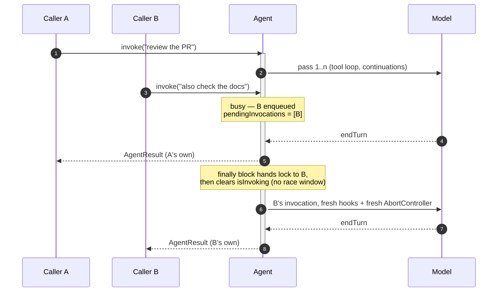
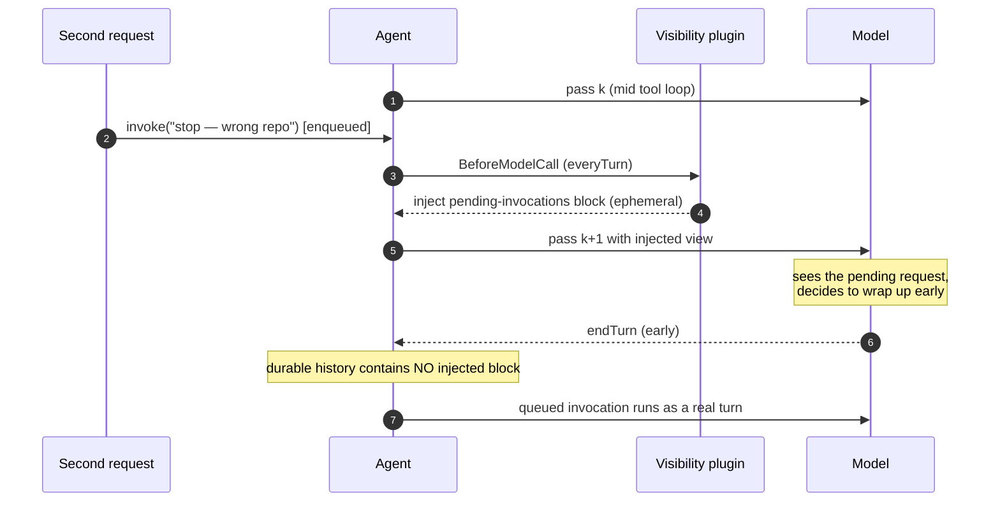
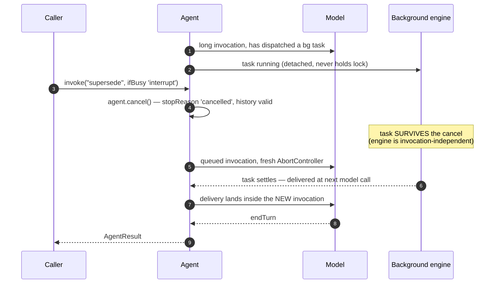
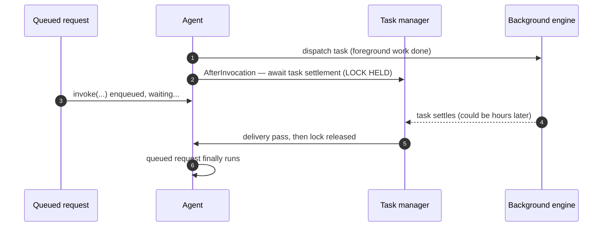
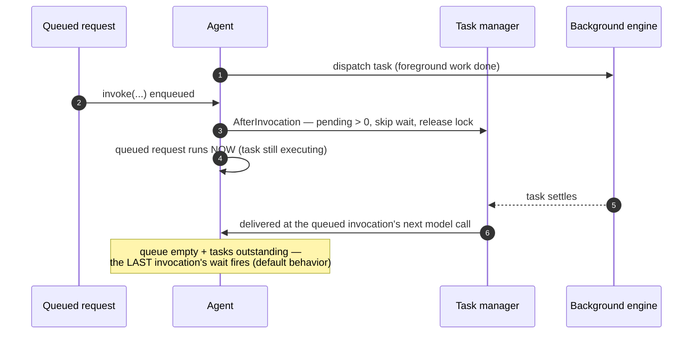

# Invocation Queueing: `concurrentInvocationMode: 'enqueue'`

**Status**: Proposed

**Date**: 2026-08-13

**Issue**: TBD

**Scope**: TypeScript SDK first (where the Background Tasks feature lives); Python parity port after, extending the existing `ConcurrentInvocationMode` enum.

**Related**:
- **Background Tasks** (TS) — design and implementation currently in review; §[Interaction with Background Tasks](#interaction-with-background-tasks) below is the integration contract between the two features
- [#3042: async/background deliverables](https://github.com/strands-agents/harness-sdk/issues/3042), [#3021: owner-blind invocation lock](https://github.com/strands-agents/harness-sdk/issues/3021) — adjacent hazards; this design adds the missing lock semantics

## Context

An agent serving real traffic gets requests while it is busy. A GitHub bot gets a second mention twenty minutes into a review; a chat UI user double-texts; a Slack command arrives mid-task. Today the SDK's answer is fail-fast: the TS `Agent` throws `ConcurrentInvocationError` from `acquireLock()`, and Python offers `ConcurrentInvocationMode.THROW` (default) or `UNSAFE_REENTRANT` (explicitly unsafe). Every serious host therefore hand-rolls the same thing in front of the agent — a lock, then a queue, then visibility, then interruption — and gets the same bugs in the same order.

We know because we did it: we implemented this exact stack in **strandly**, our autonomous agent — a session mailbox in front of the agent (a state machine with an atomic drain-or-idle transition), a pending-messages plugin inside it (mid-run visibility via `ContextInjector` plus delivery via `AfterInvocationEvent.resume`), and control-plane cancellation via `agent.cancel()`. It works and it is well tested, and its two hardest bugs — a drain race at the queue/lock boundary, and a cancelled-turn resume being poisoned by the still-armed cancel signal — are both artifacts of building *outside* the lock. Built into the lock, neither can exist.

Meanwhile the Background Tasks feature adds tools that run detached from the invocation, with results delivered as continuation passes. Background tasks make the busy-agent problem *more* common (invocations legitimately stay open longer waiting for task results) and simultaneously provide the machinery that makes interleaving solvable. The two features need a designed contract, not an accident of merge order.

## Problem

**1. A second request while busy has exactly one behavior: an exception.** TS `acquireLock()` throws; there is no mode. Python's only alternative is `UNSAFE_REENTRANT`, which corrupts shared message history and is documented as such. Neither language can queue, and neither gives the caller anything to wait on.

**2. Hosts that work around it build invisible waits.** strandly's original symptom: a follow-up ("stop, wrong repo") sits behind a host-level lock for an hour while the agent finishes the wrong task, because the running agent has no idea the message exists. Any host that wraps the agent in its own lock reproduces this.

**3. There is no introspection or control.** Nothing like the background tasks `agent.backgroundTasks` accessor exists for invocations: a server cannot render "queued behind 2", cannot cancel a queued request, cannot implement backpressure.

**4. Interruption does not compose with arrival.** `agent.cancel()` exists and is thread-safe, but "cancel the current run *because* a new request supersedes it" is a coordination pattern every host reinvents — with the ordering hazard strandly hit (the cancel signal poisoning the very request that asked for the cancel).

**5. With the Background Tasks feature as currently written, a queued request can starve behind background work.** `waitForCompletion: true` (the default) awaits task settlement inside the `AfterInvocationEvent` hook, inside `stream()`, holding the lock (`in-process-task-manager.ts`: `_onAfterInvocation` → `_waitForTaskResult`). Any queue built on the lock waits behind the entire background train. Verified in the implementation; timeline in §[Interaction](#interaction-with-background-tasks).

## Goals and Non-Goals

Goals:

- `concurrentInvocationMode: 'throw' | 'enqueue'` on the TS `Agent` (name parity with the existing Python knob). `enqueue` turns the lock into a FIFO of **fresh invocations**: each queued caller gets its own result/stream, its own hook pair, its own fresh `AbortController`.
- Per-call override `ifBusy: 'throw' | 'enqueue' | 'interrupt'` (LangGraph's `multitask_strategy` vocabulary, minus `rollback` for v1 — survey in [Appendix A](#appendix-a-prior-art)).
- Introspection: `agent.pendingInvocations` + `agent.cancelPending(id)` — shape parity with `agent.backgroundTasks`.
- Mid-run visibility: a vended plugin rendering the pending queue into every model call, ephemerally (the generic half of strandly's pending-messages plugin, upstreamed).
- **Queue-aware completion wait**: the one-line contract that makes queued requests interleave with background tasks instead of starving behind them.
- A Python parity port extending `_ConcurrencyController` (which already has the waiter bookkeeping shape via idempotency tokens).

Non-Goals (v1): durable/cross-process queues (host concern — a lease, not a lock); coalescing, TTLs, priorities (host ingress policy; strandly keeps these host-side); `rollback` semantics (needs checkpointing); streaming-input mode (pushing messages into a live turn is a different, larger feature); changing the default (`'throw'` stays).

## Proposal

### Recommended: extend the invocation lock into a mode

```ts
// Constructor — default 'throw' preserves existing behavior exactly
const agent = new Agent({
  concurrentInvocationMode: 'enqueue',
  // object form reserved for options:
  // concurrentInvocationMode: { mode: 'enqueue', maxDepth: 10, visibleToModel: true }
})

await agent.invoke(a)                            // runs now
await agent.invoke(b)                            // busy → FIFO; resolves with ITS OWN AgentResult
await agent.invoke(c, { ifBusy: 'interrupt' })   // agent.cancel() current, then run next
await agent.invoke(d, { ifBusy: 'throw' })       // opt back into fail-fast

agent.pendingInvocations // readonly { id, submittedAt, preview }[]
agent.cancelPending(id)  // dequeue → that caller rejects with a typed CancelledError
```

Semantics:

| State | `enqueue` | `interrupt` | `throw` |
|---|---|---|---|
| idle | run now | run now | run now |
| busy | FIFO wait → own invocation | `agent.cancel()` running one, then FIFO front | `ConcurrentInvocationError` (today) |
| caller's `cancelSignal` aborts while queued | dequeue, reject typed error | same | n/a |
| `maxDepth` exceeded | throw on submit | throw on submit | n/a |

The core mechanics: `acquireLock()` becomes `async acquireTurn()`; when busy under `enqueue`, the caller pushes `{resolve, reject, signal}` onto `_invocationQueue`; `stream()`'s `finally` hands the lock to the next waiter **before** clearing `_isInvoking`. Because the queue and the lock are one object mutated synchronously on one JS thread, strandly's drain race (late arrival between "queue looks empty" and "flip to idle") cannot be constructed. ~150–250 LOC plus tests.



### Why fresh invocations, not continuations

The Background Tasks feature converts the single `resume` slot into an internal multi-writer continuation queue (`_continueWith` intents, merged into follow-up passes). The tempting build is "queued message → a continuation at AfterInvocation" — it is how strandly works over `resume`. Three disqualifiers, all verifiable in that implementation:

1. **Continuations are intra-invocation.** They extend the first caller's stream and fold into *its* result. A second external request needs its own `AgentResult` — in a server, each request gets a response.
2. **Continuations die with their invocation.** `stream()` rejects intents on error, hook-cancel, and consumer break; worse, after a `'cancelled'` pass a registered continuation would run against an abort signal that is only reset in `stream()`'s `finally` — pre-poisoned. This is bit-for-bit the "cancelled turn must not be resumed" bug strandly found, and a queued request **must survive** cancellation because it is frequently the *reason* for it.
3. **`_continueWith` is `@internal`.** A queue feature needs a public surface.

A FIFO of fresh invocations gets all three free: own result, own `Before/AfterInvocationEvent` pair, own fresh `AbortController` (verified in the cancel tests: result 1 `'cancelled'`, result 2 `'endTurn'`). Cancelling run N cannot poison run N+1.

### Visibility: the vended plugin

`enqueue` alone reproduces strandly's original complaint — an invisible wait. The generic half of strandly's pending-messages plugin upstreams as a small vended plugin (~80 LOC), auto-attached when `visibleToModel: true` (recommended default for `enqueue`):

- Composes the existing `ContextInjector` (`trigger: 'everyTurn'`) to render `agent.pendingInvocations` into every model call of the *running* invocation — **ephemeral, never in durable history**.
- The block states the contract explicitly: *these are not in the conversation; they run when you finish; if one supersedes your current work, wrap up now.* Advisory injection + authoritative delivery — the split strandly proved out (a message can never be lost by being "seen" mid-run, because it is always also delivered as a real invocation).



### `ifBusy: 'interrupt'`: the control plane

`interrupt` = `agent.cancel()` + front-of-queue. `cancel()` already synthesizes valid `toolResult` blocks for in-flight tool uses and the cancelled invocation ends; the queued request then runs as a **fresh** `stream()` with a fresh signal — strandly's fold-vs-fresh-run dilemma dissolves because the queued run *is* the fresh run. No text heuristics: interruption is an explicit caller choice (a stop button, a cancel action payload), or the model's own early wrap-up via the visibility block.



## Interaction with Background Tasks

Layering is clean by construction: **continuations = SDK-internal follow-up passes within one request; the invocation queue = multiple external requests.** The queue lives at the lock; continuations live between passes inside it. A queued invocation starts only after the current invocation's entire train — goal retries, delivery passes — finishes.

One real integration point exists, and it is the starvation case (Problem 5):

| Config | Busy agent + queued request + running bg task |
|---|---|
| `waitForCompletion: false` | **Interleaving works today, zero new code.** Invocation N returns after foreground work → lock released → queued request runs *while the task executes* → result delivered at the queued invocation's next `BeforeModelCall`. |
| `waitForCompletion: true` (default), as written | Starvation: `_onAfterInvocation` holds the lock across `_waitForTaskResult` and the delivery passes. The queued request waits behind the whole background train. |
| `waitForCompletion: true` + **queue-aware wait** (this design) | "Serve the queue, wait at the end": skip the wait when someone is queued; the last invocation's wait catches stragglers. |

The fix is the shape of the task manager's existing early-return:

```ts
if (!this._config.waitForCompletion || …) return
if (agent.pendingInvocations.length > 0) return   // queue-aware: they'll receive the results
await this._waitForTaskResult(cannotContinue)
```

Correct because delivery is **state-driven, not wait-driven**: every invocation's `BeforeModelCall` and the end-of-queue wait run the same exactly-once `_deliverReady` over the engine's terminal records (with the existing reconciliation machinery). The wait was only ever scheduling; skipping it cannot drop a result.

**Today (default config) — the queued request starves:**



**With the queue-aware wait — interleaved:**



Everything else composes without code: with `waitForCompletion: false`, tasks outliving invocation N deliver into queued invocation N+1's first model call; `ifBusy: 'interrupt'` composes with the task manager's skip-on-cancelled + delivery-recovery (the queued run is the recovery target). And because the background tasks work is being split into multiple PRs, the coupling stays soft — whichever side lands second adds the three-line check.

**Boundary of the interleaving claim:** two *model loops* cannot interleave on one agent — they would race on one shared `agent.messages`, which is precisely what the lock protects. If the running work is foreground (a goal loop, an active tool loop), the options are the visibility plugin (model wraps up early) or `interrupt`. What interleaves is background *execution* with a new request's model loop — which is the case that matters, because background execution is the thing that can run for hours.

## Developer Experience

### Minimal: a server that stops throwing

```ts
const agent = new Agent({ model, tools, concurrentInvocationMode: 'enqueue' })

app.post('/invoke', async (req, res) => {
  res.json(await agent.invoke(req.body.prompt))   // second request waits its turn; both get real results
})
```

### Typical: visible queue + a stop button

```ts
const agent = new Agent({
  model, tools,
  concurrentInvocationMode: { mode: 'enqueue', maxDepth: 10, visibleToModel: true },
})

app.get('/status', (_req, res) => res.json({ pending: agent.pendingInvocations }))
app.post('/stop',  (_req, res) => { agent.cancel(); res.sendStatus(202) })
app.post('/invoke', async (req, res) => {
  res.json(await agent.invoke(req.body.prompt, { ifBusy: req.body.supersede ? 'interrupt' : 'enqueue' }))
})
```

### Errors

- Queue full → typed error on **submit** (fail fast, not after waiting).
- `cancelPending(id)` / caller's `cancelSignal` while queued → that caller rejects with a typed cancelled error; nothing else is disturbed.
- Lazy-generator caveat: a `stream()` body doesn't run until first `next()`, so an unconsumed stream never enters the queue. Documented; `invoke()` unaffected.

## Consequences

- Default unchanged (`'throw'`); the feature is pay-for-play. No schema, token, or prompt-cache cost for non-adopters; the visibility plugin costs tokens only while a queue is non-empty.
- Hosts delete their bespoke lock/queue layers: strandly's session mailbox + pending-messages plugin reduce to config (`enqueue` + `visibleToModel`) plus host-side ingress policy (coalescing, TTL, acknowledgement reactions — which stay host-side by design; [Appendix B](#appendix-b-what-the-strandly-implementation-keeps-vs-deletes)).
- The two hardest bugs of the strandly implementation (drain race, cancel-poisoning) become unrepresentable rather than tested-against.
- One soft coupling to manage with the background tasks rollout: the queue-aware wait is three lines in whichever PR lands second.

## Development Plan

1. **P1**: `concurrentInvocationMode: 'enqueue'` + `pendingInvocations`/`cancelPending` + queue-aware-wait contract (TS). Tests: FIFO order, own-result-per-caller, abort-while-queued, maxDepth, fresh-signal-after-cancel, lazy-generator, no-drain-race (adversarial interleaving).
2. **P2**: vended visibility plugin (`ContextInjector` composition; ephemerality + injection-absent-from-history tests — strandly's test shapes port directly).
3. **P3**: per-call `ifBusy` incl. `'interrupt'` (+ composition tests with background tasks: task-survives-interrupt, delivery-into-queued-run).
4. **P4**: Python parity (`ENQUEUE` in the existing enum; `_ConcurrencyController.begin()` grows a waiter list; idempotency tokens compose — a duplicate token of a queued entry joins it).

## Future Work

- Durable queue / cross-instance lease (the two-instances-one-session hazard on serverless runtimes) — host or platform concern; the `pendingInvocations` surface is shaped so a durable implementation can back it.
- `rollback` (LangGraph's fourth strategy) once checkpointing can restore pre-invocation state.
- Streaming-input mode (push messages into a live turn) — a different feature; `enqueue` delivers at turn boundaries by design.
- `waitForCompletion: 'unless-pending'` as a named policy value on the background tasks config, if the implicit queue-aware behavior wants to be explicit.

## Key Decisions

1. **Queue of fresh invocations, not continuations** — own result per caller; survives cancellation; public surface. (§Why fresh invocations)
2. **Two channels, never one**: new work queues (data plane); stop is `agent.cancel()`/`ifBusy: 'interrupt'` (control plane). No text heuristics.
3. **Visibility is advisory, delivery is authoritative** — injected view is ephemeral; the queued request always runs as a real invocation.
4. **Queue-aware completion wait** — "serve the queue, wait at the end"; delivery being state-driven makes it loss-free.
5. **Coalescing/TTL/priority stay host-side** — the SDK queue is a dumb FIFO; strandly keeps its ingress policy.
6. **Default stays `'throw'`** — additive, opt-in, zero cost to non-adopters.

## Appendix A: Prior Art

| System | Mechanism | What we take |
|---|---|---|
| LangGraph Platform | Per-run `multitask_strategy: reject \| interrupt \| rollback \| enqueue` ("double texting") | The vocabulary, per-call not global |
| Claude Code / Claude Agent SDK | Data plane: streaming input queues messages to the next turn boundary. Control plane: `interrupt()` out-of-band | The two-channel split: new work is queued data; *stop* is a control action, never a queued message |
| Erlang/Akka actors | One mailbox per actor, single-threaded processing, selective receive | Queue-before-the-loop + peeking the mailbox mid-task (the visibility plugin) |
| Temporal | Signals mutate a running workflow; it reacts at its own pace | Injected queue view = a signal the model polls each step |
| `strands.experimental.bidi` | Barge-in interruption is default | Voice preempts; text queues — hence `ifBusy` is per-call |
| strandly (ours; implementation private) | Mailbox before the agent + injector plugin inside it | The whole delivery design, minus the two races that owning the lock retires |

## Appendix B: What the strandly implementation keeps vs. deletes

| strandly piece | Fate under this design |
|---|---|
| Session mailbox (IDLE⇄RUNNING state machine, atomic drain-or-idle) | Deleted — the SDK lock does it race-free |
| Pending-messages plugin (injector + resume drain) | Deleted — vended visibility plugin + queued invocations |
| Per-ingress strategies (enqueue/interrupt/reject) | Maps to per-call `ifBusy` |
| Coalescing by trigger id, TTLs, caps, acknowledgement reactions, run ledger, dedup contracts | Stays in the host (ingress policy) |
| Cancel + clear-cancel choreography around a shared signal | Deleted — a fresh invocation per queued run makes it unnecessary |

## Appendix C: Verified claims and their sources

All load-bearing claims were verified against code, not descriptions: the TS lock throw (`agent.ts`, `acquireLock`), the Python modes (`types/agent.py`, `_concurrency.py`), fresh-`AbortController`-per-`stream()` (the cancel tests: `'cancelled'` then `'endTurn'`), the background tasks lock-held wait (`in-process-task-manager.ts`, `_onAfterInvocation` → `_waitForTaskResult`, a loop over `engine.wait`), that wait's escape hatches (aborts on `agent.cancelSignal`; early-returns on `paused` interrupts), state-driven delivery (`_deliverReady` invoked from both `BeforeModelCall` and `AfterInvocation`, with reconciliation for exactly-once), continuation rejection paths (`_rejectContinuations` at every `stream()` exit), and `_continueWith` being `@internal`. strandly mechanics come from our implementation and its test suite (private).
